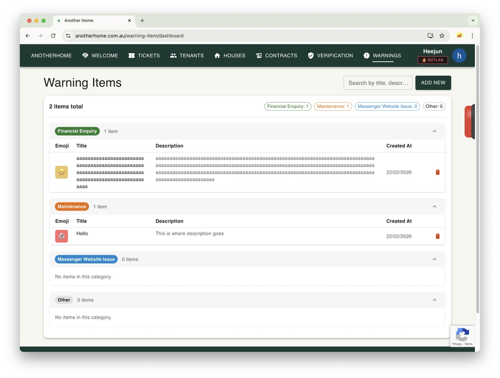

# AnotherHome, still ~~hustling~~ developing...
Surprisingly, I'm still working on the AnotherHome project.
Sure, I've been swamped with English study, work, the PY course, going out, and learning guitar thanks to Prince, but I've still been improving the design and shipping new features.
This time, I added functionality for Warning Items.

## What is it?
From a support ticket admin's perspective, there are things you want users to clearly acknowledge, or at least be aware of, before they submit a ticket.
Since all the CRUD functionality was already in place, I built this so admins can input content themselves and display it directly to users.

## Why built it?
Honestly, it's not the kind of content that requires changes frequently. Opening an API, managing a table, and handling data validation for that feels like overkill. If something rarely changes, you could just hardcode it on the frontend.
But since the backend was already there, I was curious how much effort adding a related feature would actually take.
Also, regardless of how practical this feature would be, I figured it at least gives the impression to admins that they do have controls on the system and the service is running on a solid and well-managed base. 
That's why I built it.

## Cheating?
I built the backend myself, but for the frontend I borrowed a little (okay, a lot of) help from Antigravity. It was insanely good. I kind of imagine this is how Peter Parker felt when he discovered his superpowers.
Adding a page is basically just copy-pasting the existing page structure anyway, so there wasn't much for me to think through. I had no problem handing that off to Antigravity. Besides, frontends get reverse-engineered anyway, so I don't keep any important logic in there.
Either way, this was my first real experience using an AI assistant. It knows what I want with uncanny precision. What have you made? Google..

## Tutorial
I uploaded a video to the AnotherHome YouTube channel. My voice sounds a bit flat, that's what happens when you record it all in one take..lol

  <iframe 
    src="https://www.youtube.com/embed/nkuJhmtgXhA"
    style="position:absolute;top:0;left:0;width:100%;height:100%;"
    frameborder="0"
    allowfullscreen>
  </iframe>

Funnily enouth, This shorts got more than 200 views after 1 hour of uploading. What?

You are more than welcome to <a href="https://http://anotherhome.com.au" target="_blank" rel="noopener noreferrer">Try it out</a>