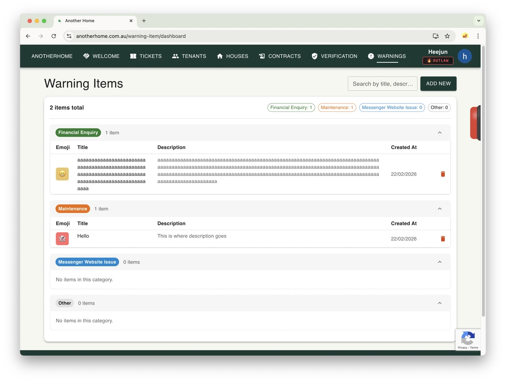

## AnotherHome ยังคง ~~ขายของ~~ พัฒนาต่อไป..
น่าแปลกใจที่ผมยังทำโปรเจกต์ AnotherHome อยู่จริงๆ
ถึงจะวุ่นวายกับการเรียนภาษาอังกฤษ งาน คอร์ส PY การออกไปเที่ยว หรือการหัดกีตาร์เพราะตกหลุมรัก Prince แต่ผมก็ยังปรับปรุงดีไซน์และเพิ่มฟีเจอร์ใหม่อยู่
ฟีเจอร์ที่เพิ่มเข้ามาครั้งนี้คือฟีเจอร์เกี่ยวกับ Warning Item

## มันคืออะไร?
ในมุมของผู้ดูแลระบบตั๋วซัพพอร์ต จะมีเรื่องที่อยากให้ผู้ใช้ตรวจสอบให้แน่ชัดก่อนจะส่งตั๋วเข้ามา หรือเรื่องที่อยากให้ผู้ใช้รับรู้ไว้
ในเมื่อฟังก์ชัน CRUD ทำไว้ครบอยู่แล้ว นี่จึงเป็นฟีเจอร์ที่ให้ผู้ดูแลพิมพ์เนื้อหาเองแล้วแสดงให้ผู้ใช้เห็น

## ทำไมถึงพัฒนา?
จริงๆ แล้วมันไม่ใช่เนื้อหาที่จะเปลี่ยนบ่อยขนาดนั้น การจะเปิด API จัดการตาราง แล้วมาตรวจสอบข้อมูลอาจเป็นงานที่ไม่จำเป็นด้วยซ้ำ ถ้าเนื้อหาไม่ได้เปลี่ยนบ่อย ฮาร์ดโค้ดไว้ที่ฝั่งฟรอนต์เอนด์ก็ได้
แต่ในเมื่อฝั่งแบ็กเอนด์เขียนไว้เรียบร้อยแล้ว ผมก็อยากรู้ว่าการเพิ่มฟีเจอร์ที่เกี่ยวข้องจะใช้แรงมากแค่ไหน
อีกอย่าง ถึงจะไม่รู้แน่ชัดว่าฟีเจอร์นี้จะมีประโยชน์จริงๆ แค่ไหน แต่ผมคิดว่ามันจะช่วยให้รู้สึกได้ว่าผู้ดูแลถือสิทธิ์ควบคุมอยู่ และบริการนี้เป็นระบบที่ดำเนินไปอย่างมั่นคง ผมจึงลงมือทำ

## ผิดกติกาไหม?
ฝั่งแบ็กเอนด์ผมทำเอง แต่ฝั่งฟรอนต์เอนด์ผมยืมพลังของ Antigravity มานิดหน่อย (จริงๆ คือเยอะ) บ้าไปแล้ว ผมคิดว่าคงคล้ายกับความรู้สึกของปีเตอร์ พาร์กเกอร์ ตอนโดนแมงมุมกัดแล้วได้พลังพิเศษครั้งแรกหรือเปล่า
ยังไงการเพิ่มหน้าใหม่ก็เป็นแค่การก๊อปวางโครงสร้างหน้าเดิมที่มีอยู่ ผมไม่ต้องใช้สมองอะไรมาก เลยยกให้ Antigravity ทำแบบไม่ต้องคิดมาก อีกอย่างฟรอนต์เอนด์ยังไงก็โดนรีเวิร์สเอนจิเนียร์ได้ ผมเลยไม่ใส่ลอจิกสำคัญไว้ตรงนั้น
ยังไงก็ตาม นี่คือบันทึกการใช้ผู้ช่วย AI ครั้งแรกของผม มันรู้ว่าผมต้องการอะไรอย่างละเอียดจนน่าตกใจ อะไรของแกเนี่ย Google..

## บทเรียน
ผมอัปโหลดวิดีโอไว้ในช่องยูทูบของ AnotherHome เสียงฟังดูห่อเหี่ยวไปนิดเพราะอัดรวดเดียวจบ..ฮ่าๆ

  <iframe 
    src="https://www.youtube.com/embed/nkuJhmtgXhA"
    style="position:absolute;top:0;left:0;width:100%;height:100%;"
    frameborder="0"
    allowfullscreen>
  </iframe>

ตลกดีที่วิดีโอสั้นอันนี้ยอดวิวแตะ 200 ภายในหนึ่งชั่วโมงหลังอัปโหลด อะไรกันเนี่ย?

ทดลองใช้เองได้ <a href="https://anotherhome.com.au" target="_blank" rel="noopener noreferrer">ที่นี่</a>
