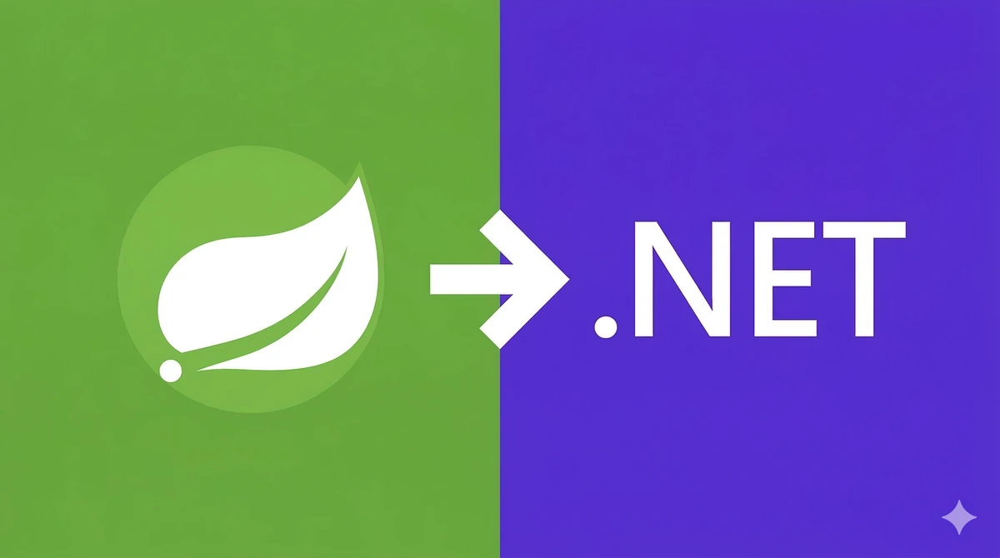
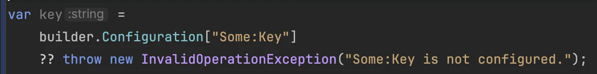
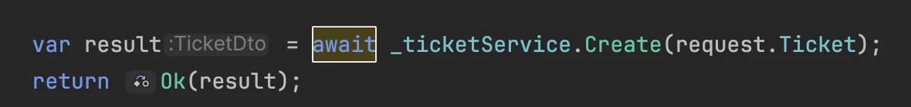
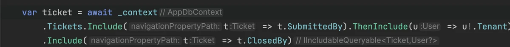
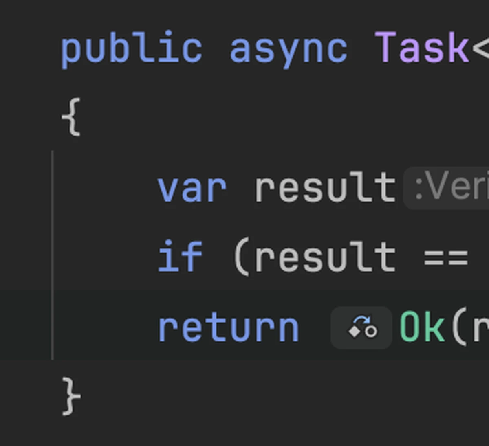
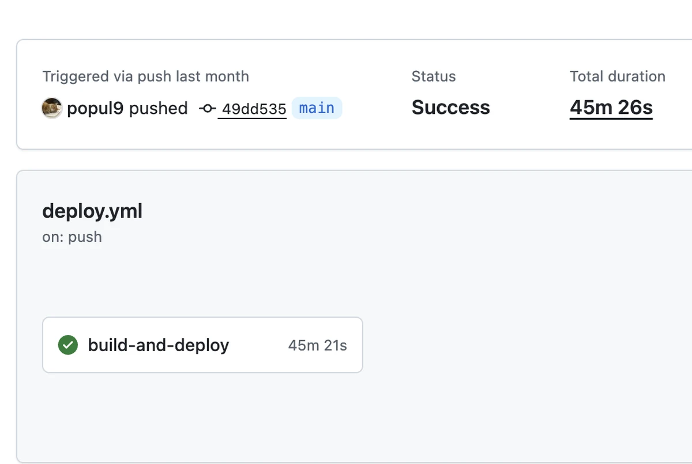
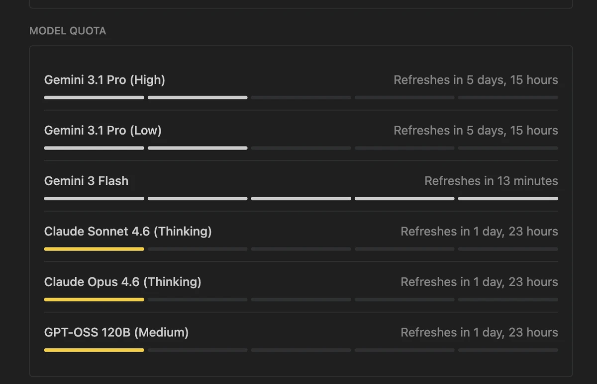
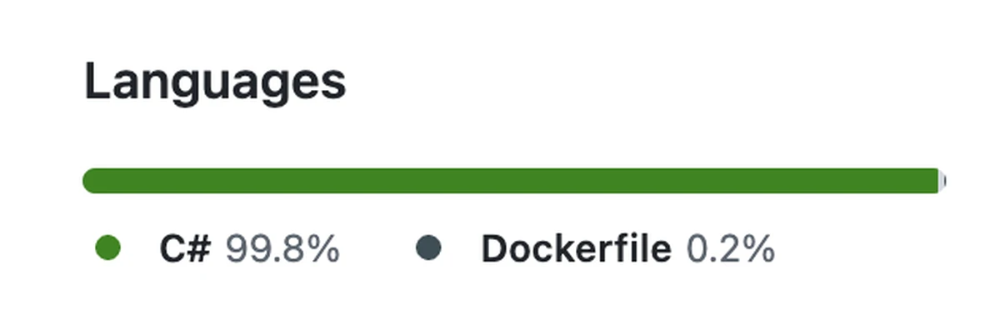
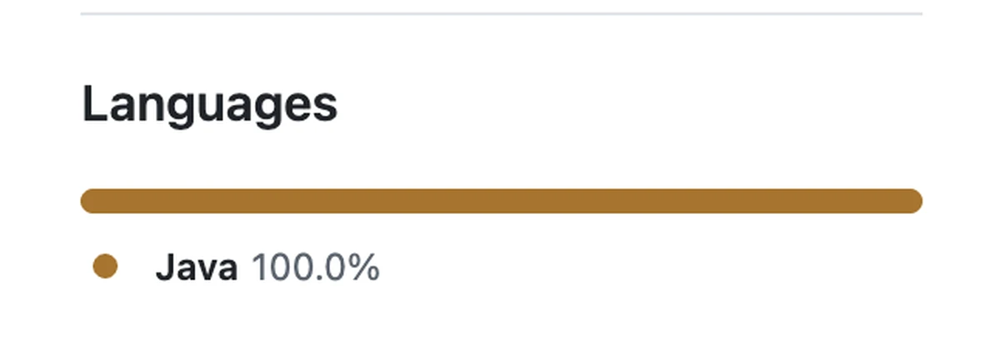

### A Crush?
I've been watching .NET for quite a while now.

- The most popular framework in Australia
- Insanely flexible yet powerful LINQ
- Native AOT compilation that just feels natural
- Runs on a VM like Java, with runtime optimization baked in
- Noticeably lower memory and CPU usage compared to Spring
- And I even knew that its peak performance can actually surpass Java's
- This blog's domain is even (heejun).net
- I'd occasionally ask ChatGPT what C# feels like compared to Java
- I've been attending Adelaide .NET meetups (there's no Spring Boot community in Adelaide.)
- I even know the somewhat shady origin story, how Microsoft created C# as a Java killer and tried to poison the open source world back in the days.

### Things Have Changed.
I've always been a Java guy, but we're living in the age of LLMs now. 
What does it even mean to lack experience in a specific language or framework? Personal projects are meant to be fun, do it if it excites you! 
Last weekend, with my assistant Antigravity, I kicked off migrating SpringBoot anotherhome project to DotNet 10.

### Wait, Is This JavaScript?

`??` throws a null check error?

There's `await`/`async`? 
And apparently C# had both of these first... What are you C#? Turns out you're a pretty wild language.

### The Best Part

It's LINQ, obviously. Unlike Spring Boot where I'd have to click into the repository just to check whether something is lazy-loaded or Join Fetched. 
I can just read it right there in the service layer. Now I actually feel like doing native compilation.

### The Allman Brace Style Though...

Since I'm going to be switching back and forth with Java, this feels a little awkward. I already dislike extra whitespace and indentation, so it's a bit of a bummer. 
That said, by day three today, I'm kinda getting used to it though?

### I'm Excited.
As I mentioned in the previous post on the <a href="https://heejun.net/developer/language-picker/" target="_blank" rel="noopener noreferrer">language picker</a>, I love optimisation (even when the gains are more theoretical than felt). 
My Spring Boot app takes 45 minutes to compile on GitHub with GraalVM.

On top of that, you have to carefully tune the compilation environment. It barely squeaks through with the default memory allocation (just under 8GB), and I had to dial in the parallel core count too.  The worst part is that even after a painful successful compile, it still throws runtime errors all over the place (reflection). 
In short, you have no idea if it'll blow up until you actually run it. Meanwhile, I've heard that .NET handles all of this naturally with AOT native support, honestly, what more could I ask for?

### Shoutout to Antigravity
Knocked out about 90% of the features from Java in just a day or two. (I'm a Pro subscriber) 

Login with Oauth2 works smoothly, basic CRUD is running fine too. 
It's still throwing a ton of small errors, but we will fix them soon.

Burned through the quota of a week.

### .NET Is Sexy.
Apparently it started getting really good since 2019, I'll finish the migration and deployment and report back on what else this thing has to offer. 
Also I am expecting to deploy as a Function without a VM. I'll save that money and put it toward the DB instead.

### Still Though

I haven't fully taken off my Microsoft-tinted glasses just yet. 
Why did GitHub assign Java that muddy brown color and give C# that pretty green? 
(Okay actually it seems to be coffee-colored. lol)