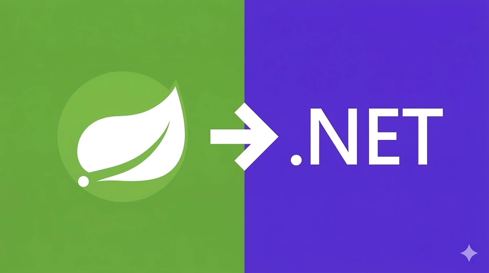
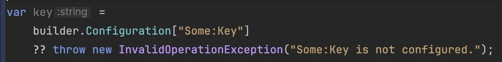
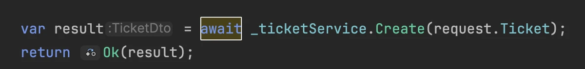
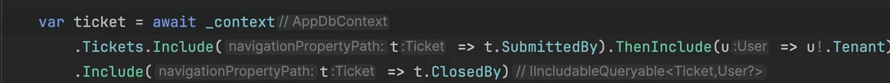
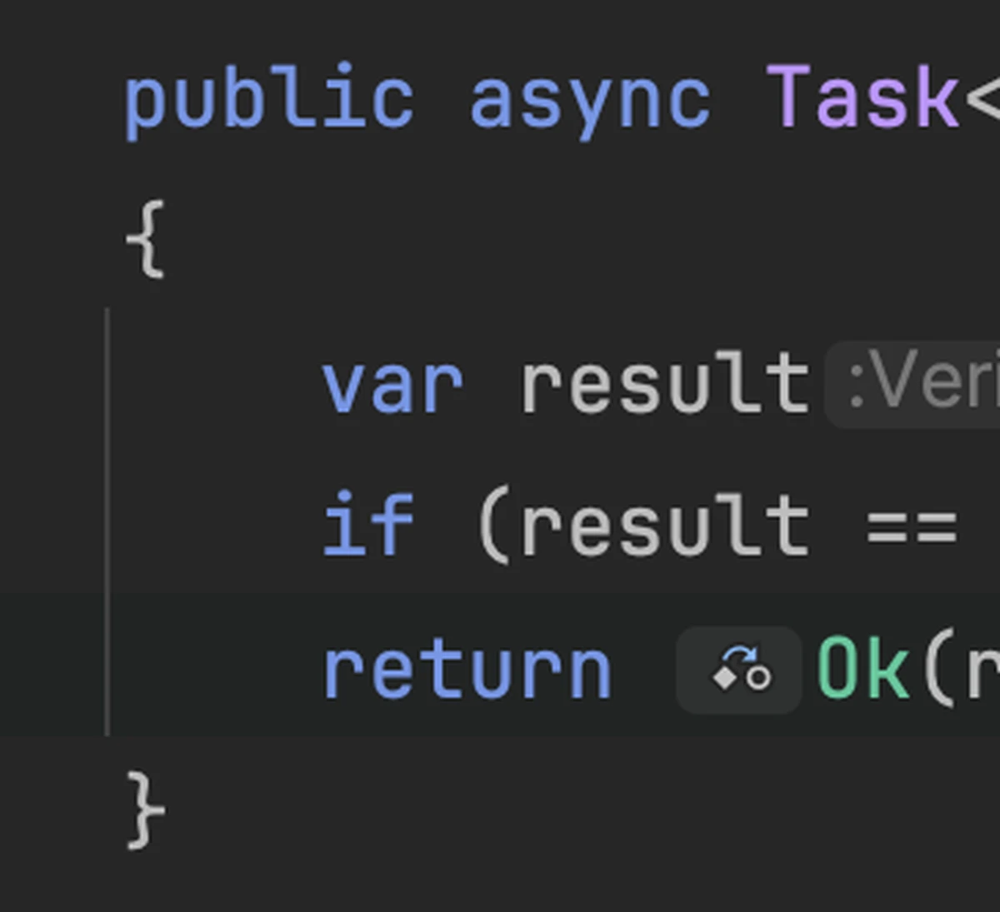
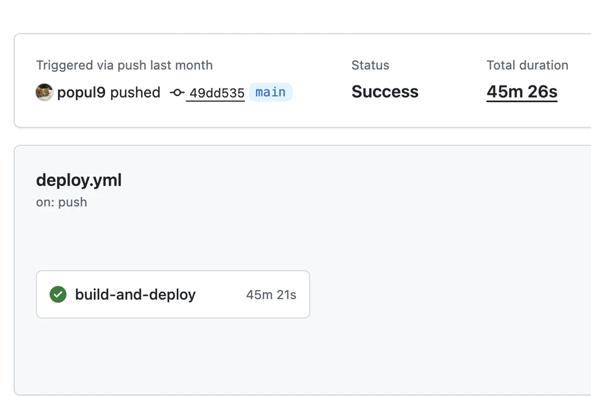
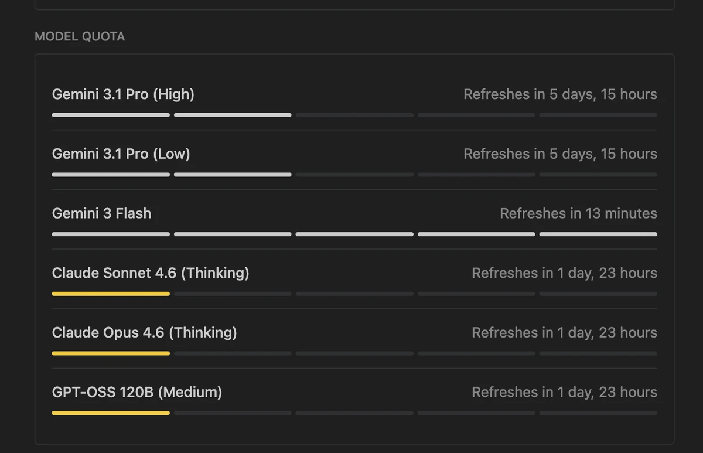
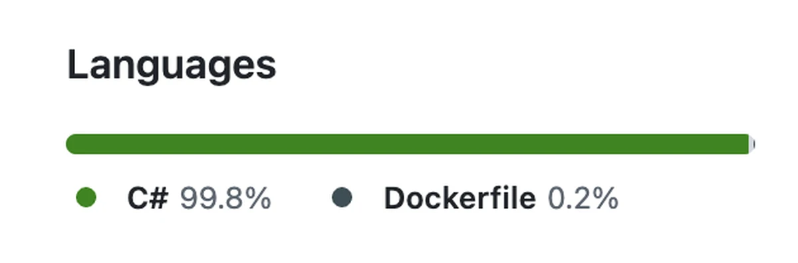
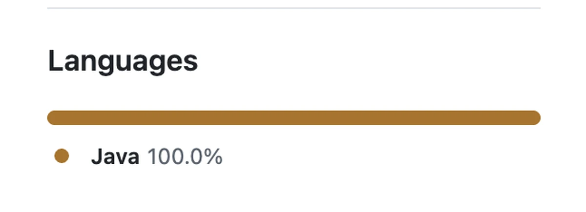

### Yêu.. đơn phương?
Tôi đã dõi theo .NET khá lâu rồi.

- Framework phổ biến nhất ở Úc
- LINQ vừa linh hoạt vừa mạnh mẽ đến điên rồ
- Biên dịch native AOT một cách tự nhiên
- Chạy trên VM giống Java nên có tối ưu lúc runtime
- Sự thật là chiếm bộ nhớ và CPU ít hơn Spring rõ rệt
- Tôi còn biết cả chuyện hiệu năng đỉnh của nó còn cao hơn Java
- Tên miền của cái blog này cũng là heejun dot net
- Thỉnh thoảng tôi còn hỏi ChatGPT xem C# so với Java thì cảm giác thế nào
- Và tham gia cộng đồng .NET ở Adelaide đều đặn (Spring Boot thì không có ở Adelaide)
- Tôi biết cả cái tiểu sử ra đời bẩn thỉu? của nó, hồi Microsoft thả độc vào phe mã nguồn mở và vạch kế hoạch cho nó thành kẻ giết Java

### Tình hình đã đổi khác
Tôi vốn mang căn tính của một lập trình viên Java, nhưng giờ là thời của LLM. 
Chuyện không có kinh nghiệm với một ngôn ngữ hay framework cụ thể thì có gì là ràng buộc chứ? Dự án cá nhân, thấy ngầu thì cứ làm thôi!  
Cuối tuần vừa rồi, cùng với trợ lý của tôi là Antigravity, tôi bắt đầu chuyển ứng dụng backend Anotherhome vốn viết bằng SpringBoot.

### JavaScript đấy à?

Dùng `??` để ném lỗi null check được luôn á?

Có cả `await`/`async` nữa á? 
Mà hóa ra cả hai thứ đó C# có trước.. Cái gì vậy trời.. Hóa ra em là một ngôn ngữ đáng sợ.

### Điểm hay nhất

Vẫn là LINQ. Không phải click vào repository để xem cái này được lazy loading hay Join Fetch như Spring Boot, 
cứ đọc thẳng ở tầng service là xong. Biên dịch native kiểu này mới đã tay.

### Còn xuống dòng kiểu Allman thì ừm..

Vì tôi sẽ qua lại với Java nên cái này hơi gượng. Vốn đã không thích mấy khoảng trắng kiểu indentation rồi nên thấy tiếc.  
Mà hôm nay là ngày thứ ba nhìn lại thì lại thấy ổn đấy chứ?

### Rất đáng mong chờ
Như đã nhắc trong bài trước về <a href="https://heejun.net/ko/developer/language-picker/" target="_blank" rel="noopener noreferrer">bộ chọn ngôn ngữ</a>, tôi thích tối ưu (chuyện có cảm nhận được hay không thì để sau). Spring Boot của tôi biên dịch bằng GraalVM mất tới 45 phút trên GitHub.

Lại còn phải chỉnh cấu hình môi trường biên dịch cho khớp. Phải lọt vào bộ nhớ được cấp (chưa tới 8Gb) một cách sát sàn sạt thì mới biên dịch thành công, rồi còn phải chỉnh số nhân song song cho vừa.  Tệ nhất là dù có biên dịch thành công một cách vất vả thì lúc runtime nó vẫn ném lỗi liên tục (reflection).  
Nói gọn lại, chưa chạy thử thì chưa biết có lỗi hay không. Ngược lại, nghe nói .NET hỗ trợ AOT Native một cách tự nhiên ở tất cả những chỗ đó, còn gì phấn khích hơn nữa? hihi

### Vỗ tay cho Antigravity
Trước mắt thì nó đã chép gần 90 phần trăm toàn bộ chức năng từ Java sang thành công chỉ trong một hai ngày. (đang đăng ký Pro)  

Hiện tại đăng nhập được và CRUD đơn giản chạy không vấn đề gì. 
Tất nhiên là nó ném ra vô số lỗi vặt.

Thế nên tôi dùng hết sạch quota.

### Quyến rũ thật, .NET.
Nghe nói từ năm 2019 nó tốt lên vượt bậc, không biết sắp tới còn bao nhiêu thứ hay ho nữa, để tôi chuyển và triển khai xong rồi sẽ quay lại kể. 
Nghe bảo có thể triển khai dưới dạng Function mà không cần VM.. hay đấy.. Tiền tiết kiệm được tôi sẽ đổ vào DB.

### Dù vậy

Tôi vẫn chưa gỡ hẳn cặp kính màu khi nhìn Microsoft. 
Sao trên GitHub Java lại bị gán màu phân còn C# thì được màu xanh lá đẹp đẽ vậy? 
(thật ra nghe nói màu của Java là màu cà phê haha)
