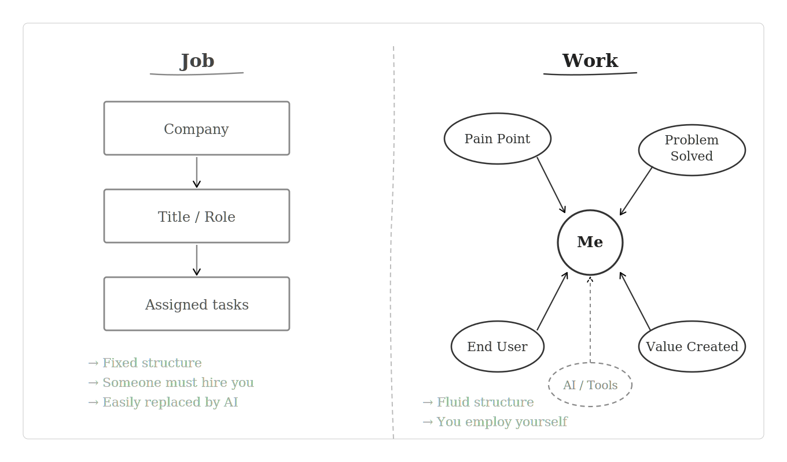
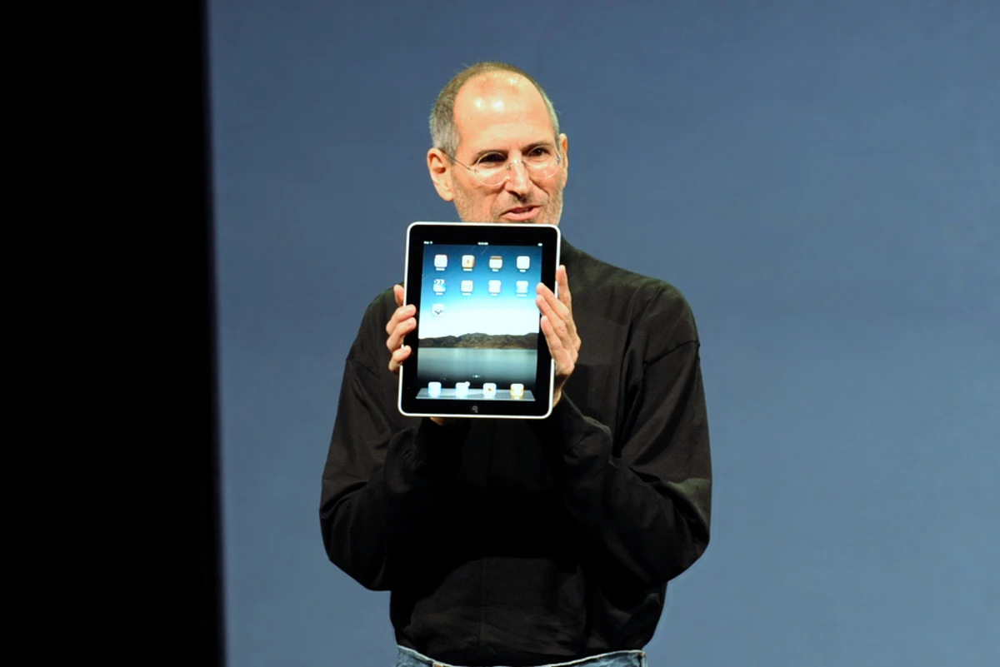

## 我在Tech Walk听到的

昨天，我久违地参加了在阿德莱德博尼顿公园举办的Tech Walk聚会。
这是一个边走边和IT人交流的活动，对初级工程师和学生非常友好（甚至可以带宠物来，哈哈）。
途中突然倾盆大雨，我们差点解散了三次，最终还是走完了全程。

自然而然地，大家聊起了IT就业市场。如今大多数开发者对AI的普遍心态大概是这样的：

1. 因为AI，最近真的很难找到工作。
2. 然而他们又在尝试各种有趣的AI实现，折腾这个语言、那个框架。
3. 开发的乐趣消失了。他们怀念亲手实现算法、用自己的双手敲出代码的感觉。

我理解他们的痛苦。尤其是当我遇到处境相似的朋友，听到他们的故事时。
因为我只是一个运气还不错的初级工程师，蒙一家公司不弃，在毫无实战经验的情况下以学生身份被录用，才得以挂上"开发者"这个头衔。

但每次听到这些故事，我都会想起朴赞郁导演的电影《没有别的选择》，以及李圣民饰演的具范模这个角色。

> "我靠墨水和纸张活了25年。我是工程师！！"
>
> ——《没有别的选择》，具范模（演员 李圣民）

---

## Work的时代，而非Job的时代

时代变了。我们真正进入了一个必须靠自己雇用自己的时代。
自2000年代个人电脑普及以来，风向早已改变。终身职业或终身事业的概念正在消退，人们纷纷说每个人都需要自由职业者的心态。而AI这场洪流，彻底淹没了开发者。真的是从字面意义上，把我们全都卷走了。

所以每次听到同样的故事反复上演，我都忍不住想：寻找Job的时代结束了，寻找Work的时代来临了。

（无论是否受雇，这在职场中同样适用）

作为工程师，我们对手艺的自尊、对AI的恐惧与钦佩，这些都重要。但归根结底，更重要的是：我们在这个世界上发现了什么痛点，又为此做了什么。

对那些热衷于炫耀技术栈的人，我想提几个问题：
- 你究竟解决了什么问题？
- 你说你把LLM + RAG集成进了Web应用并实现了自动化。这真的转化成了连你自己都会认可的最终用户满意度吗？
- 据说AI能帮助做支持聊天机器人。但你有没有在自己真正使用的服务里，被某个聊天机器人真正满足过？
- 你做了一个应用。但是什么驱使你去做它，最初的问题又是什么？
- 最重要的是：在解决问题的过程中，有什么让你感到意外？你觉得有趣吗？如果有，具体是什么点燃了你的好奇心？

当我听到有人跳过所有这些，直接聊用了什么AI、某个框架怎么运作，我不禁想问：究竟是什么在驱动这个人？

一切真的变了。开发者的时代结束了，产品设计师的时代来临了。

---

## 第一代iPad给我们的启示

如果我说的还没能引起共鸣，让我再举一个简单的例子。

史蒂夫·乔布斯于2010年发布了第一代iPad。

<small>
  图片来源：<a href="https://www.flickr.com/photos/40134069@N07/4310699758" target="_blank">matt buchanan</a>，
  <a href="https://creativecommons.org/licenses/by/2.0" target="_blank">CC BY 2.0</a>，
  via <a href="https://commons.wikimedia.org/wiki/File:Steve_Jobs_with_the_Apple_iPad_no_logo.jpg" target="_blank">Wikimedia Commons</a>
</small>

与第二代相比，第一代iPad是一款相当粗糙的硬件。如果你是苹果内部一位骄傲的资深工程师，看到它大概会气得发狂。

|  | iPad 第一代 | iPad 第二代 |
|------|:------------:|:------------:|
| 摄像头 | 无 | 前后双摄 |
| 内存 | 256MB | 512MB |
| 厚度 | 1.3cm | 0.88cm |
| 重量 | 680g | 601g |
| 处理器 | Apple A4 | Apple A5（CPU最高2倍，GPU最高9倍性能）|
| 最高支持iOS | iOS 5 | iOS 9 |

如果再推迟一年发布，或者多卖几百美元，用来增加内存、换更薄的电池、加上摄像头，本可以做出一款完成度更高的设备，让人舒舒服服用上整整五年。
而现实是，这款设备因内存限制，只额外获得了约一年的iOS更新支持，止步于iOS 5。

然而，史蒂夫·乔布斯将市场预期的999美元售价直接腰斩，以499美元发布。

苹果得以迅速塑造平板电脑市场，仅仅一年后便推出了杰作：iPad 2，更薄、更轻、更快，终于配备了前后摄像头。那款设备拥有出色的可用性、扎实的性能，iOS更新一路支持到iOS 9，堪称一代传奇。

史蒂夫·乔布斯曾亲历失败：一款工程上无懈可击却定价过高、错失发布窗口的产品。如果无法以亲民的价格迅速占领消费市场，就根本不会有下一次机会。

硅谷大多数成功公司都遵循这一公式。如今的硅谷公司是无可争议的软件开发领军者，但他们的DNA可以追溯到理查德·加布里埃尔（MIT培养的软件哲学家）的*Worse is Better*哲学。

硅谷公司近来将海量AI tokens倾入近乎黑盒的事物，看似鲁莽，但归根结底，这正是刻在他们DNA里的东西。
没有时间去担忧技术的美感或多年后的可扩展性。只需通过消费者的眼睛，解决此刻真实存在的问题。
因为做到这一点，你才能赢得机会，一步一步构建出更好、更优雅的产品。

---

**不要造一个完美的产品。造一个会坏的产品。**
不断质疑它，认真思考它可能在哪里失败，然后造出一个你真正能够为之站台的东西。