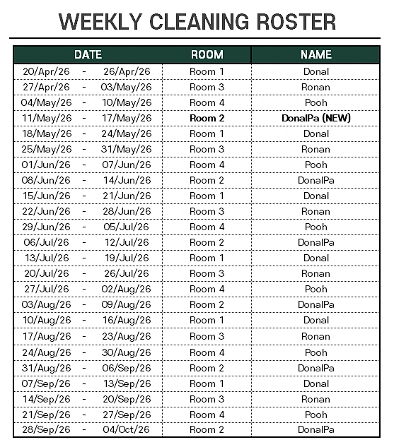
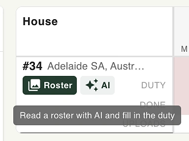

개발 아이디어를 따라가다 보면 정신없이 구현에 집중하느라 공유할 시간이 없다 😅. 
최근 들어 AI와 관련해서 나의 재미있는 고뇌(?)는 똑똑한 모델에 대한 딜레마다.

## 청소 로스터, 그리고 Opus와의 사흘
공용구역 청소 로스터 기반 청소기록 관리 시스템을 구현했는데, 이게 워낙 복잡한 조건이고 여러 케이스가 파생되는지라 어떻게 하면 최대한 쉽게 구현할지가 중요한 task였다. 
그래서 내가 접근할 수 있는 가장 좋은 모델, Opus 5를 가져와서 내 생각의 흐름을 설명하니 아주 유창하고 자신 있게 하나하나씩 문제 해결에 필요한 쟁점들을 풀어 설명하는 게 아닌가? 
그렇게 삼일을 이 학술적인 설명을 이해하는 데 소비했다 😓. 정확히는 삼일 동안 작업하면서, 직접 부딪히며 제안된 아키텍처를 이해하며 구현을 완료했다. 
근데 이해하고 보니까 단순한 AI API 호출 하나를 구현하기 위해 지나치게 많은 아키텍처를 내 시스템에 accommodate해야 하는 오버헤드가 나는 싫었다. 
그래서 다시 삼일 동안 내가 필요 없는 기능들을 모두 strip하는 데 썼다. 결과적으로 코드를 생성하는 데 많은 양의 토큰을 쓰고, 다시 지우는 데도 많은 양의 토큰(그리고 무엇보다 금쪽같은 시간!!)을 소비했다.
그러고 나서도 나의 모델 선택은 왠만하면 Opus였다. budget이 있는데 왜 굳이 Sonnet을 써야 하는지?

## 근데…
일주일 동안 이 야생마, Opus를 다루는데 실패했다. 매 명령어마다 제발 쉽게 설명을 좀 풀어서 해달라고 애원했다. 
아니, 때로는 제발 똑똑한 척 뽐내며 잘난 체하듯 설명하지 말라고 딱 잘라서도 말해봤다. 어쨌든 문제를 지나치게 깊게 파고 들어간다.

## 이게 내가 원한 게 맞아?
세상에 복잡한 문제란 존재한다. 그럼 복잡한 아키텍처가 필요한지는 두 번째 문제다. 
나는 심플한 사람이다. 나는 코드를 복잡하게 쓰면 나중에 쉬운 방식으로 고칠 수 있지만, 아키텍처는 다르다. 아키텍처를 복잡하게 구조적으로 먼저 밀어넣어버리면 그 후 파생되는 모든 구현은 복잡해진다.

정확히는, 닷넷 백엔드에서 AI에게 API call을 보내고 그 결과를 유저에게 확인받는 기능이었는데, 여기에 온갖 기술적인 장치들을 accommodate해야 했다. 
서버가 페일하면 어떻게 복구할지, 상태는 DB에 어떻게 저장할지, 완료되면 이벤트는 어떻게 자동으로 트리거할지.. 등등. 한마디로 너무 지나치게 알아서 다 딸깍 해결해주는 기능을 구현하려고 한 거다. 
(다른 말로는, 알아서 다 해주려다가 정작 유저는 지금 무슨 일이 일어나는지도 모르는 시스템이 되어버린 거다.)

근데 나는 worse is better파다. 내부 구현이 투명하게 드러나는 쪽을 선호한다. 유저에게 지금 무슨 일이 일어나는지 명확한 시그널을 전달해야 하니까. 
그래서 async는 프론트엔드에서 훅으로 받아서 처리하기로 했다. (페이지를 새로고침하면 날아가긴 하지만.) 그래도 이렇게 하면 백엔드는 기존 REST API 동기 방식 그대로 아주 심플하게 유지되고, 무엇보다 유저에게 이게 어떻게 작동하는지 명확하게 설명할 수 있게 됐다. 
그리고 이런 비동기 처리는 가능하면 프론트엔드에서 구현해서 빠르게 만들어보는 쪽으로 방향을 잡았다.

<svg viewBox="0 0 700 460" style="width:100%;height:auto;display:block;font-family:Atkinson, sans-serif;">
  <defs>
    <marker id="arrowBlue" viewBox="0 0 10 10" refX="8" refY="5" markerWidth="6" markerHeight="6" orient="auto">
      <path d="M0,0L10,5L0,10z" fill="#2337FF" />
    </marker>
  </defs>

  <rect x="10" y="40" width="300" height="390" rx="16" fill="#E5E9F0" stroke="#D7DCE6" stroke-width="1.5" />
  <text x="160" y="68" text-anchor="middle" font-size="15" font-weight="700" fill="#0F1219">Opus의 제안 (3일)</text>
  <text x="160" y="88" text-anchor="middle" font-size="11" fill="#60739F">AI 콜 → 확인까지 전부 자동화</text>

  <g stroke="#B7BFD6" stroke-width="1.3">
    <line x1="160" y1="140" x2="251" y2="193" />
    <line x1="251" y1="193" x2="251" y2="298" />
    <line x1="251" y1="298" x2="160" y2="350" />
    <line x1="160" y1="350" x2="69" y2="298" />
    <line x1="69" y1="298" x2="69" y2="193" />
    <line x1="69" y1="193" x2="160" y2="140" />
    <line x1="160" y1="245" x2="160" y2="140" />
    <line x1="160" y1="245" x2="251" y2="193" />
    <line x1="160" y1="245" x2="251" y2="298" />
    <line x1="160" y1="245" x2="160" y2="350" />
    <line x1="160" y1="245" x2="69" y2="298" />
    <line x1="160" y1="245" x2="69" y2="193" />
  </g>

  <g font-size="11" fill="#0F1219" text-anchor="middle">
    <rect x="112" y="123" width="96" height="34" rx="7" fill="#FFFFFF" stroke="#8A93AD" stroke-width="1.2" />
    <text x="160" y="144">웹훅 리스너</text>

    <rect x="203" y="176" width="96" height="34" rx="7" fill="#FFFFFF" stroke="#8A93AD" stroke-width="1.2" />
    <text x="251" y="197">이벤트 버스</text>

    <rect x="203" y="281" width="96" height="34" rx="7" fill="#FFFFFF" stroke="#8A93AD" stroke-width="1.2" />
    <text x="251" y="302">재시도 핸들러</text>

    <rect x="112" y="333" width="96" height="34" rx="7" fill="#FFFFFF" stroke="#8A93AD" stroke-width="1.2" />
    <text x="160" y="354">상태 머신 (DB)</text>

    <rect x="21" y="281" width="96" height="34" rx="7" fill="#FFFFFF" stroke="#8A93AD" stroke-width="1.2" />
    <text x="69" y="302">AI API 콜</text>

    <rect x="21" y="176" width="96" height="34" rx="7" fill="#FFFFFF" stroke="#8A93AD" stroke-width="1.2" />
    <text x="69" y="197">완료 트리거</text>

    <rect x="110" y="228" width="100" height="34" rx="7" fill="#DCE1F5" stroke="#2337FF" stroke-width="1.4" />
    <text x="160" y="249">오케스트레이터</text>
  </g>

  <text x="160" y="410" text-anchor="middle" font-size="10.5" fill="#60739F" font-style="italic">유저 입장: 지금 뭐가 일어나는지 모름</text>

  <line x1="316" y1="245" x2="384" y2="245" stroke="#2337FF" stroke-width="2.5" marker-end="url(#arrowBlue)" />
  <text x="350" y="228" text-anchor="middle" font-size="11" font-weight="700" fill="#0F1219">3일 걸려 스트립</text>
  <text x="350" y="270" text-anchor="middle" font-size="10" fill="#60739F">토큰 태우고, 시간도 태우고</text>

  <rect x="390" y="40" width="300" height="390" rx="16" fill="#E5E9F0" stroke="#D7DCE6" stroke-width="1.5" />
  <text x="540" y="68" text-anchor="middle" font-size="15" font-weight="700" fill="#0F1219">프론트엔드 훅 + 동기 REST</text>
  <text x="540" y="88" text-anchor="middle" font-size="11" fill="#60739F">유저가 항상 지금 상태를 앎</text>

  <line x1="540" y1="170" x2="540" y2="210" stroke="#2337FF" stroke-width="2" marker-end="url(#arrowBlue)" />
  <line x1="540" y1="250" x2="540" y2="290" stroke="#2337FF" stroke-width="2" marker-end="url(#arrowBlue)" />

  <rect x="475" y="130" width="130" height="40" rx="8" fill="#FFFFFF" stroke="#2337FF" stroke-width="1.6" />
  <text x="540" y="154" text-anchor="middle" font-size="12" fill="#0F1219">프론트엔드 훅</text>

  <rect x="475" y="210" width="130" height="40" rx="8" fill="#FFFFFF" stroke="#2337FF" stroke-width="1.6" />
  <text x="540" y="234" text-anchor="middle" font-size="12" fill="#0F1219">REST API (동기)</text>

  <rect x="475" y="290" width="130" height="40" rx="8" fill="#FFFFFF" stroke="#2337FF" stroke-width="1.6" />
  <text x="540" y="310" text-anchor="middle" font-size="11" fill="#0F1219">AI 응답</text>
  <text x="540" y="323" text-anchor="middle" font-size="11" fill="#0F1219">→ 화면에 바로</text>

  <text x="540" y="380" text-anchor="middle" font-size="10.5" fill="#60739F" font-style="italic">새로고침하면 날아감. 근데 그게 낫다.</text>
</svg>

*왼쪽이 Opus가 제안한, 유저 몰래 알아서 다 처리해주는 백엔드 오케스트레이션. 오른쪽이 실제로 택한, 프론트엔드 훅 기반의 투명한 동기 처리, worse is better.*

그래서 내가 언제 코드를 리뷰해도, 문제가 생긴 부분을 빠르게 진단하고 필요할 때 내가 빠르게 파악할 수 있었으면 좋겠다. 
한마디로 Sonnet, 약간 멍청한 모델을 의도적으로 아키텍처 디자인을 한다는 소리다. 단, 디버깅은 Opus로 한다 (이 야생마는 엣지 케이스를 탐험해낼 때는 미친 듯한 추리력을 가진다. 무섭다 😬).

참고로 이 이론이 재밌게 느껴진다면 어떻게 "스마트"한 기능들을 직접 버림으로써 실패없는 제트기 시스템을 구현했는지 설명하는 다음 영상을 강추한다 :)

  <iframe 
    src="https://www.youtube.com/embed/Gv4sDL9Ljww"
    style="position:absolute;top:0;left:0;width:100%;height:100%;"
    frameborder="0"
    allowfullscreen>
  </iframe>

  

## 그래서 뭘 했다는거임?
그중 그동안 작업해온 기능들을 소개해본다 :)

### 1. 청소 로스터 기능

두 개의 레이어로 나뉜다. 그 주의 청소 당번, 그리고 청소를 실제로 실시한 사람이 매 주, 매 하우스마다 표기된다. 청소 당번을 테넌트들끼리 바꿔도 자연스럽게 표에서 확인이 된다 :)

테넌트 쪽에서 보는 화면은 이렇다. 그 주 로스터, 청소 가이드, 사진 업로드가 한 페이지에 다 있다.

### 2. 청소 로스터 자동 읽기 기능
지금 청소 로스터는 이미지 기반이다. 원본은 이런 식으로 생긴 표다.

이 버튼 하나만 누르면 셀에 자동으로 읽어와준다. LLM이 매우 잘하는 이미지 파싱 -> 정형화된 데이터 저장 전략이다.

### 3. 청소 안 한 사람 누구?

그럼 관리자 입장에서는 청소 안 한 사람이 주 단위로 모두 한 번에 표기된다. 이메일도 한번에 뽑을 수 있음.

### 4. 인라인 노트 (Control + .)

그리고 이제 내부 노트를 구현해서 어드민 유저는 Control + .만 누르면 항상 지금 작업 영역에 있는 데이터에 대한 코멘트를 직접 체크해볼 수 있다. 매우 flexible한 구현 방식으로 아무 노트나 빠르게 연관된 노트들을 노드를 활용해서 불러올 수 있는 기능인데(개발자로서 이 다이나믹한 연결 고리를 저장할 수 있게 처리하는 걸 매우 재밌게 했지만) 유저 입장에서는 직접 노트를 관리해주는 게 오버헤드인 듯하다. 일단 추가 기능 구현은 보류. 
후에 AI가 어시스턴트 역할을 이 영역에서 구현해볼까 싶은데 일단 넘긴다. 마법같이 알아서 작동되는 기능은 아니기에 그런 듯.

그리고 이것저것 작은 기능들 구현하는 대로 업로드해보겠다 :)
