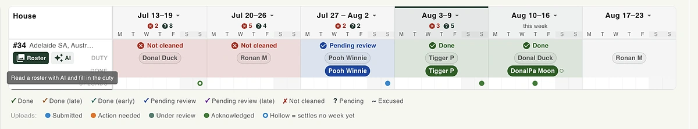
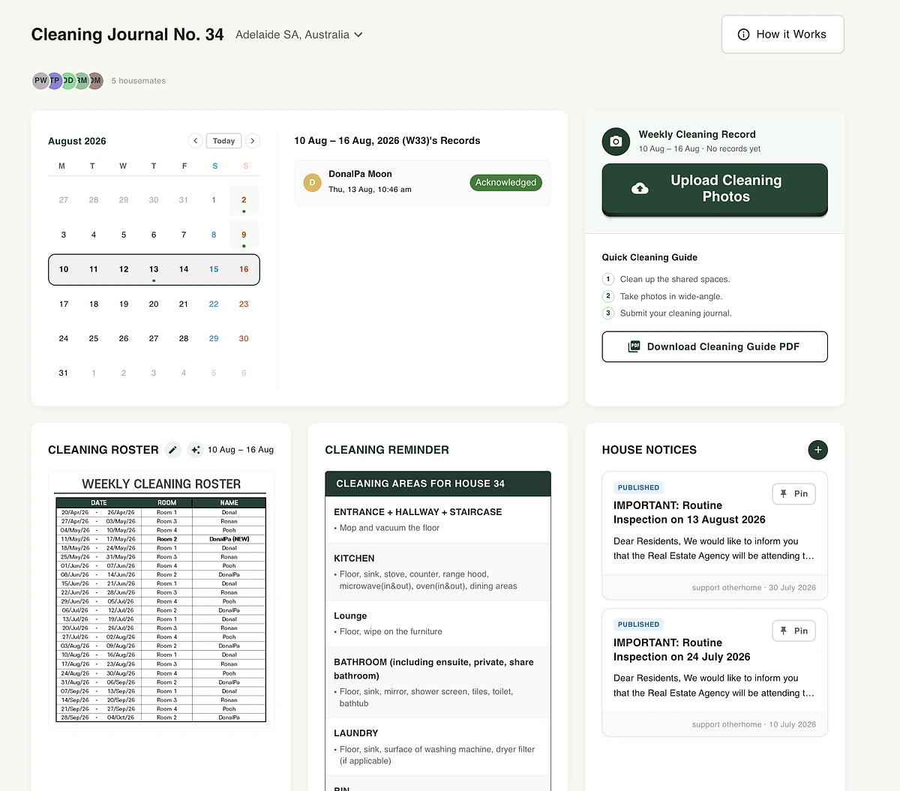
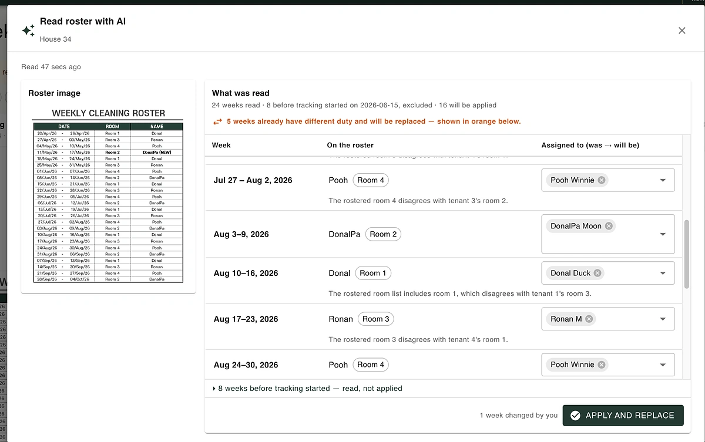
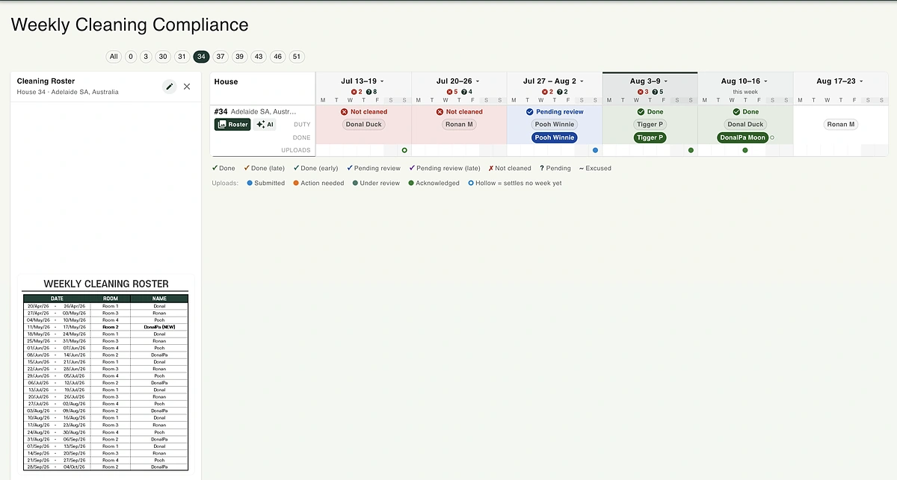
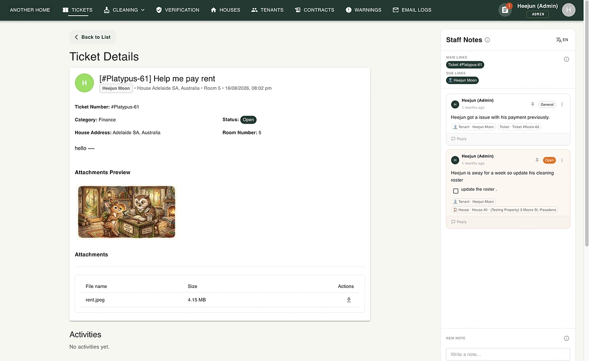

import rosterSourceImage from './roster-source-image.webp';
import aiReadButton from './ai-read-button.webp';

追着开发想法跑的时候，总是一头扎进 implement 里，根本没时间分享 😅。
最近关于 AI，我觉得挺有意思（？）的烦恼，就是这个聪明模型的两难。

## 清洁排班表，和跟 Opus 相处的三天
我做了一个基于清洁排班表（cleaning roster）的管理系统，条件复杂到离谱，真正的 task 其实是怎么用最简单的方式把它实现出来。
于是我把我能用到的最好的模型 Opus 5 请出来，跟它讲了我的思路，结果它把要解决的每个问题都流畅又自信地一个个拆解出来，这谁能不信？
就这样，我花了整整三天去理解这套学术级的讲解 😓。准确地说，这三天是我边动手边碰壁，实际把它提出的架构理解并实现完成的。
但理解完之后，我特别不喜欢那种为了实现一个简单的 AI API 请求功能，就要在系统里 accommodate 这么庞大架构的开销。
于是我又花了三天，把所有不需要的功能全部 strip 掉。结果生成代码烧了一大堆 token，再删掉又烧了一大堆 token（最重要的是时间，比金子还宝贵！！）。

即便如此，我选模型基本上还是 Opus。都有 budget 了，何必用 Sonnet？

## 但是……
一整个星期，我都没能驯服 Opus 这匹野马。每条指令我都在求它，拜托解释得简单一点。
不，有时候我甚至直接撂话，让它别再故作聪明、卖弄一样地解释。但不管怎样，它还是复杂。不管怎样，它还是要深挖问题。

## 这真的是我想要的吗？
世上确实存在复杂的问题，这没错。但需不需要复杂的架构，是另一回事。
我是个喜欢简单的人。代码写得乱一点，之后还能回来用简单的方式改掉；但架构不一样。一旦在架构层面先把复杂的结构塞进去，后续所有基于它的实现都会跟着复杂起来。

具体来说，这个功能是从 .NET 后端向 AI 发一个 API call，再让用户确认结果，但为此得 accommodate 各种各样的技术装置。
服务器挂了怎么恢复，状态怎么存进 DB，完成后怎么自动触发事件……等等等等。说白了，就是想做一个"啪嗒"一下、什么都自动帮你搞定的过度功能。
（换句话说，想什么都自动帮你处理，结果反而变成了一个连用户自己都不知道现在发生了什么的系统。）

但我是 worse is better 派的，更喜欢内部实现透明可见的方式。因为必须给用户传达清晰的信号，让他们知道现在在发生什么。
所以我决定把异步部分交给前端的 hook 来处理（虽然一刷新页面就没了）。但这样一来，后端能保持原来同步的 REST API，非常简单，更重要的是，我能给用户讲清楚它到底是怎么运作的。
往后这类异步处理，我也打算尽量放在前端实现，先快速做出来再说。

<svg viewBox="0 0 700 460" style="width:100%;height:auto;display:block;font-family:Atkinson, sans-serif;">
  <defs>
    <marker id="arrowBlue" viewBox="0 0 10 10" refX="8" refY="5" markerWidth="6" markerHeight="6" orient="auto">
      <path d="M0,0L10,5L0,10z" fill="#2337FF" />
    </marker>
  </defs>

  <rect x="10" y="40" width="300" height="390" rx="16" fill="#E5E9F0" stroke="#D7DCE6" stroke-width="1.5" />
  <text x="160" y="68" text-anchor="middle" font-size="15" font-weight="700" fill="#0F1219">Opus 的方案（3 天）</text>
  <text x="160" y="88" text-anchor="middle" font-size="11" fill="#60739F">全自动：AI 调用 → 确认</text>

  <g stroke="#B7BFD6" stroke-width="1.3">
    <line x1="160" y1="140" x2="251" y2="193" />
    <line x1="251" y1="193" x2="251" y2="298" />
    <line x1="251" y1="298" x2="160" y2="350" />
    <line x1="160" y1="350" x2="69" y2="298" />
    <line x1="69" y1="298" x2="69" y2="193" />
    <line x1="69" y1="193" x2="160" y2="140" />
    <line x1="160" y1="245" x2="160" y2="140" />
    <line x1="160" y1="245" x2="251" y2="193" />
    <line x1="160" y1="245" x2="251" y2="298" />
    <line x1="160" y1="245" x2="160" y2="350" />
    <line x1="160" y1="245" x2="69" y2="298" />
    <line x1="160" y1="245" x2="69" y2="193" />
  </g>

  <g font-size="11" fill="#0F1219" text-anchor="middle">
    <rect x="112" y="123" width="96" height="34" rx="7" fill="#FFFFFF" stroke="#8A93AD" stroke-width="1.2" />
    <text x="160" y="144">Webhook 监听器</text>

    <rect x="203" y="176" width="96" height="34" rx="7" fill="#FFFFFF" stroke="#8A93AD" stroke-width="1.2" />
    <text x="251" y="197">事件总线</text>

    <rect x="203" y="281" width="96" height="34" rx="7" fill="#FFFFFF" stroke="#8A93AD" stroke-width="1.2" />
    <text x="251" y="302">重试处理器</text>

    <rect x="112" y="333" width="96" height="34" rx="7" fill="#FFFFFF" stroke="#8A93AD" stroke-width="1.2" />
    <text x="160" y="354">状态机（DB）</text>

    <rect x="21" y="281" width="96" height="34" rx="7" fill="#FFFFFF" stroke="#8A93AD" stroke-width="1.2" />
    <text x="69" y="302">AI API 调用</text>

    <rect x="21" y="176" width="96" height="34" rx="7" fill="#FFFFFF" stroke="#8A93AD" stroke-width="1.2" />
    <text x="69" y="197">完成触发器</text>

    <rect x="110" y="228" width="100" height="34" rx="7" fill="#DCE1F5" stroke="#2337FF" stroke-width="1.4" />
    <text x="160" y="249">编排器</text>
  </g>

  <text x="160" y="410" text-anchor="middle" font-size="10.5" fill="#60739F" font-style="italic">用户视角：不知道现在发生了什么</text>

  <line x1="316" y1="245" x2="384" y2="245" stroke="#2337FF" stroke-width="2.5" marker-end="url(#arrowBlue)" />
  <text x="350" y="228" text-anchor="middle" font-size="11" font-weight="700" fill="#0F1219">花 3 天砍掉</text>
  <text x="350" y="270" text-anchor="middle" font-size="10" fill="#60739F">烧 token，也烧时间</text>

  <rect x="390" y="40" width="300" height="390" rx="16" fill="#E5E9F0" stroke="#D7DCE6" stroke-width="1.5" />
  <text x="540" y="68" text-anchor="middle" font-size="15" font-weight="700" fill="#0F1219">前端 Hook + 同步 REST</text>
  <text x="540" y="88" text-anchor="middle" font-size="11" fill="#60739F">用户始终知道当前状态</text>

  <line x1="540" y1="170" x2="540" y2="210" stroke="#2337FF" stroke-width="2" marker-end="url(#arrowBlue)" />
  <line x1="540" y1="250" x2="540" y2="290" stroke="#2337FF" stroke-width="2" marker-end="url(#arrowBlue)" />

  <rect x="475" y="130" width="130" height="40" rx="8" fill="#FFFFFF" stroke="#2337FF" stroke-width="1.6" />
  <text x="540" y="154" text-anchor="middle" font-size="12" fill="#0F1219">前端 Hook</text>

  <rect x="475" y="210" width="130" height="40" rx="8" fill="#FFFFFF" stroke="#2337FF" stroke-width="1.6" />
  <text x="540" y="234" text-anchor="middle" font-size="12" fill="#0F1219">REST API（同步）</text>

  <rect x="475" y="290" width="130" height="40" rx="8" fill="#FFFFFF" stroke="#2337FF" stroke-width="1.6" />
  <text x="540" y="310" text-anchor="middle" font-size="11" fill="#0F1219">AI 响应</text>
  <text x="540" y="323" text-anchor="middle" font-size="11" fill="#0F1219">→ 直接显示在画面上</text>

  <text x="540" y="380" text-anchor="middle" font-size="10.5" fill="#60739F" font-style="italic">刷新就没了。但这样反而更好。</text>
</svg>

*左边是 Opus 提出的方案——背着用户把一切都自动处理好的后端编排。右边是我实际采用的——基于前端 Hook 的透明同步处理，worse is better。*

所以，不管我什么时候回来review代码，都希望自己能快速诊断出问题所在，需要的时候也能马上搞明白。
说白了，就是用 Sonnet 来做架构设计，但 debug 还是用 Opus（这匹野马一旦去探索 edge case，那推理能力简直疯狂，挺吓人的 😬）。

说白了，至少在系统设计这件事上，我开始故意选一个稍微"笨"一点的模型。顺便说一句，如果你觉得这个说法挺有意思，强烈推荐下面这个视频，讲的是如何通过直接舍弃"聪明"的功能，做出一套零故障的喷气式飞机系统 :)

  <iframe 
    src="https://www.youtube.com/embed/Gv4sDL9Ljww"
    style="position:absolute;top:0;left:0;width:100%;height:100%;"
    frameborder="0"
    allowfullscreen>
  </iframe>

  

## 那到底做了什么？
接下来介绍一下这段时间做的功能 :)

### 1. 清洁排班表功能

分成两层：当周负责清洁的人，以及实际完成清洁的人，按周、按房子分别标注。就算租客之间自己换了值日，表格也能自然地反映出来 :)

这是租客那边看到的画面。当周排班、清洁指南、照片上传都在同一个页面里。

### 2. 清洁排班表自动读取功能
现在的清洁排班表是基于图片的。原始表格长这样。

  
  

只要按下这一个按钮，就会自动把内容读进各个单元格。这是一个图片解析 -> 存成结构化数据的策略，正好是 LLM 非常擅长的事。

### 3. 谁没打扫？

从管理员的角度看，没打扫的人会按周汇总，一次性全部标出来 :) 还能导出邮件列表。

### 4. 内联笔记（Control + .）

另外我还实现了内部笔记功能，管理员只要按 Control + . ，就能随时查看当前工作区域数据相关的评论。这是一个非常 flexible 的实现方式，可以通过节点快速调取任意相关的笔记（作为开发者，能实现这种保存动态关联的机制让我挺享受的），但站在用户的角度，自己动手管理笔记似乎反而成了负担。所以这部分功能的后续开发先搁置了。
以后也许会考虑在这块让 AI 扮演助手的角色，但暂时先跳过。大概是因为这不是那种能像魔法一样自己运作的功能。

之后做完各种小功能，也会陆续发上来 :)
