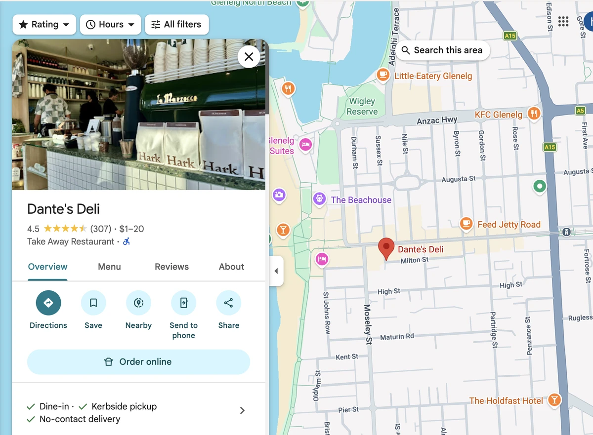
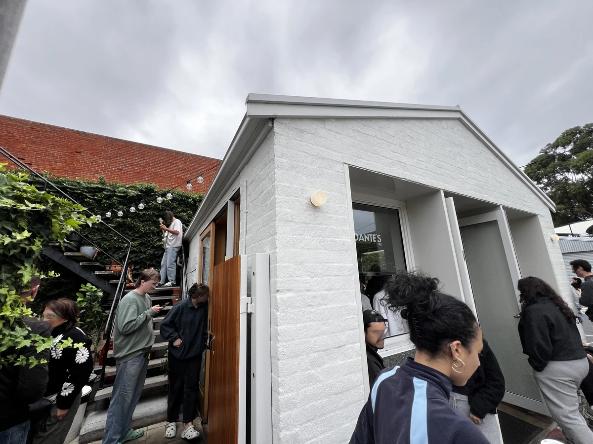
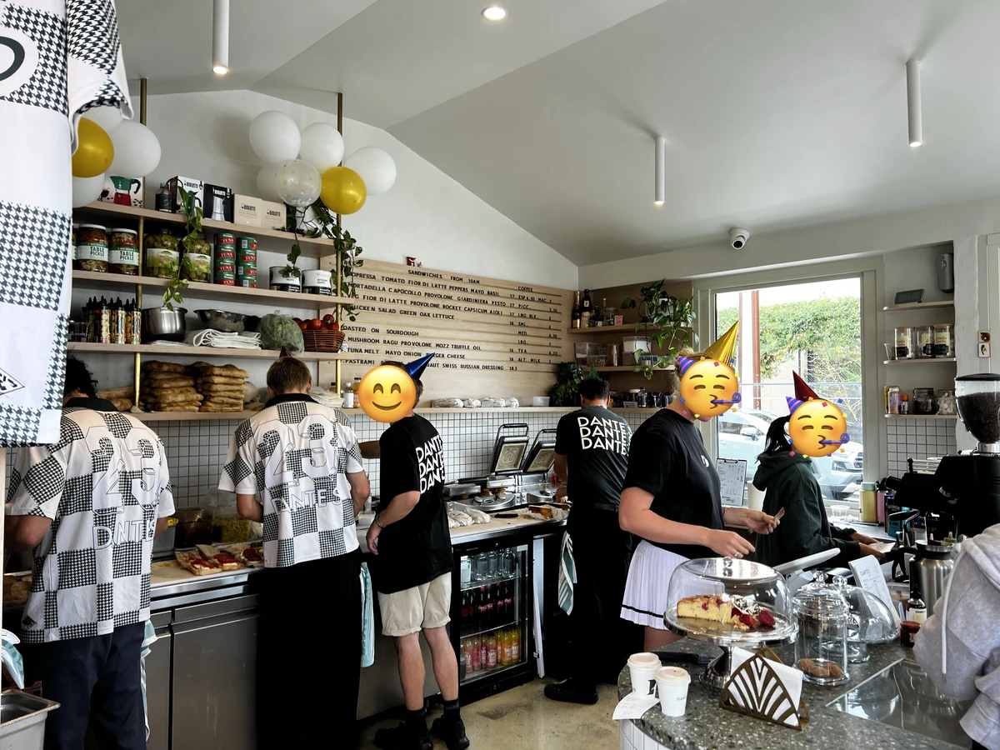
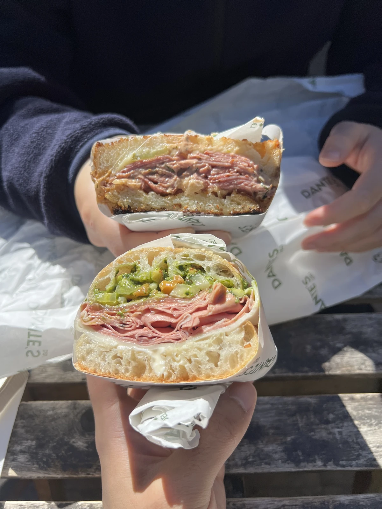
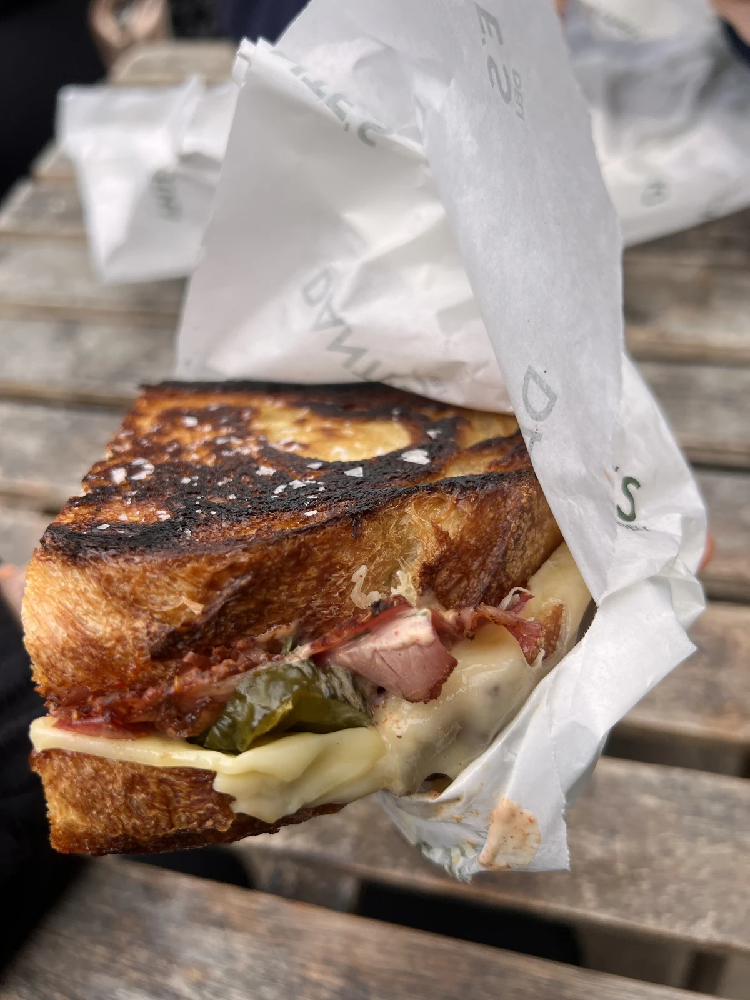
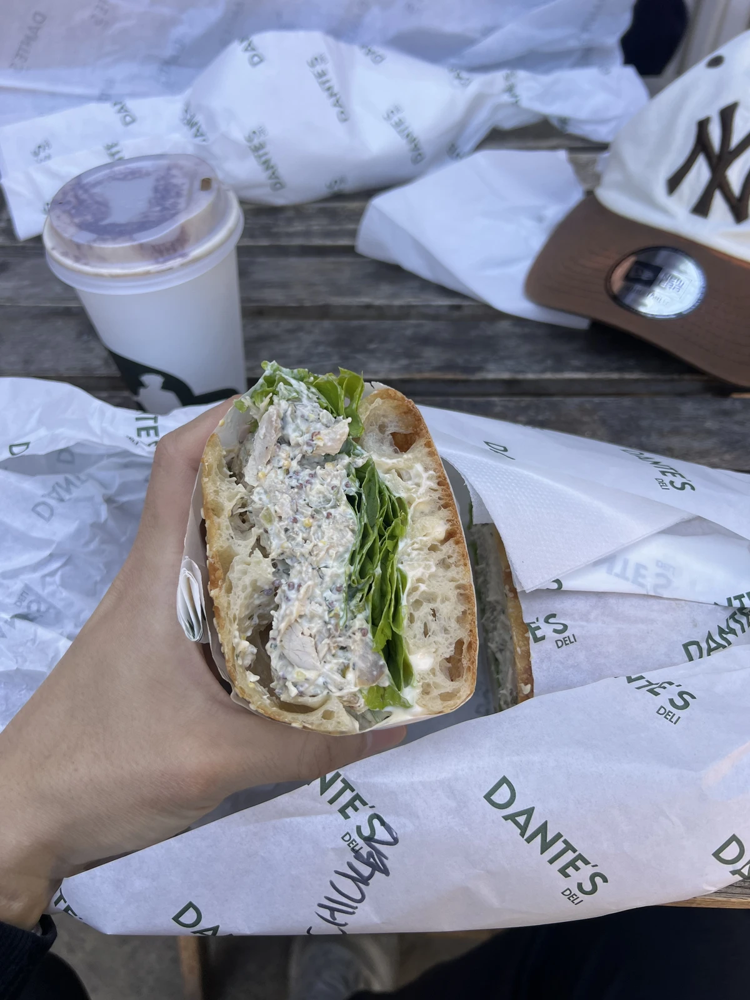
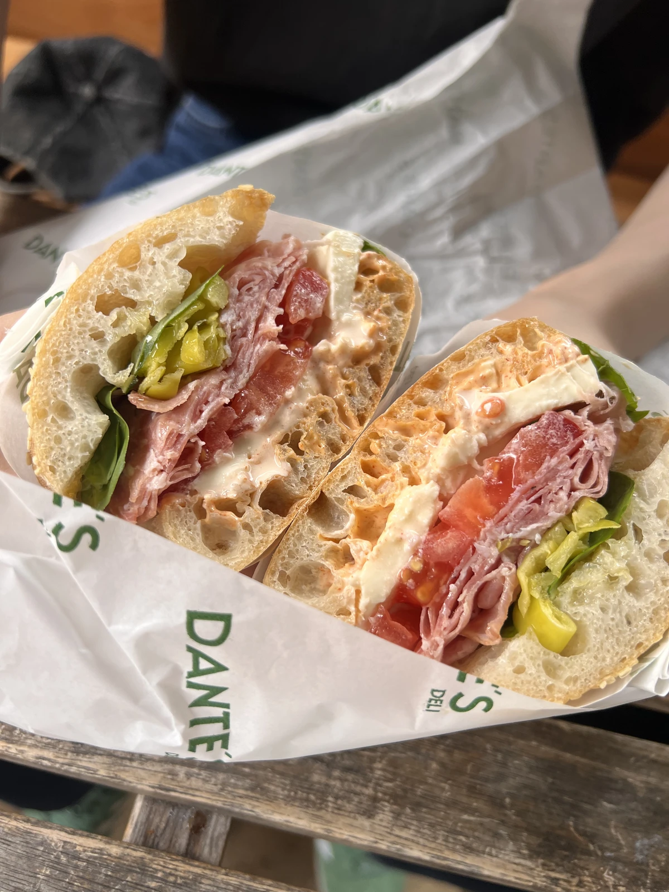
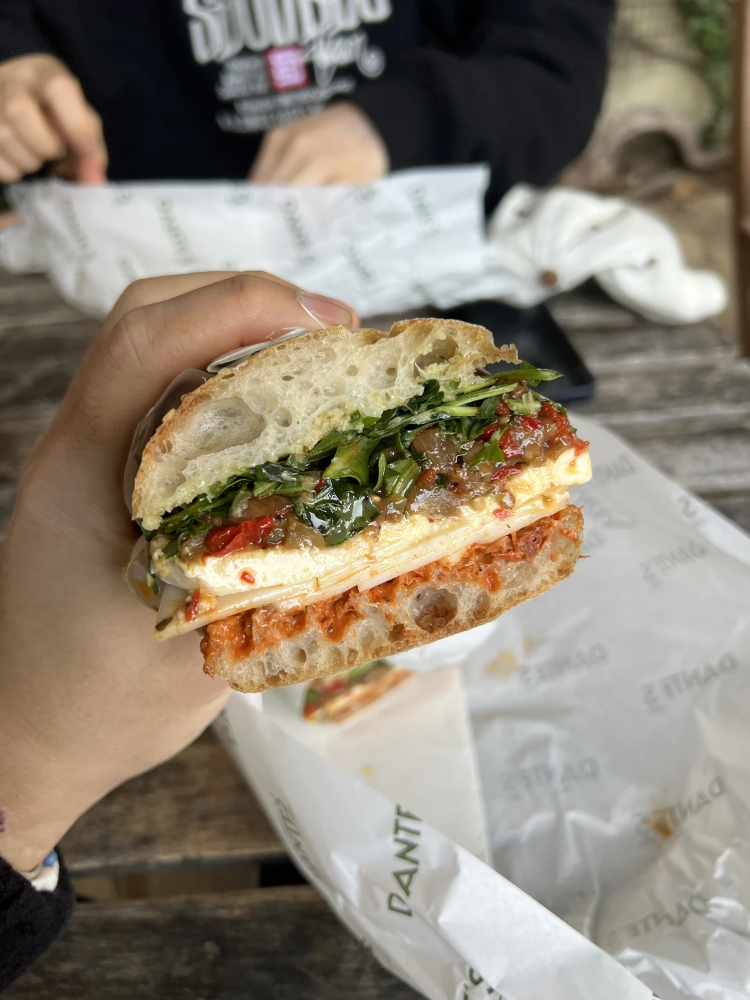
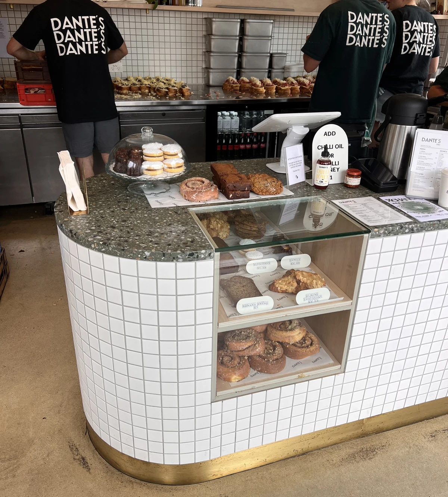
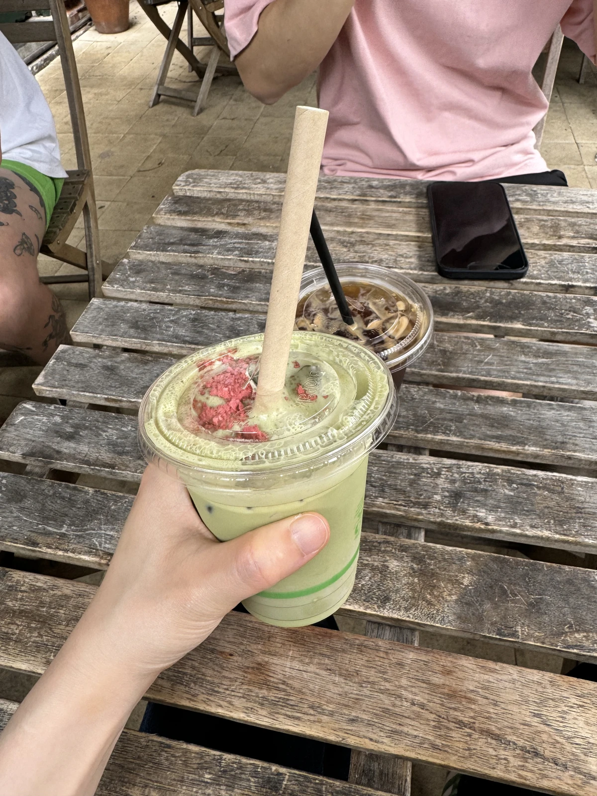

## Dante's Deli

Glenelg was never really known for its food scene. This place changed that for me — it was the first time I thought, okay, Glenelg actually has something worth coming for. It genuinely breathed new life into the area 😁. I first went in early 2024 after a friend recommended it.

## Regular

We go pretty often. Most places start to slip after a year or two, but the coffee and sandwiches here have stayed consistently good.
The photos are from our first anniversary visit last year — it's always packed.

## Menu
##### Mortadella

##### Pastrami

##### Chicken Salad

##### Sopressa

##### Vege

The bread here is so good that honestly everything on the menu is worth trying. That said, the pastrami is probably the crowd favourite. Personally, from the fresh options, the chicken is my go-to!!

The pastry selection changes every now and then too.

It's not on the menu, but we've ordered matcha a few times too.

Maybe it's the atmosphere, but the coffee always hits here 😁. Go on a weekend and you'll find yourself thinking about it all week long... lol