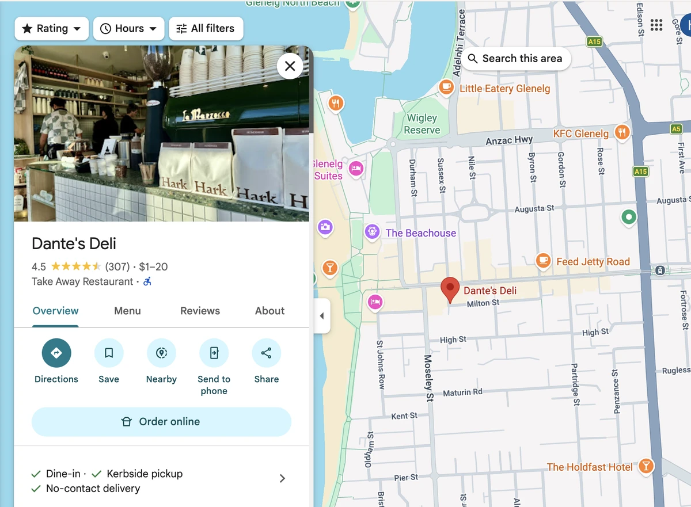
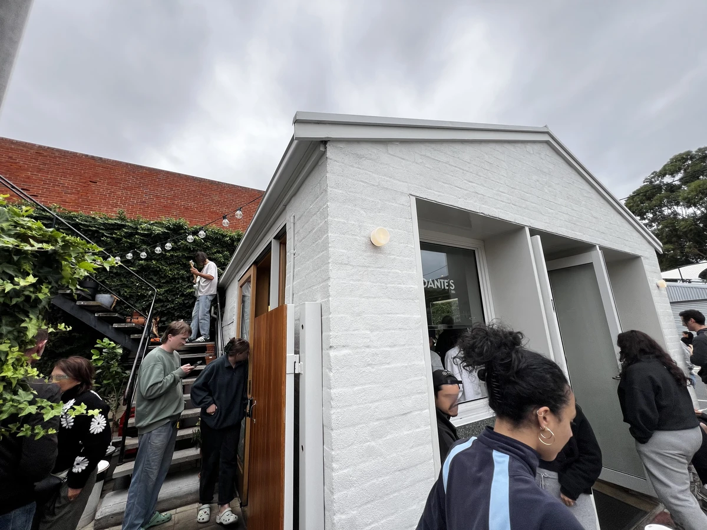
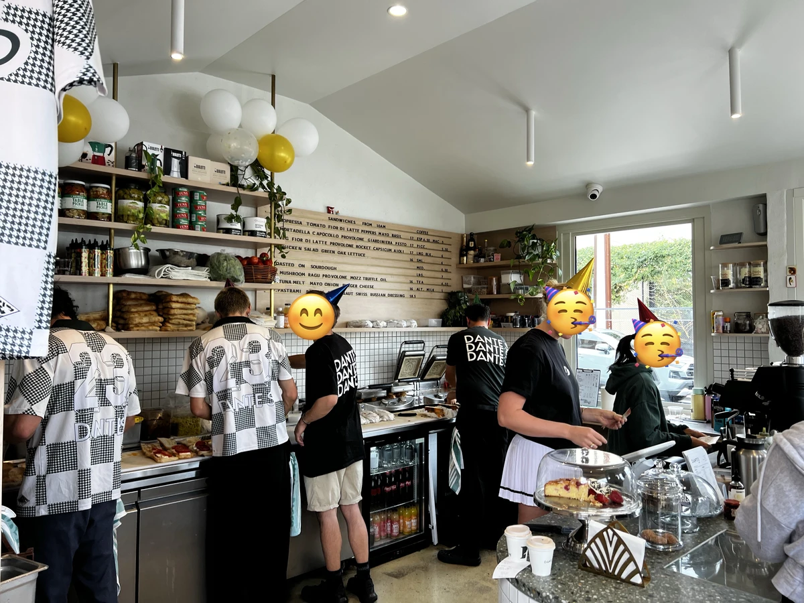
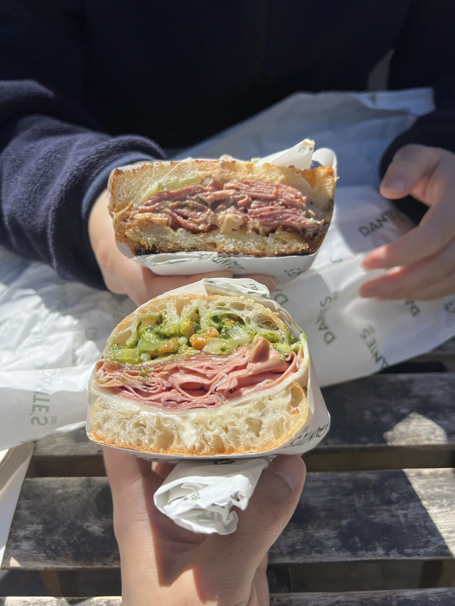
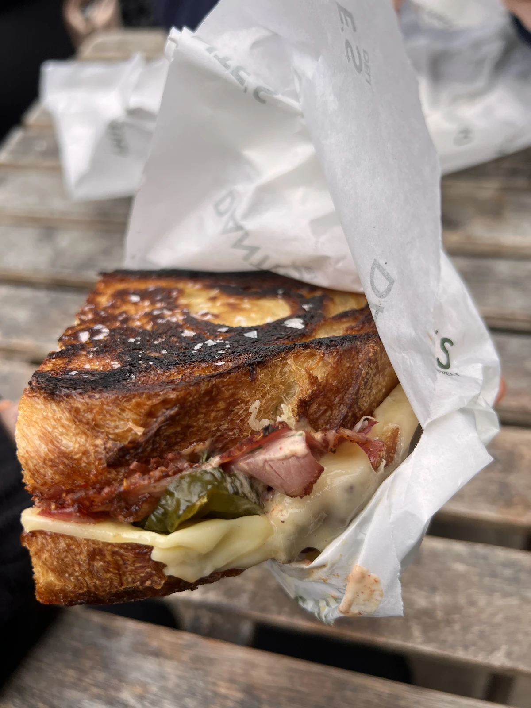
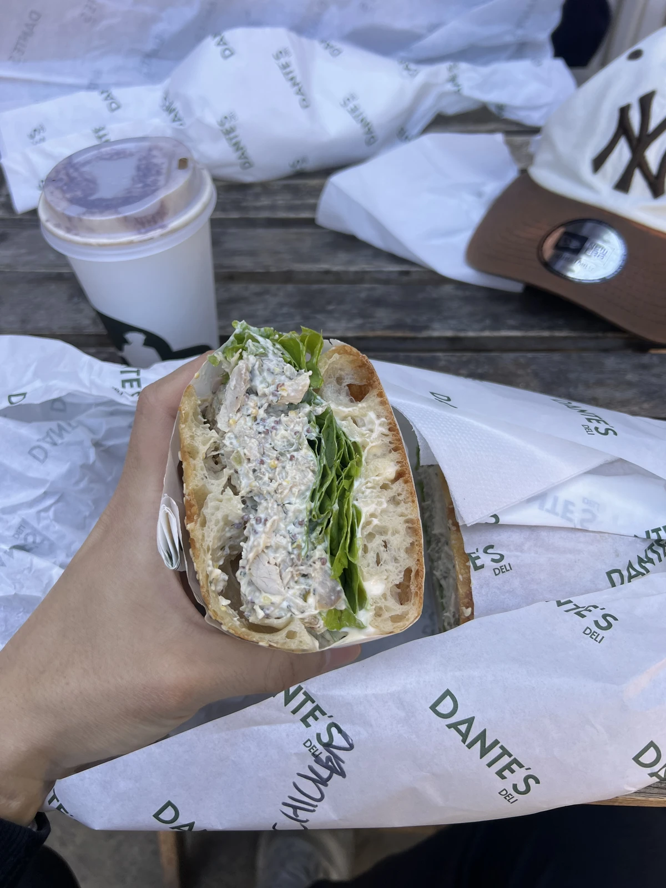
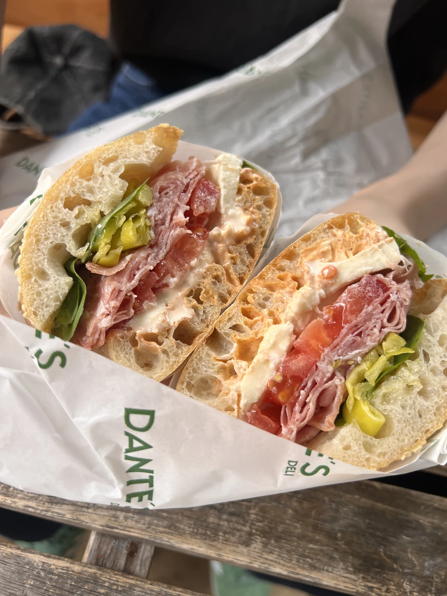
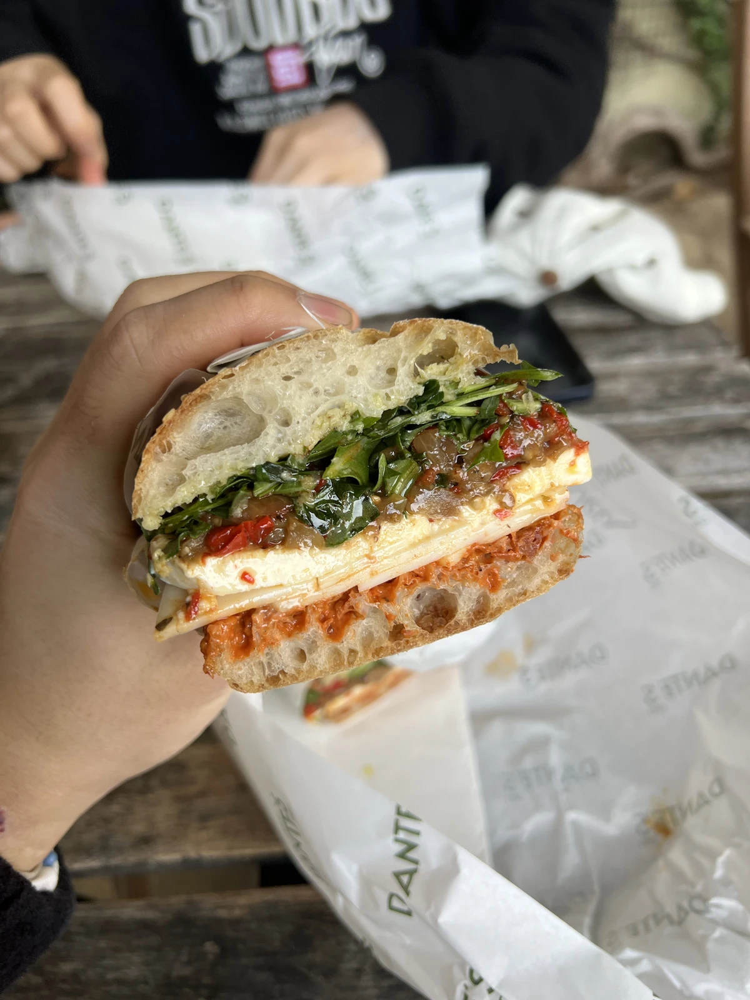
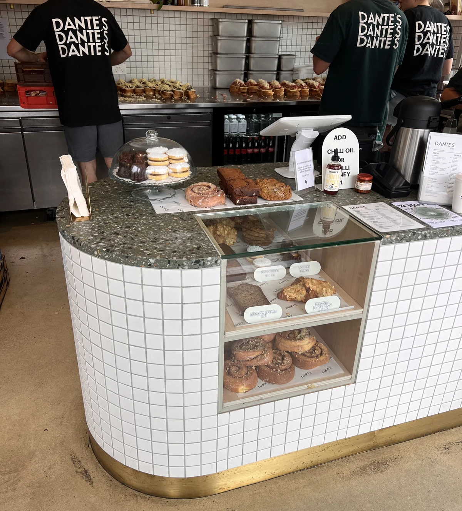
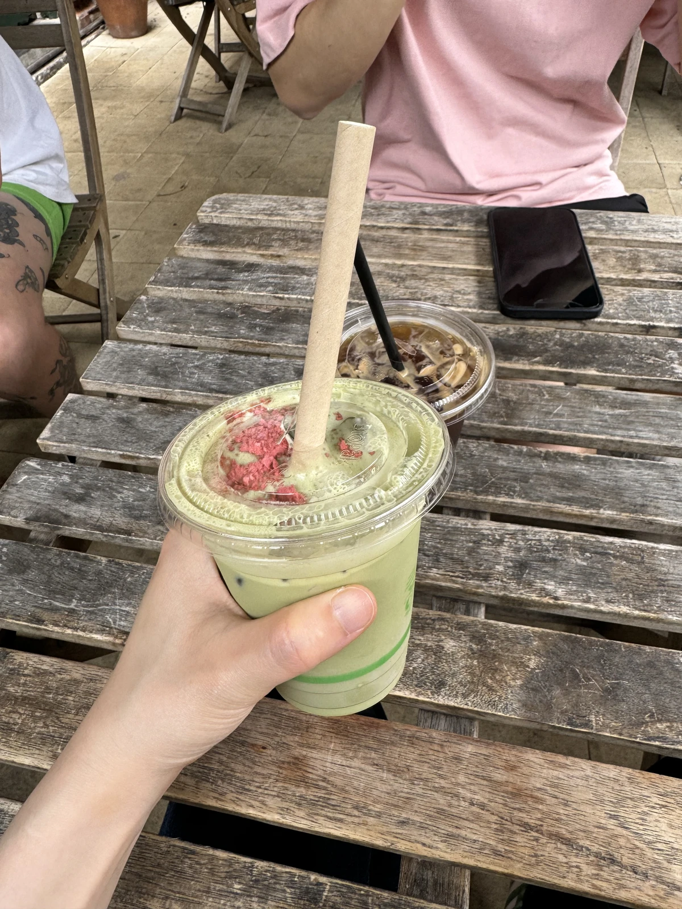

## Dante's Deli

เกลเนลก์ไม่ใช่ย่านที่ขึ้นชื่อเรื่องร้านอร่อย ที่นี่คือร้านที่ทำให้ผมรู้สึกเป็นครั้งแรกว่าเกลเนลก์ก็มีร้านอร่อยกับเขาแล้วนะ เป็นสถานที่ที่เติมชีวิตชีวาให้เกลเนลก์ 😁 ครั้งแรกที่ไปคือช่วงต้นปี 2024 เพื่อนแนะนำมาเลยได้ลองไป

## Regular

เราไปกันบ่อย ปกติร้านอร่อยพอผ่านไปหนึ่งสองปีรสชาติก็มักจะเปลี่ยน แต่ที่นี่ทั้งกาแฟและแซนด์วิชไม่เปลี่ยนเลยสักอย่าง
รูปนี้ตอนครบรอบหนึ่งปีเมื่อปีที่แล้ว ยุ่งตลอดเวลา

## Menu
##### Mortadella

##### Pastrami

##### Chciken Salad

##### Sopressa

##### Vege

ที่นี่ขนมปังอร่อยเลยอร่อยหมดทุกอย่าง ถึงอย่างนั้นที่ฮิตที่สุดน่าจะเป็นพาสตรามี ส่วนตัวถ้าเป็นเมนูสดๆ ต้องไก่!!

เพสตรีก็เปลี่ยนไปทีละนิด

ไม่มีในเมนูแต่ผมก็สั่งมัทฉะอยู่บ่อยๆ

อาจจะเป็นเพราะบรรยากาศดีก็ได้ แต่กาแฟที่นี่ผมดื่มแล้วอร่อยตลอด 😁 ถ้าไปวันเสาร์อาทิตย์ ก็จะคิดถึงมันไปตลอดทั้งสัปดาห์ถัดไป..ฮ่าๆ
