## Brunswick 在哪？
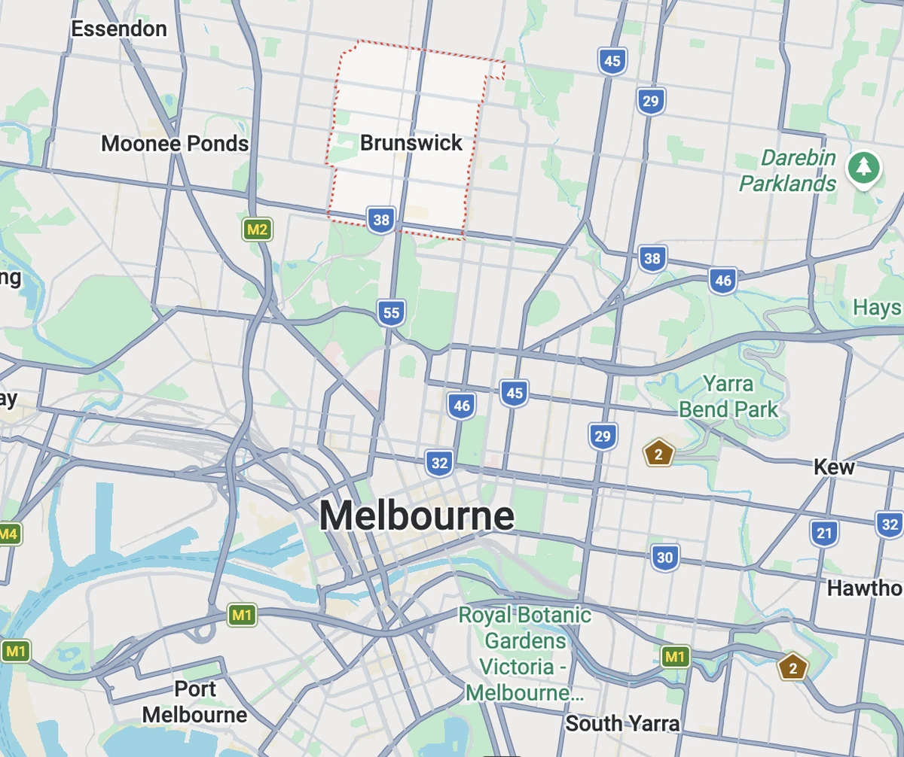
我只知道墨尔本，Brunswick 是第一次听说。老婆告诉我的（真的太感谢了 🥹）。年轻艺术家、街头涂鸦、咖啡文化，一句话就是很潮的地方。有意思的是日本文化氛围也很浓。
在 Brunswick 站下车，沿着铁路一路往上开始探索。

## 探索
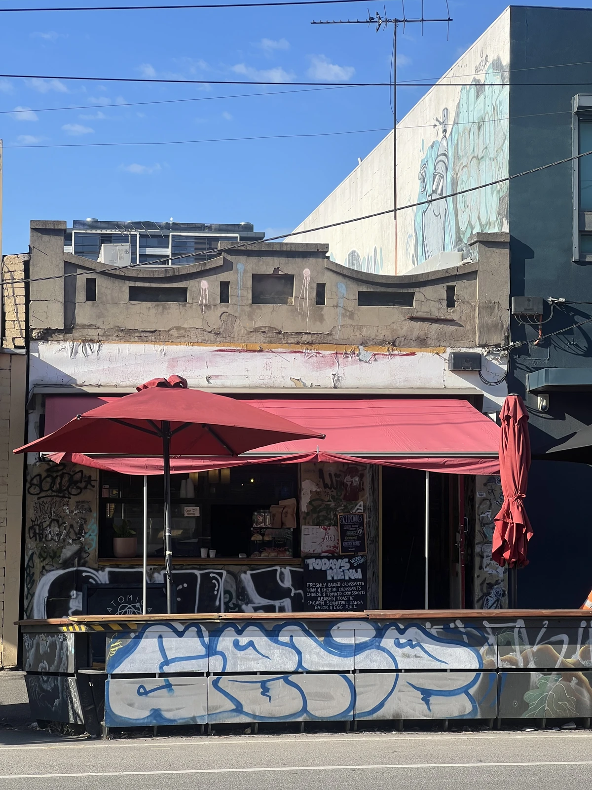
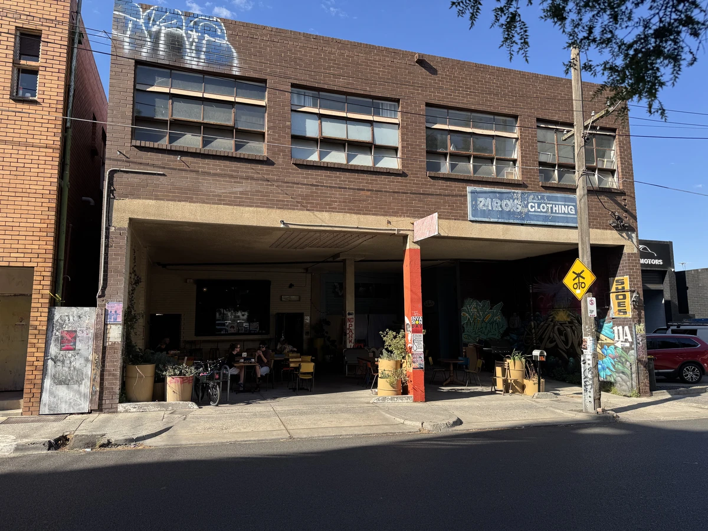
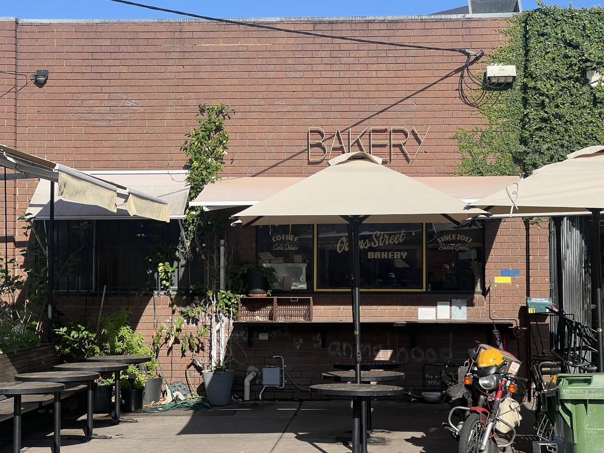
路过的咖啡馆一家比一家气质不凡。都想进去坐坐，但因为想先去 Osoi，就全跳过了。

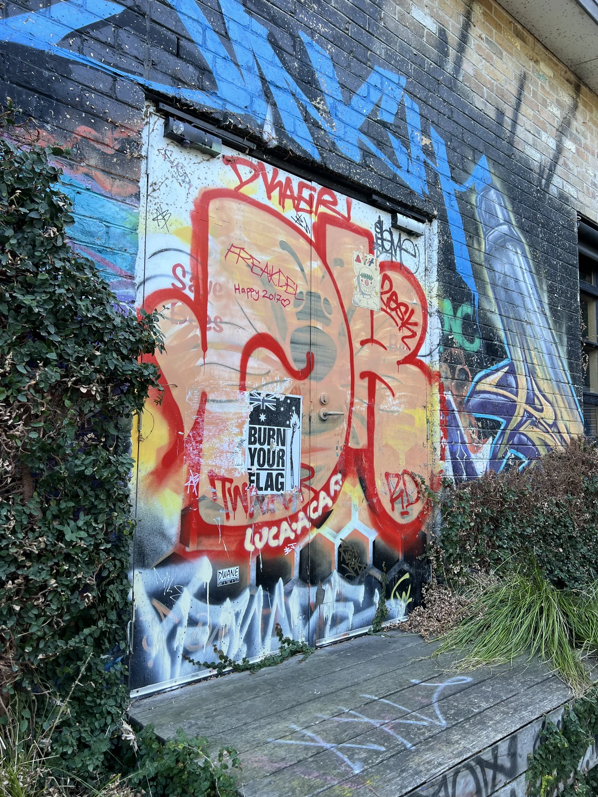
街头艺术

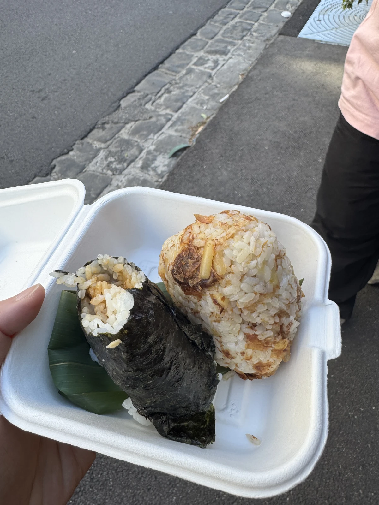
走到一半太饿了，在一家日式咖啡馆吃了饭团。朴实无华，真的很日本风格。

## 抵达，Osoi
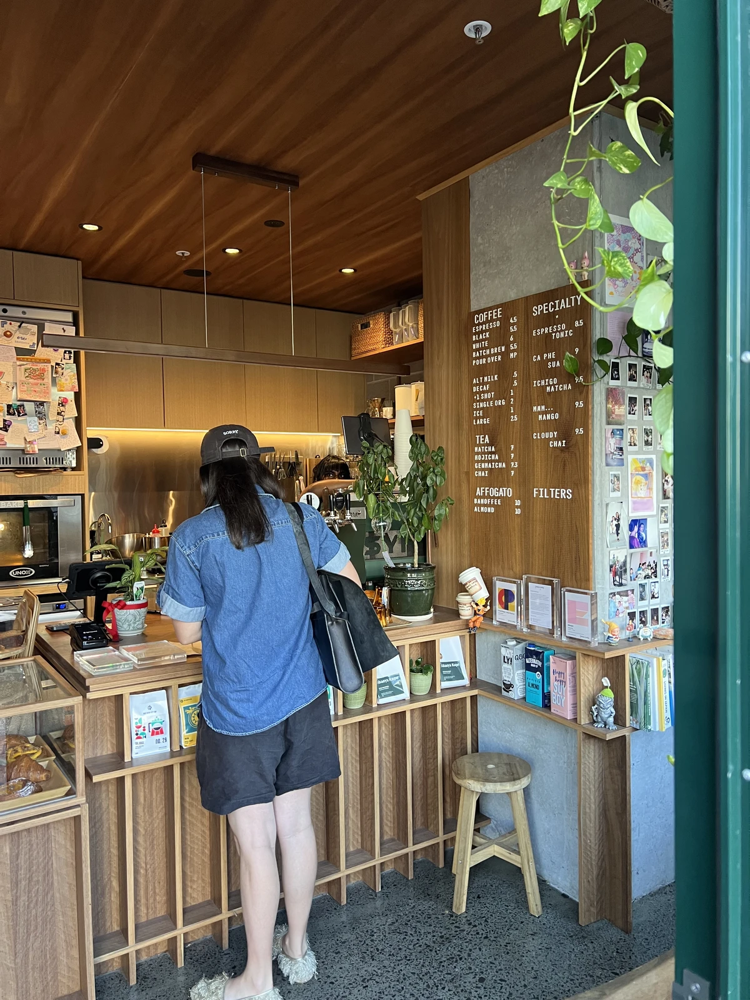
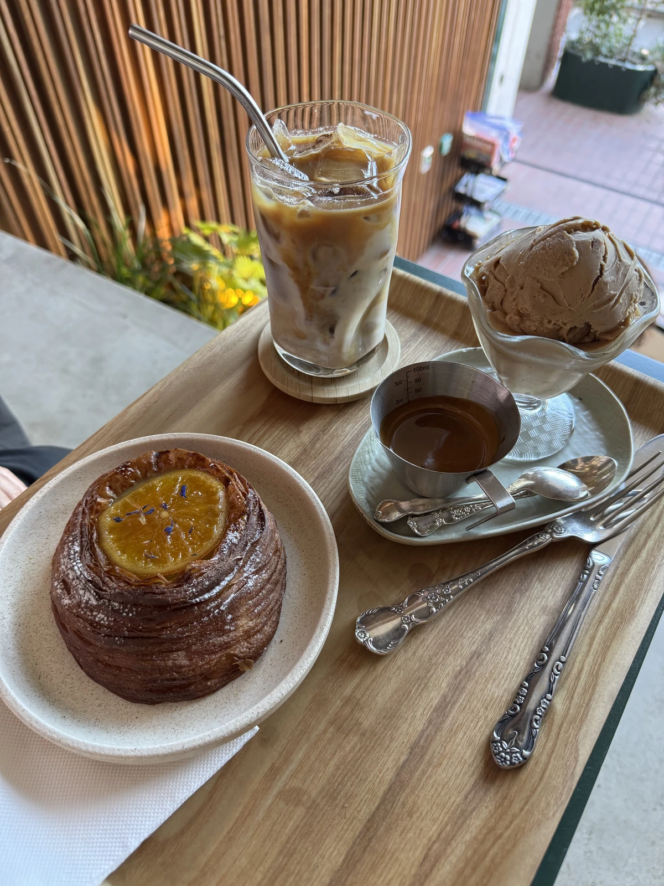
点了杏仁阿芙佳朵、拿铁和丹麦面包！真的太好吃了。

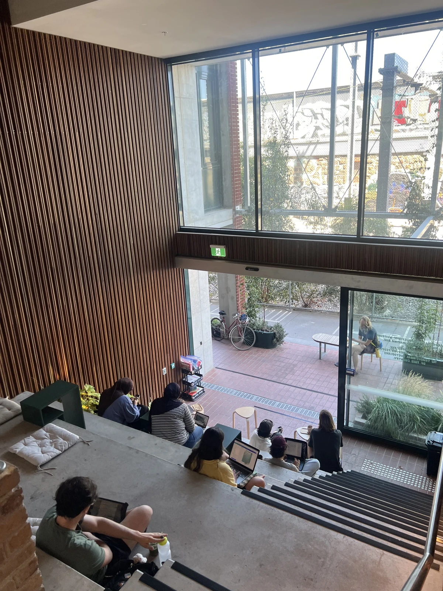
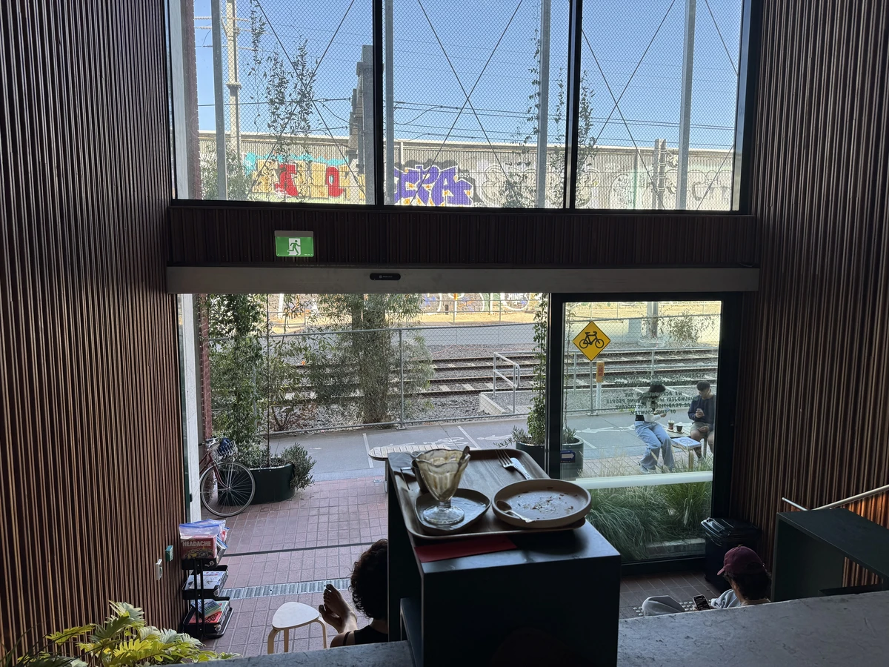
前面火车偶尔经过，就这样悠闲地消磨了时光。背景音乐也轻柔地流淌着。

前面两个人偶然相遇聊起天来，被我（无意中）听到了一些。
两个人都是做戏剧表演的，一个在布鲁克林（美国）和这里之间两头跑着做戏剧，另一个是澳洲演员，说澳洲戏剧产业跟美国比起来太小、太难做了。没全听完，但在这样一家咖啡馆里能飘来这种对话..ㅋㅋㅋ 真的太酷了。我到底在哪里啊？😆

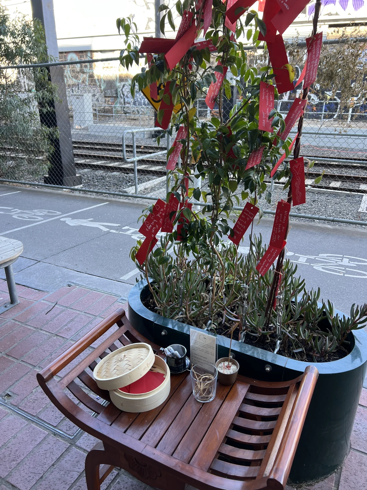
新年到了，我也写了一个愿望。"*希望能常来这家咖啡馆。*" ㅋㅋㅋ
很感恩。