## Brunswick là ở đâu?
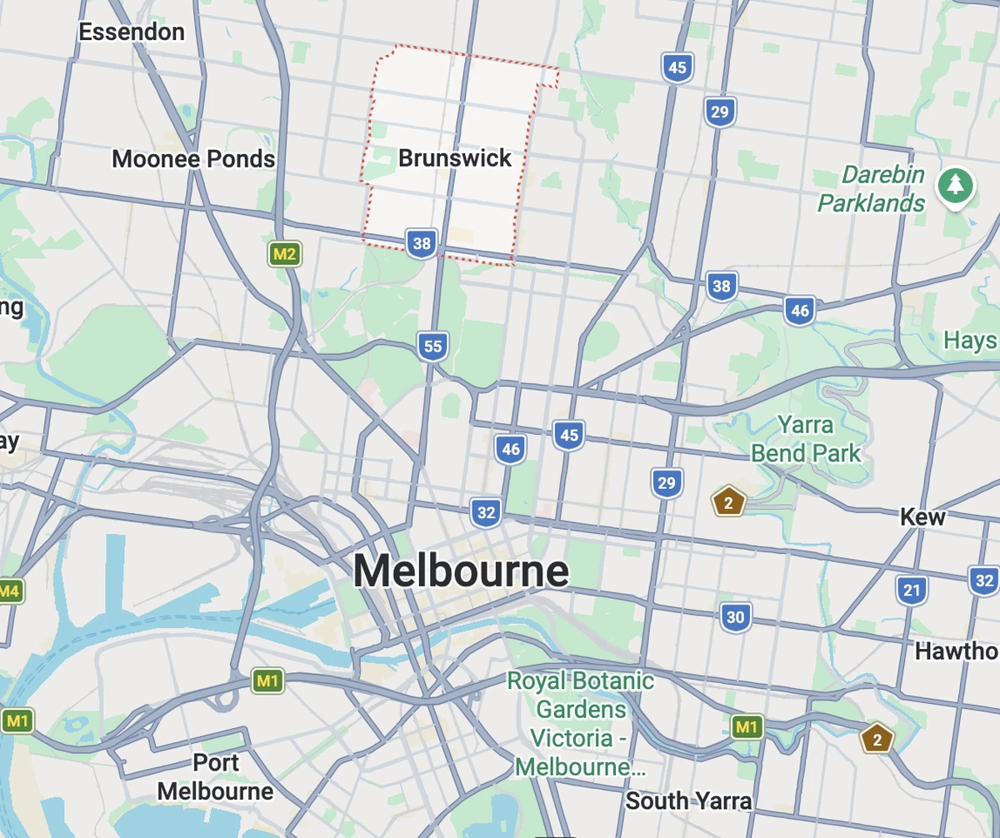
Tôi chỉ biết Melbourne thôi, còn Brunswick thì lần đầu nghe tới. Vợ tôi chỉ cho (biết ơn ghê 🥹). Nghệ sĩ trẻ, street art, văn hóa cà phê, nói gọn lại là một khu rất hip. Thú vị là văn hóa Nhật ở đây cũng đậm.
Xuống ga Brunswick rồi men theo đường ray đi ngược lên, bắt đầu cuộc thám hiểm.

## Thám hiểm
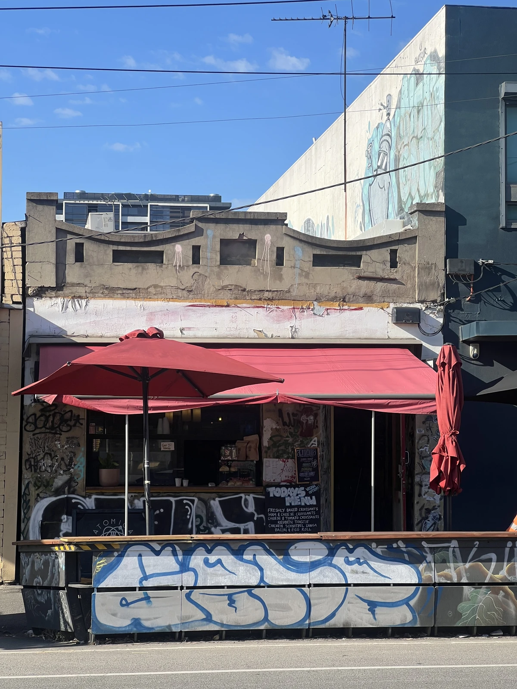
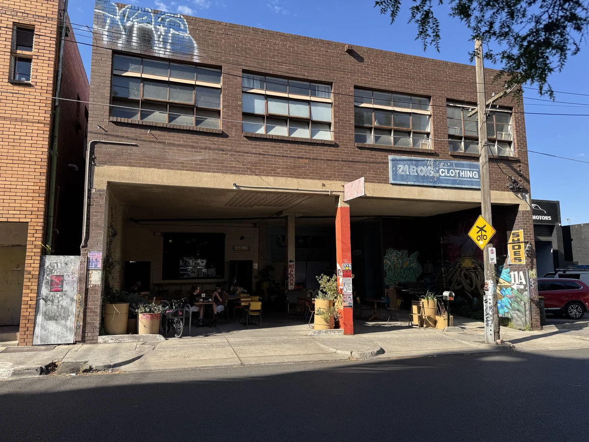
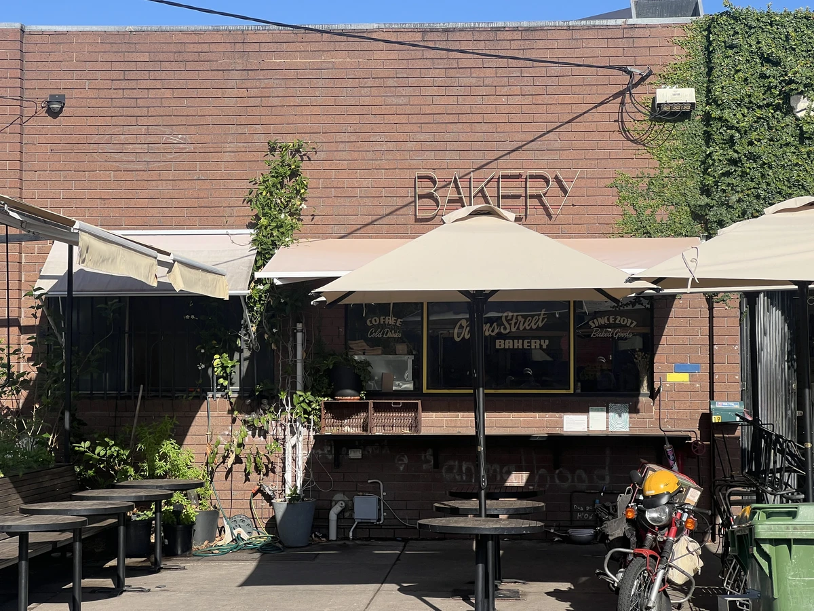
Mới chỉ mấy quán cà phê đi ngang qua thôi mà khí chất đã không tầm thường. Quán nào cũng muốn ghé, nhưng vì muốn tới Osoi trước nên đành bỏ qua.

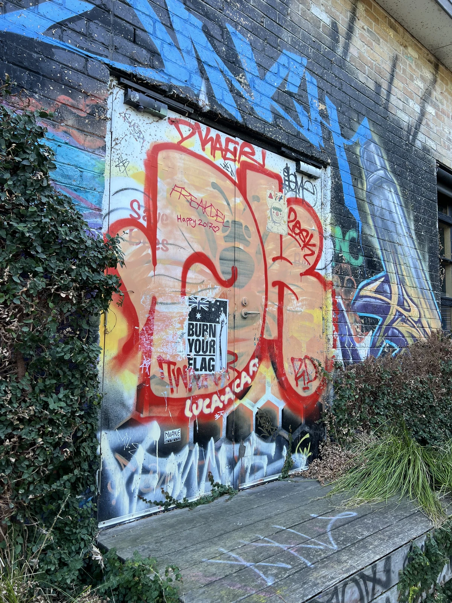
Nghệ thuật đường phố

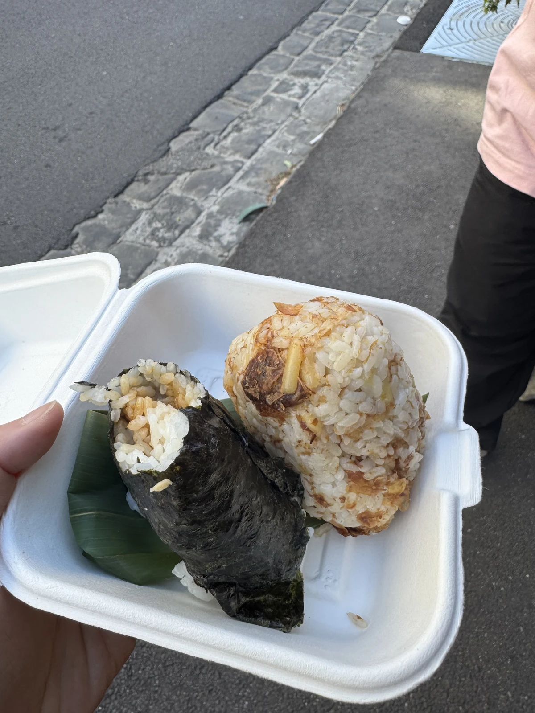
Trên đường đi đói quá nên ghé một quán kiểu Nhật ăn cơm nắm. Nhạt nhạt vậy chắc đúng chất Nhật thật.

## Đã tới, Osoi
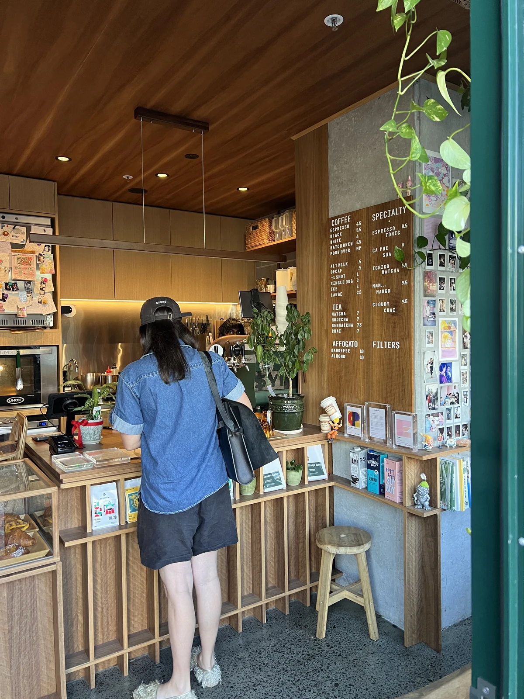
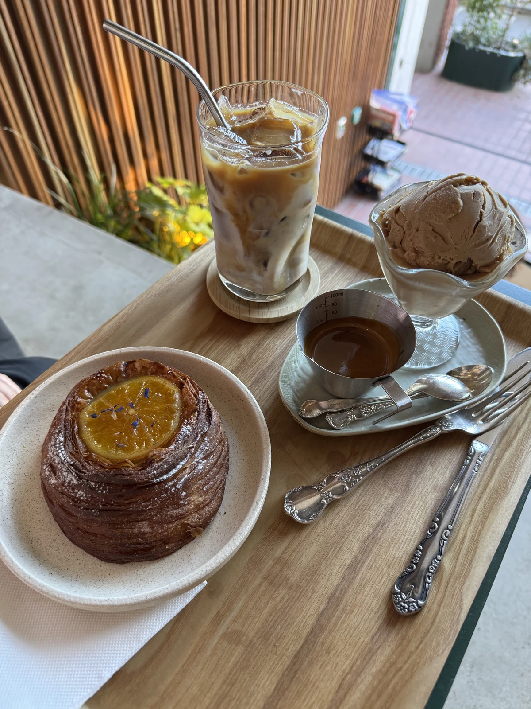
Gọi affogato hạnh nhân, latte và bánh Danish! Ngon quá thể.

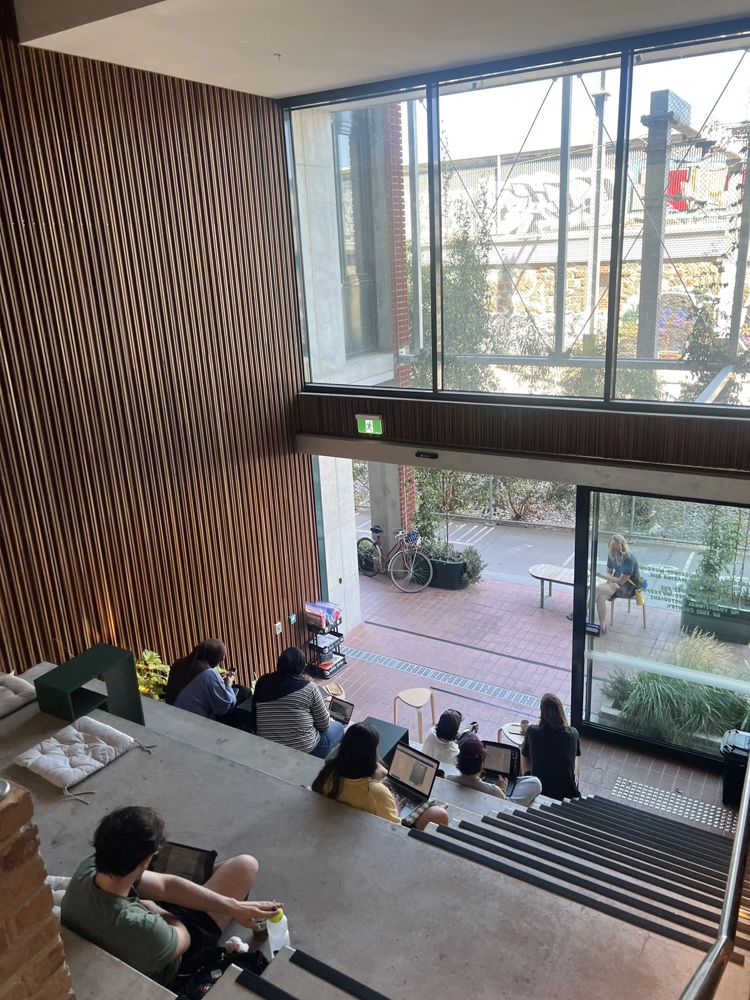
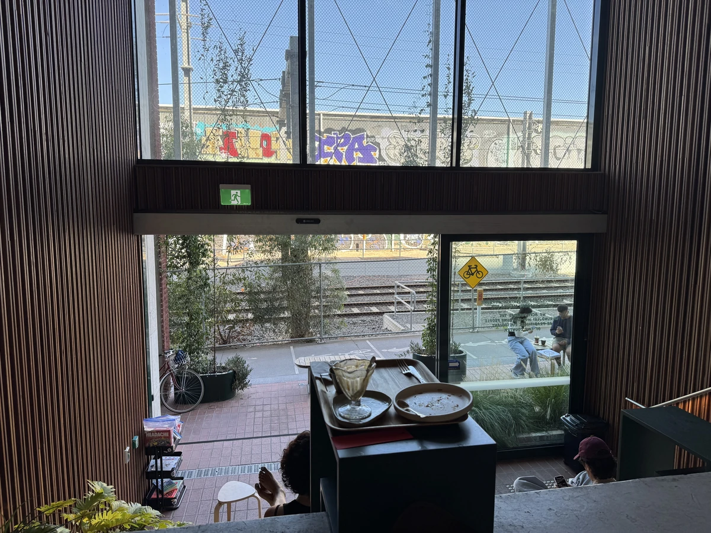
Phía trước có tàu chạy qua, chúng tôi ngồi tận hưởng thời gian yên bình. Nhạc cũng phát nhè nhẹ.

Tôi (vô tình) nghe lỏm được câu chuyện của hai người phía trước tình cờ gặp nhau.
Cả hai đều làm trong ngành kịch nghệ, một người đi đi về về giữa Brooklyn (Mỹ) và đây để làm sân khấu, người kia là diễn viên Úc và than rằng ngành sân khấu Úc quá nhỏ so với Mỹ nên vất vả. Tôi không nghe hết được, nhưng một quán cà phê mà có những câu chuyện hay ho như vậy trôi qua..hahaha thật sự ngầu. Tôi đang ở đâu thế này? 😆

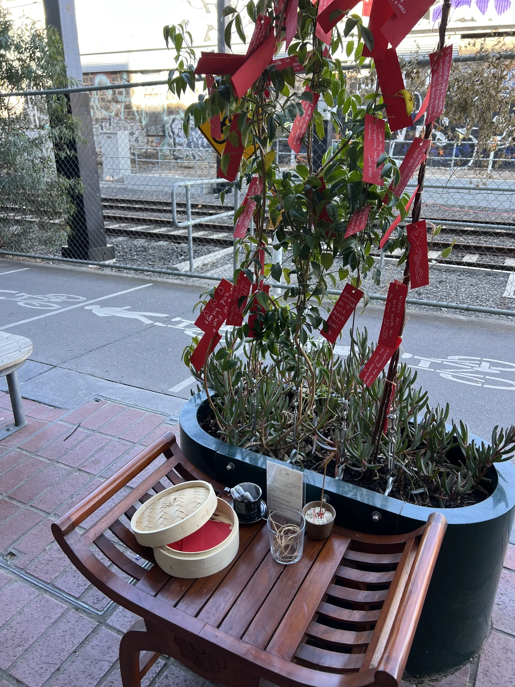
Đang dịp năm mới nên tôi cũng viết điều ước của mình. "*Cho con được đến quán này thường xuyên.*" hahaha
Biết ơn thật.
