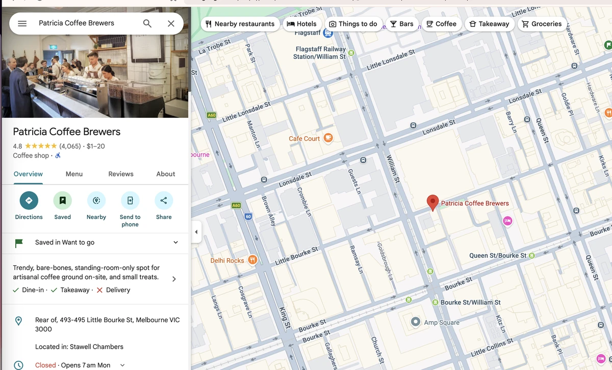
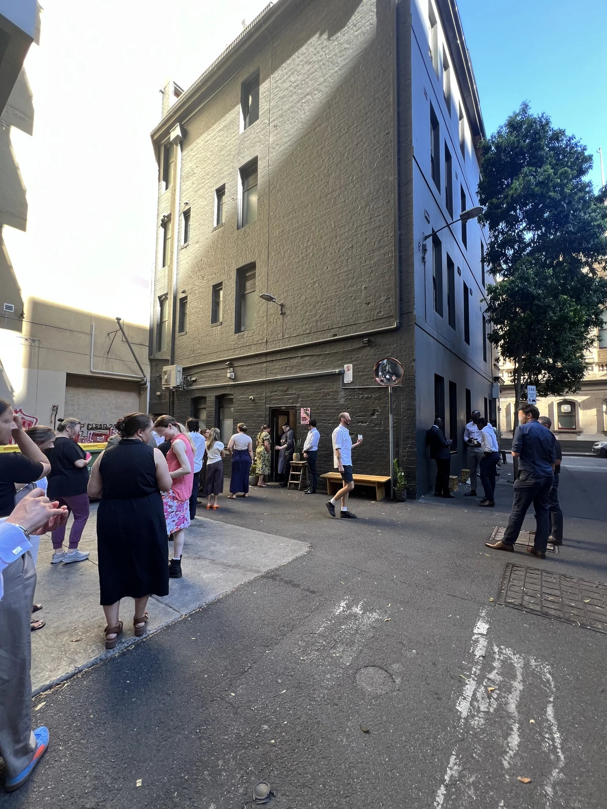
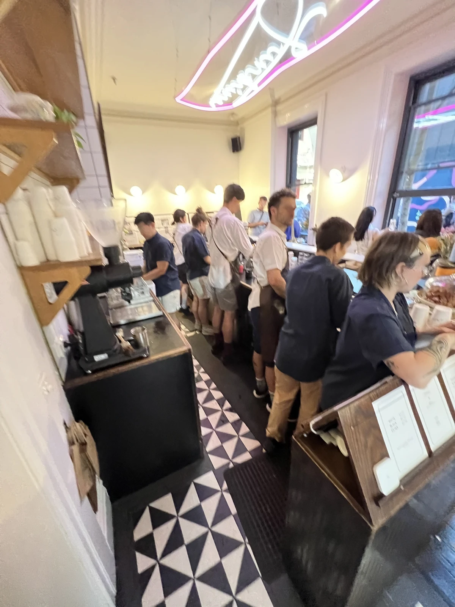
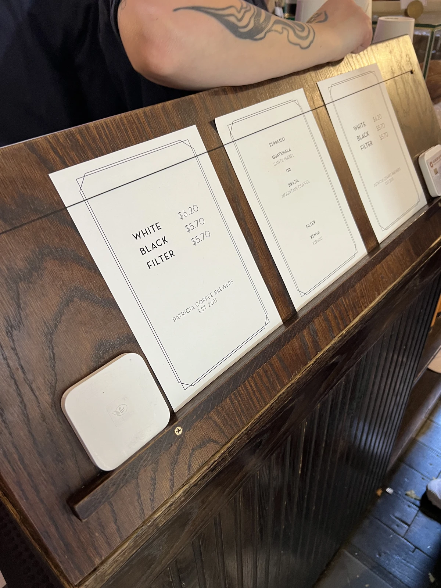
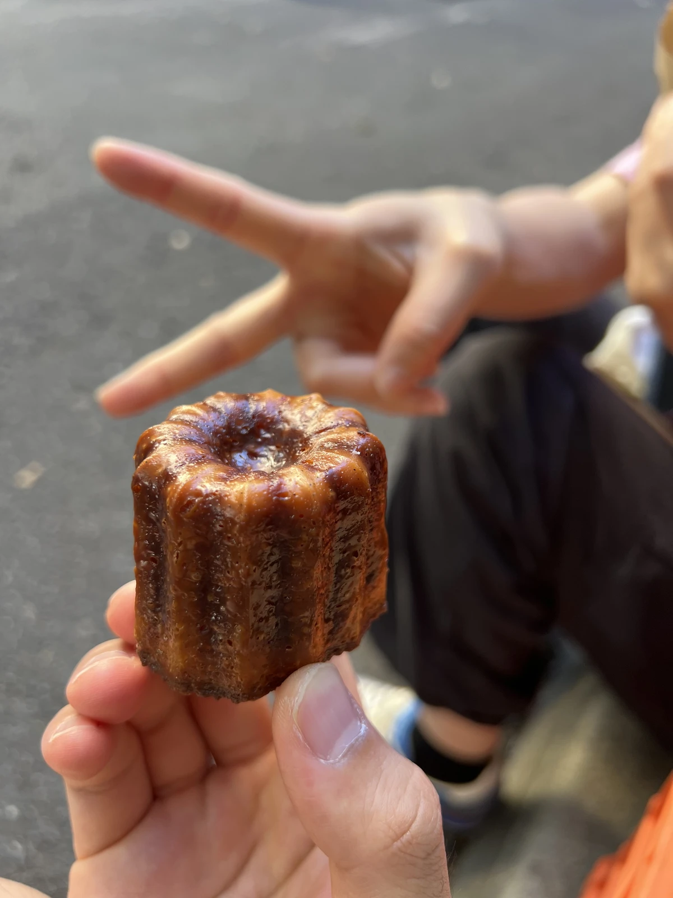
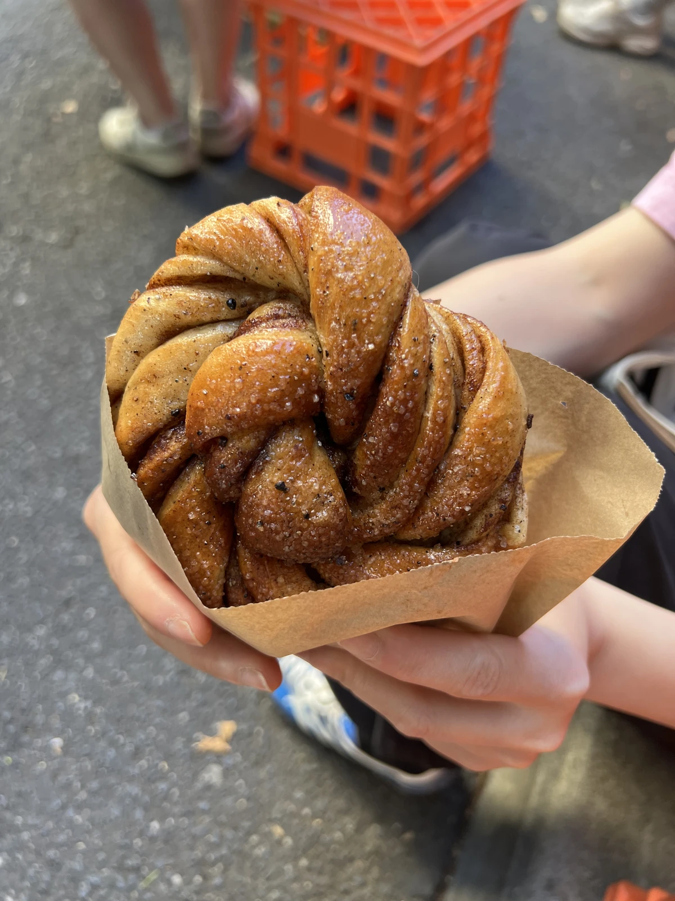

## 멜버른에서 가장 유명한 로스터즈?

멜버른 하면 커피 문화 아니겠는가? 구글맵에서 CBD에 있는 페트리시아 로스터즈를 찾아가봤다. 무려 4천개가 넘는 리뷰와 평점 4.6점.

아주 뒷편 골목길에 있는 느낌인데 평일 오전 10시임에도 주변 오피스에서 온 사람들 위주로 북적였다. 다행히 줄은 금방 줄었다.

내부는 이렇게 작은 편이다. 카메라 흔들림에서 느껴지듯이 아주 바쁘다! ㅋㅋ

우리는 라때랑, 플랫 화이트를 주문했는데 둘다 동일한 White Coffee로 통일 되었다. 메뉴를 보니 딱 세가지다. White / Black / Filter. 가격도 괜찮다.
커피인도 골라야했는데 산타 이사벨 / 마운틴 커피, 각각 하나씩 골랐다.
특이한 점으로는 엄청 바쁜데도 주문받는 점원분이 아주 차분하게 메뉴를 안내해줬다. 줄이 길고 바빠도 하나의 주문 받는거에 온전히 시간을 할애해주는 태도에서 전문성이 느껴진다. 어떻게 ~~클라언트~~ 고객 마음을 이렇게 잘 알지 싶었다.

기본적으로 스탠딩 카페라서 다들 밖에서 서서 마시거나 바닥 블록에 앉아서 마신다. 뒷골목, 커다란 재활용 빈 주변에서 마시는 커피가 문화적 경험이 되는 곳이다. 테이크어웨이 컵을 선택했는데 커피잔으로도 마실 수 있다.

까눌레! 다들 구글 리뷰에서 시키길래 우리도 시켰다! 맛있다.

이건 맛있어 보여서 주문. 이게 진짜 맛있다. 시나몬 번인데, 시나몬 가루가 아니라 스틱을 거칠게 갈아서 넣었다.
부드러운 빵에 시나몬 큼지막한 가루가 씹히면서 프레시한 시나몬 향이 확 퍼진다.
빅토리안 마켓 베이커리에서 가져오는것 같은데 (거기서 똑같이 생긴거 봄) 커피랑 조화가 미쳤다.

## 좋다
솔직히 말해서 나는 커피맛 모른다. 근데 여긴 커피 마시는 *경험*이 있는곳이었다. 
재활용 빈이 있는 뒷골목, 길에 앉아서 북적북적한 분위기에 시나몬 빵과 마시는 커피, 재밌다 😄.