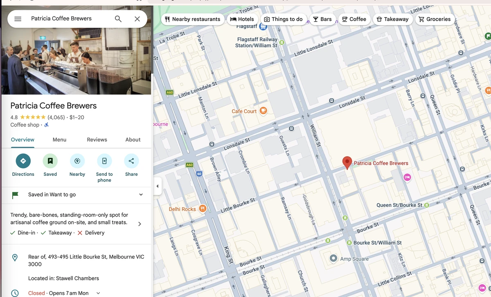
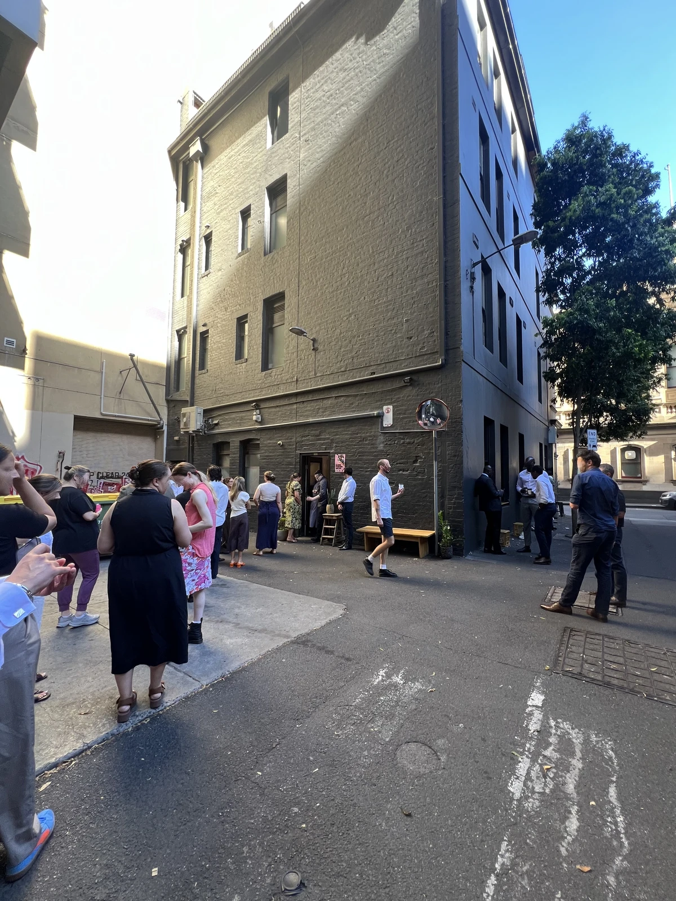
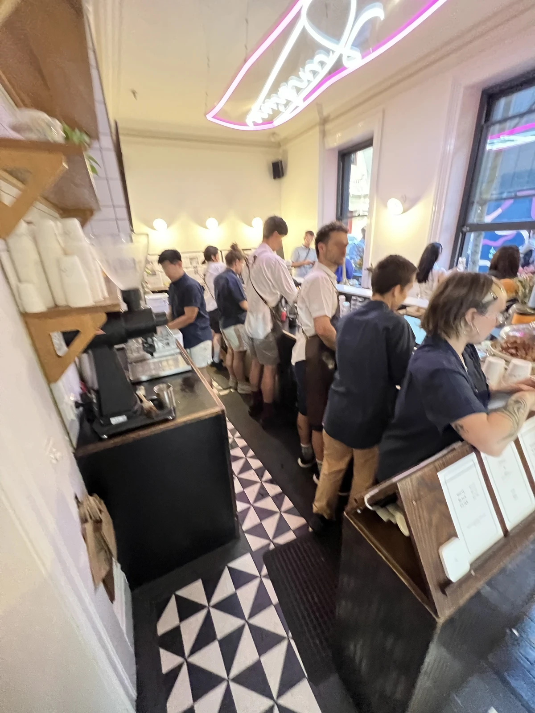
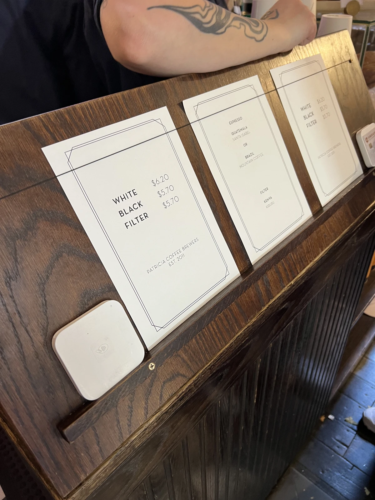
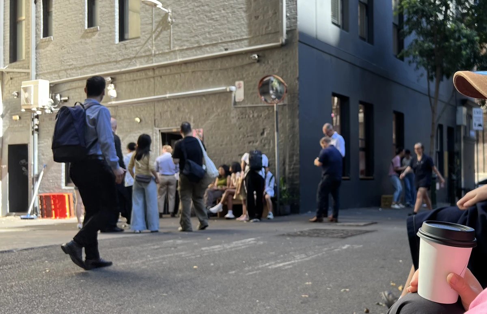
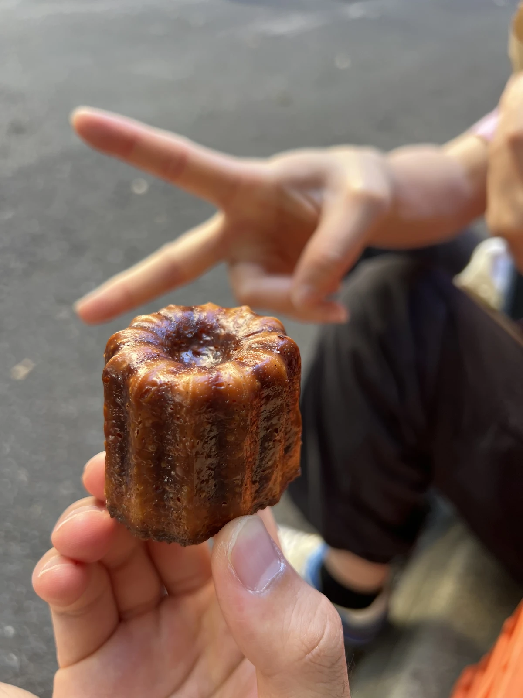
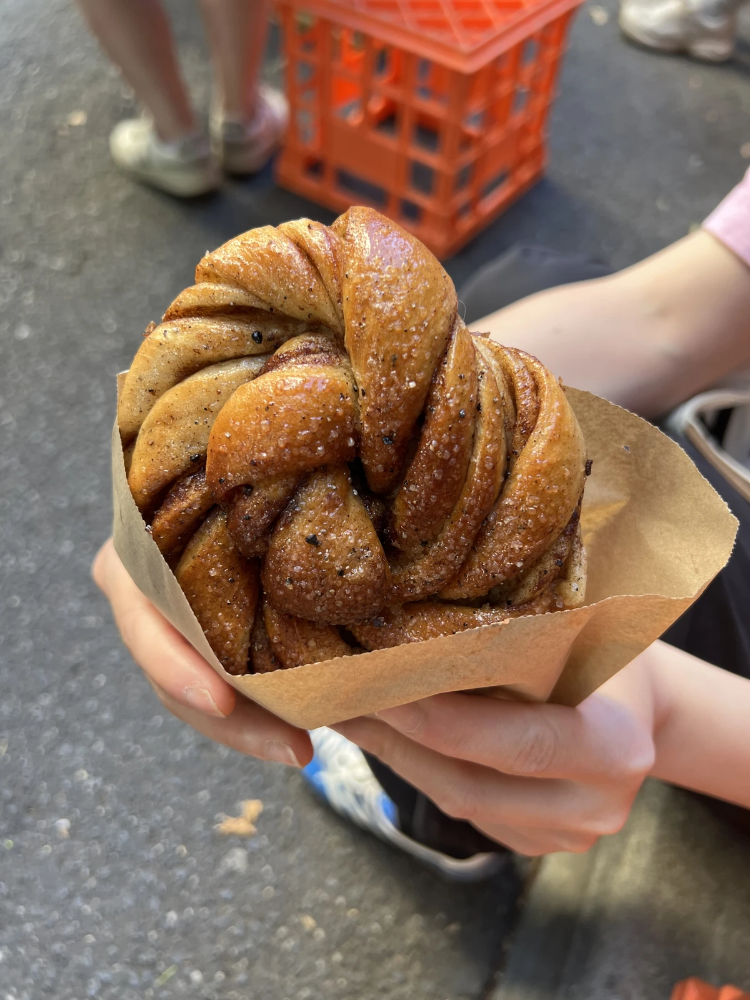

## Nhà rang xay nổi tiếng nhất Melbourne?

Nhắc tới Melbourne thì phải là văn hóa cà phê chứ còn gì nữa? Tôi mở Google Maps rồi tìm tới Patricia Roasters trong khu CBD. Hơn bốn nghìn lượt đánh giá và điểm 4.6.

Cảm giác như nằm tít trong một con hẻm phía sau, vậy mà mười giờ sáng ngày thường vẫn đông nghịt, chủ yếu là người từ các văn phòng quanh đó. May là hàng vơi đi khá nhanh.

Bên trong khá nhỏ như thế này. Nhìn máy ảnh rung là đủ thấy bận tới mức nào rồi! haha

Chúng tôi gọi latte và flat white, nhưng cả hai đều được gộp chung thành White Coffee. Nhìn thực đơn thì thấy đúng ba loại. White / Black / Filter. Giá cũng dễ chịu.
Còn phải chọn cả hạt cà phê nữa, chúng tôi chọn Santa Isabel và Mountain Coffee, mỗi thứ một loại.
Điểm đặc biệt là dù bận đến vậy, bạn nhân viên nhận order vẫn hướng dẫn thực đơn rất điềm tĩnh. Hàng dài và công việc gấp gáp, nhưng thái độ dành trọn thời gian cho từng đơn hàng đó khiến người ta cảm nhận được sự chuyên nghiệp. Tôi tự hỏi sao họ hiểu lòng ~~client~~ khách hàng giỏi đến thế.

Về cơ bản đây là quán đứng uống nên mọi người đều đứng uống bên ngoài hoặc ngồi trên bậc gạch ven đường. Là nơi mà ly cà phê uống trong con hẻm sau, cạnh mấy thùng tái chế to đùng, trở thành một trải nghiệm văn hóa. Chúng tôi chọn ly mang đi, nhưng cũng có thể uống bằng tách.

Cannelé! Thấy trên Google ai cũng gọi nên chúng tôi cũng gọi! Ngon.

Cái này thì trông ngon nên gọi thử. Và cái này ngon thật. Là bánh cuộn quế, nhưng không phải bột quế mà là thanh quế được xay thô rồi cho vào.
Nhai trúng những mẩu quế to trong lớp bánh mềm, mùi quế tươi bung ra khắp miệng.
Hình như họ lấy từ tiệm bánh trong Victoria Market (vì tôi thấy cái y hệt ở đó), kết hợp với cà phê thì đúng là điên rồ.

## Thích thật
Nói thật thì tôi không sành vị cà phê. Nhưng đây là nơi có *trải nghiệm* uống cà phê.
Con hẻm sau với mấy thùng tái chế, ngồi bệt bên đường, giữa không khí nhộn nhịp, ăn bánh quế và uống cà phê, vui thật 😄.
