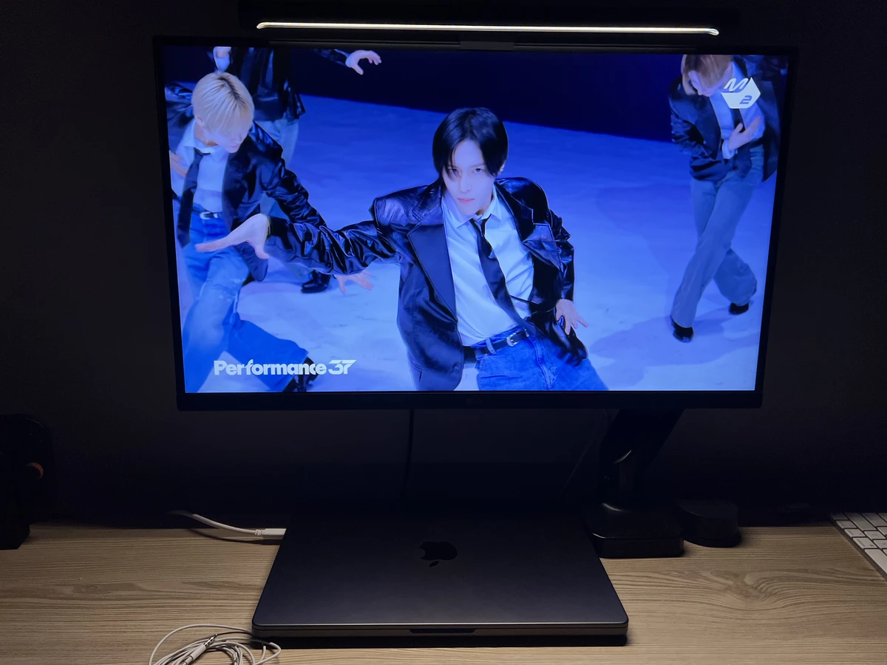

นี่คือ Boom Boom Bass ของ Riize
ถ้าใครชอบ Michael Jackson ก็คงรู้ได้ทันที นักแต่งเพลง/โปรดิวเซอร์ของเพลงนี้เหมือนกำลังตะโกนว่า "ฉันชอบ Michael Jackson!!" อยู่เลย

  <iframe 
    src="https://www.youtube.com/embed/78lNnCitcBM"
    style="position:absolute;top:0;left:0;width:100%;height:100%;"
    frameborder="0"
    allowfullscreen>
  </iframe>

ฟังเพลงนี้เท่าไหร่ก็ยังสงสัยอยู่ดีว่าการคารวะ Michael Jackson ถูกซ่อนอยู่ตรงไหนและแสดงออกมาแบบไหน เป็น brain candy ที่สมบูรณ์แบบจริงๆ
ด้านล่างนี้คือเพลงที่ผมนึกถึง

 

## เบส - Get on the Floor (ช่วงเริ่มต้น)

  <iframe 
    src="https://www.youtube.com/embed/YtYsw_TQ7cs"
    style="position:absolute;top:0;left:0;width:100%;height:100%;"
    frameborder="0"
    allowfullscreen>
  </iframe>

เริ่มต้นก็ต้องเป็นเบสอยู่แล้ว เป็นงานเลี้ยงของ frisson (ความรู้สึกขนลุก) ขนลุกเลยทีเดียว

 

## ทำนอง - Baby Be Mine

  <iframe 
    src="https://www.youtube.com/embed/O3tnOVideSo"
    style="position:absolute;top:0;left:0;width:100%;height:100%;"
    frameborder="0"
    allowfullscreen>
  </iframe>

เป็นเพลงของ Michael Jackson ที่ผมรู้สึกผูกพันมากที่สุด! จะมีเพลงไหนที่ให้ฟีลแบบนี้อีกไหมนะ
บางคนบอกว่าทำนองนี้ทำให้นึกถึง Jackson 5 - ABC แต่ผมว่ามันน่าจะได้แรงบันดาลใจจากเพลงนี้เอง (Baby Be Mine) มากกว่า ABC

 

## บริดจ์ - Smooth Criminal (ตั้งแต่นาทีที่ 1:50 เป็นต้นไปในมิวสิกวิดีโอ)

  <iframe 
    src="https://www.youtube.com/embed/h_D3VFfhvs4?start=246"
    style="position:absolute;top:0;left:0;width:100%;height:100%;"
    frameborder="0"
    allowfullscreen>
  </iframe>

 
 

## ความหลอนๆ - Thriller

  <iframe 
    src="https://www.youtube.com/embed/sOnqjkJTMaA"
    style="position:absolute;top:0;left:0;width:100%;height:100%;"
    frameborder="0"
    allowfullscreen>
  </iframe>

ตรงกลางเพลงมีความรู้สึกหลอนๆ บางอย่างที่ชวนให้นึกถึง Thriller อย่างชัดเจน อะคาเปลลาของ Riize เหมือนซ้อนทับกับเปียโนไฟฟ้าของ Thriller

 

## เต้น

  <iframe 
    src="https://www.youtube.com/embed/0GTyDijQEUQ"
    style="position:absolute;top:0;left:0;width:100%;height:100%;"
    frameborder="0"
    allowfullscreen>
  </iframe>

เรื่องเต้นผมไม่ค่อยรู้เท่าไหร่ ขอฝากไว้กับทุกคนแล้วกัน 😆

 

นักแต่งเพลง/โปรดิวเซอร์ที่ชื่นชอบอัลบั้มยุคแรกของ Michael Jackson มากๆ เขียนจดหมายรักอย่างละเอียด แล้วห่อใส่ซองจดหมายที่ชื่อว่า K-pop อย่างแน่นหนา
ทำไมถึงเข้าใจใจผมได้ขนาดนี้.. นี่คือผลงานชิ้นเอกที่สุดของ SM Entertainment