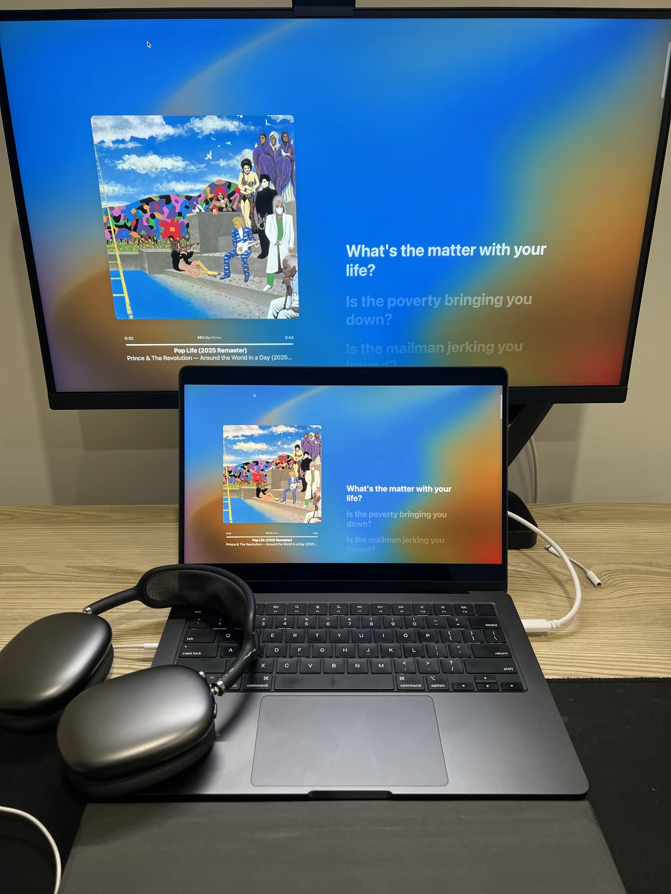

나는 이 곡이 원래는 앨범의 특성상 나 이제 안해!! 라는 선언서와 같은 앨범의 전체적인 의도, 당시 프린스가 겪었을 압력과 시대적 맥락에 따라 일부러 마치 미완성 느낌을 주며 (다른 앨범과 비교해) 급하게 발매한 곡인 줄 알았다.

 

## Pop Life (Album Version)

  <iframe 
    src="https://www.youtube.com/embed/aP6mrmXrs2c"
    style="position:absolute;top:0;left:0;width:100%;height:100%;"
    frameborder="0"
    allowfullscreen>
  </iframe>

일부러 완성도를 낮추면서 내놓아서 최대한 빠르게 대중의 인기 "슈퍼스타" 라는 그의 너무 강렬한 기대의 풍선을 터뜨리고 싶었으니까.
그래서 이 곡은 정말 좋은 곡이지만 그에게 더 다듬졌으면 엄청 났겠다고 생각했고 아쉬움을 느끼게 해준 곡이었다 (근데 그런 아쉬움을 느끼게 하는 프린스 마저 나는 좋았다).

 

## Pop Life (Extended Version)

  <iframe 
    src="https://www.youtube.com/embed/98Lc83VaDlE"
    style="position:absolute;top:0;left:0;width:100%;height:100%;"
    frameborder="0"
    allowfullscreen>
  </iframe>

근데 이 extended 버전을 듣고나서는 완전 (한번 더) 깨져버렸다. 그냥 다 완성했던 곡이었구나.
나는 한바퀴 풀 서클을 돌아, 그의 앨범 의도를 다시 생각해보게 된 곡이다. 그의 실제 앨범 제작 비하인드에 대한 생각을 멈출 수가 없다.

 

## America

  <iframe 
    src="https://www.youtube.com/embed/V3y7I2qCanE"
    style="position:absolute;top:0;left:0;width:100%;height:100%;"
    frameborder="0"
    allowfullscreen>
  </iframe>

또다른 명곡, 아메리카도 듣는중이다.. 이 한 곡은 그냥 21분을 생으로 달린다. 내가 더 바랄 수 있는게 세상에 존재나 할까?
