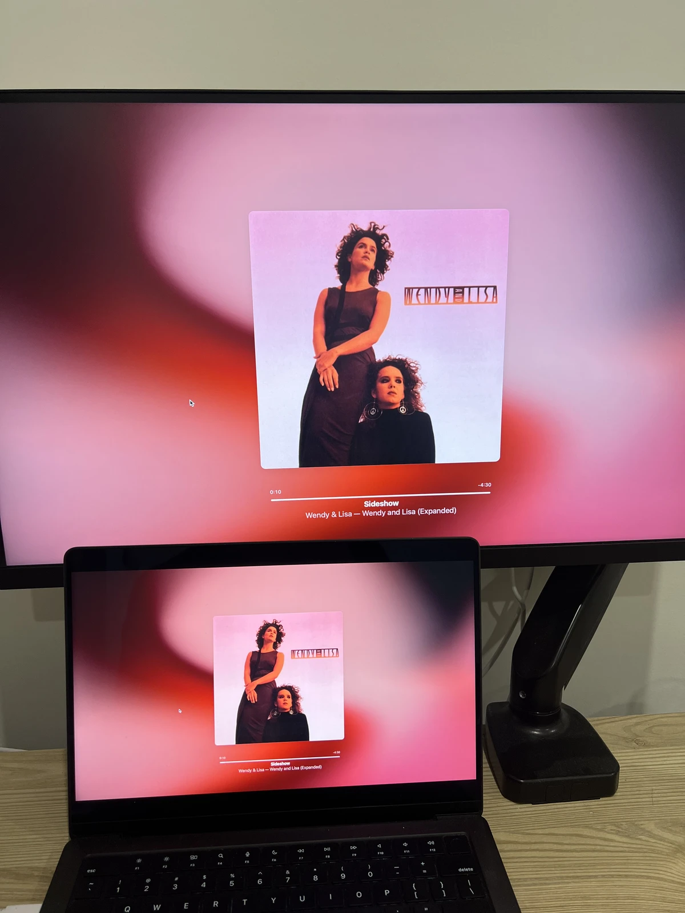

听着Prince的音乐，忍不住就会去查他的人生故事。

Prince的Purple Rain专辑尤其让人想了解他身边的乐队成员。其中有一首绝对不能错过的名曲，那就是Computer Blue。

## Computer Blue

  <iframe 
    src="https://www.youtube.com/embed/wyKeCYYzIRk"
    style="position:absolute;top:0;left:0;width:100%;height:100%;"
    frameborder="0"
    allowfullscreen>
  </iframe>

我之前一直以为这首歌里的"Lisa"指的是苹果麦金塔电脑。结果发现Lisa其实是一位乐队成员。
IT男的脑回路：Computer + Lisa = 苹果 哈哈

Purple Rain大获成功后，Prince解散了乐队。Wendy和Lisa独立出来，这张专辑就是她们作为二人组的第一张专辑。据说Prince苦苦挽留，在她们离开后深感心碎。听着她们独树一帜的风格，多少能理解他的心情。

## Honeymoon Express

  <iframe 
    src="https://www.youtube.com/embed/CaaTOWCLejU"
    style="position:absolute;top:0;left:0;width:100%;height:100%;"
    frameborder="0"
    allowfullscreen>
  </iframe>

这让我不禁反思，自己一直以来是不是主要在听（传统定义上的）男性艺术家的音乐。
尤其和Prince的曲子对比，有种难以言说的感觉。没有剑拔弩张，没有急于证明什么，没有那种非要展示什么的执念。

## Waterfall

  <iframe 
    src="https://www.youtube.com/embed/0o7xojyeX2s"
    style="position:absolute;top:0;left:0;width:100%;height:100%;"
    frameborder="0"
    allowfullscreen>
  </iframe>

流行音乐里，还有谁能以"水"为主题，做出这么纯粹的音乐？（"纯粹"的定义先放一边......哈哈）
音乐流淌得那么自由，那么轻盈，像是在细节里嬉游玩耍。感觉就像一个对"自我"毫无执念的AI，借了一副人类的躯体，来短暂地享受一下音乐。

## Sideshow

  <iframe 
    src="https://www.youtube.com/embed/J42V9TEXEI0"
    style="position:absolute;top:0;left:0;width:100%;height:100%;"
    frameborder="0"
    allowfullscreen>
  </iframe>

如果你是一个准备好用借来的躯体游历这个世界的旅人，欢迎来到这场Sideshow :)