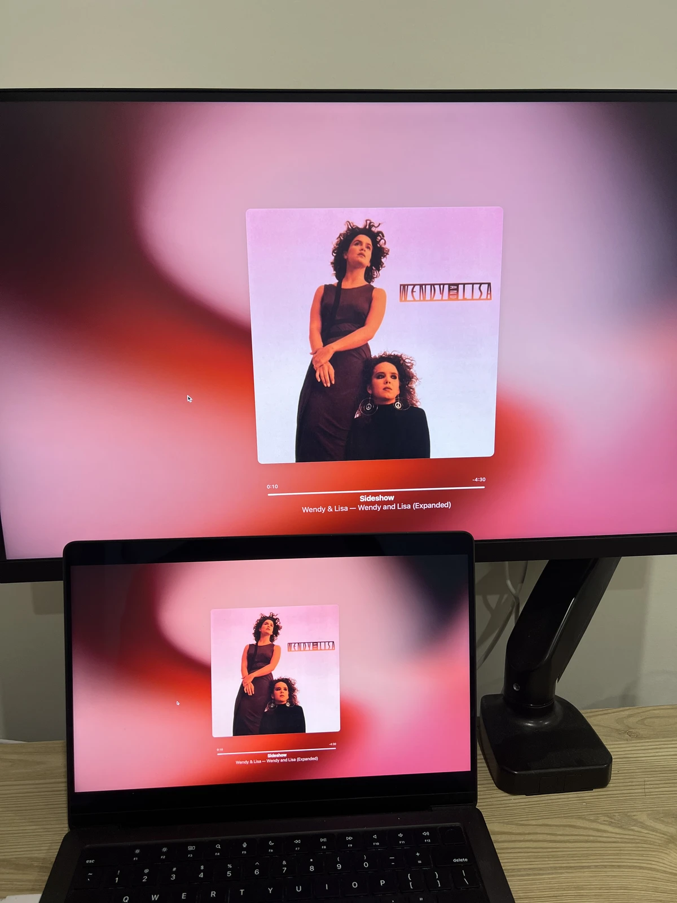

พอฟังเพลงของ Prince ไปเรื่อยๆ ก็อดสงสัยเรื่องราวชีวิตของเขาจนต้องไปตามหาข้อมูลไม่ได้
  
โดยเฉพาะอัลบั้ม Purple Rain ของ Prince ที่ทำให้อยากรู้จักสมาชิกวงรอบตัวเขาด้วย และในนั้นมีเพลงระดับตำนานที่พลาดไม่ได้เลยคือ Computer Blue

## Computer Blue

  <iframe 
    src="https://www.youtube.com/embed/wyKeCYYzIRk"
    style="position:absolute;top:0;left:0;width:100%;height:100%;"
    frameborder="0"
    allowfullscreen>
  </iframe>

ผมนึกว่า Lisa ในเพลงนี้หมายถึง Apple Macintosh แต่ที่จริงคือสมาชิกที่ชื่อ Lisa  
ในหัวของคนสาย IT, Computer + Lisa => Apple ฮ่าๆ

ได้ยินว่าหลังจาก Purple Rain ประสบความสำเร็จอย่างใหญ่หลวง แล้ว Prince ยุบวง สองคนนี้ก็แยกออกมาตั้งทีมของตัวเองและทำอัลบั้มแรกนี้ขึ้นมา 
Prince ขอให้สองคนนี้อยู่ต่อคนเดียวก็ยังดี แต่พอทั้งคู่จากไปเขาก็เสียใจมาก ซึ่งพอเห็นสไตล์ที่ไม่เหมือนใครของทั้งสองแล้วก็เข้าใจได้เลย

## Honeymoon Express

  <iframe 
    src="https://www.youtube.com/embed/CaaTOWCLejU"
    style="position:absolute;top:0;left:0;width:100%;height:100%;"
    frameborder="0"
    allowfullscreen>
  </iframe>

ผมเริ่มสงสัยว่าที่ผ่านมาตัวเองฟังแต่เพลงของศิลปินชาย (ในนิยามแบบดั้งเดิม) มาตลอดหรือเปล่า 
โดยเฉพาะเมื่อเทียบกับเพลงของ Prince ข้างบน มันรู้สึกได้ถึงการไม่มีความแค้นเคือง ไม่มีความหมกมุ่นที่จะต้องอวดหรือพิสูจน์อะไรสักอย่าง

## Waterfall

  <iframe 
    src="https://www.youtube.com/embed/0o7xojyeX2s"
    style="position:absolute;top:0;left:0;width:100%;height:100%;"
    frameborder="0"
    allowfullscreen>
  </iframe>

จะมีใครทำเพลงบริสุทธิ์ที่ว่าด้วยเรื่องน้ำแบบนี้ในโลกป๊อปได้อีก? (นิยามของคำว่าบริสุทธิ์ขอเก็บไว้ทีหลังก่อน..ฮ่าๆ)
ในขณะเดียวกันก็เหมือนเล่นสนุกกับดนตรีอย่างอิสระแบบเรียบๆ รายละเอียดต่างๆ ทำเอาอึ้ง 
เหมือน AI ที่ไม่ยึดติดกับการมีตัวตนของ 'ฉัน' ยืมร่างมนุษย์มาสวมแล้วแวะมาสนุกกับดนตรีสักพักหนึ่ง

## Sideshow

  <iframe 
    src="https://www.youtube.com/embed/J42V9TEXEI0"
    style="position:absolute;top:0;left:0;width:100%;height:100%;"
    frameborder="0"
    allowfullscreen>
  </iframe>

ถ้าคุณคือนักเดินทางที่พร้อมจะออกเดินทางด้วยร่างที่ยืมโลกนี้มาชั่วคราว ก็ขอต้อนรับเข้าสู่ sideshow นี้เลย :)
