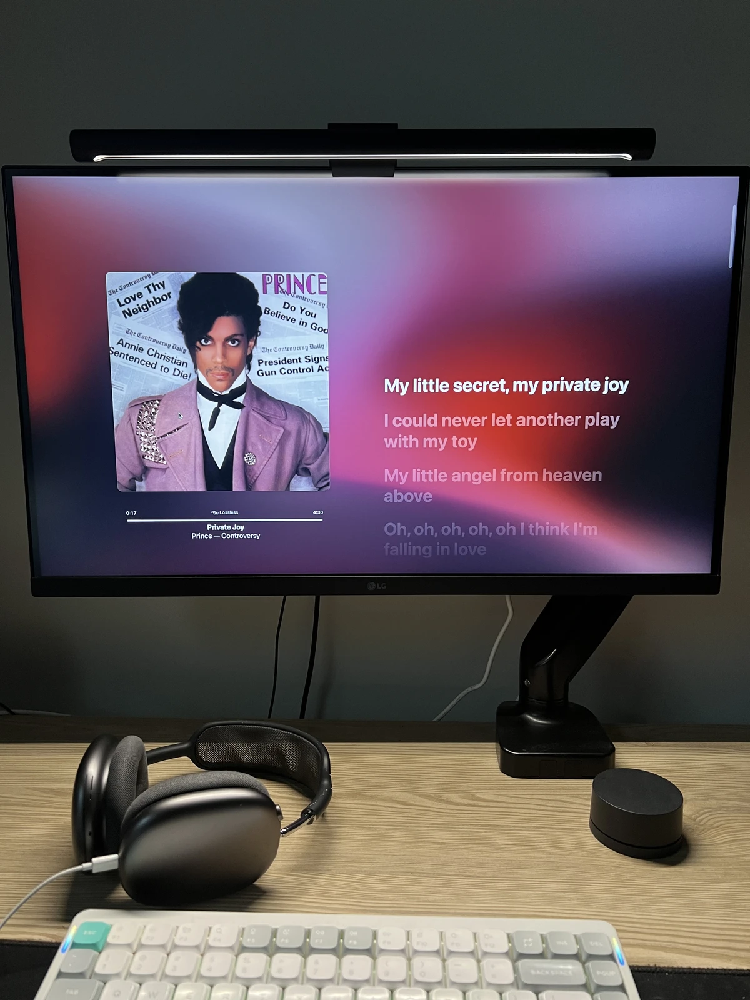

Prince's Controversy album! Such a joyful track — his obsession with sexual pleasure, or a tribute to it? 😅.
As you listen, that cheerful, bouncy breathlessness strangely? puts you in a good mood.

 

## Private Joy

  <iframe 
    src="https://www.youtube.com/embed/5BMz-eHOs5U"
    style="position:absolute;top:0;left:0;width:100%;height:100%;"
    frameborder="0"
    allowfullscreen>
  </iframe>

Listen to it on repeat and Prince's cry at the very beginning drives you crazy. Even his hiccup singing!
Somewhere in the back half, in the bridge, there's a line about strangling Rudolph Valentino, the original sex symbol actor — and honestly, fair enough!
Be my little, private, (sexual) joy 😁.

 

## Private Joy (Extended Dance Mix) - La Toya Jackson

  <iframe 
    src="https://www.youtube.com/embed/PXwxviNSYHg"
    style="position:absolute;top:0;left:0;width:100%;height:100%;"
    frameborder="0"
    allowfullscreen>
  </iframe>

This song was later remade by (Michael Jackson's sister) La Toya. The regular version follows the original format so closely that it ends up feeling off instead, and the extended version, the one with the producer's own interpretation in it, is the real thing.
The producer's style, mixed with that bass at the end where you can feel the Jackson influence + a Prince-style guitar arrangement — that interpretation is a lot of fun.

 

## Oh! - Girls' Generation

  <iframe 
    src="https://www.youtube.com/embed/TGbwL8kSpEk"
    style="position:absolute;top:0;left:0;width:100%;height:100%;"
    frameborder="0"
    allowfullscreen>
  </iframe>

But this song.. once you're listening, there's no way this one doesn't come to mind.
