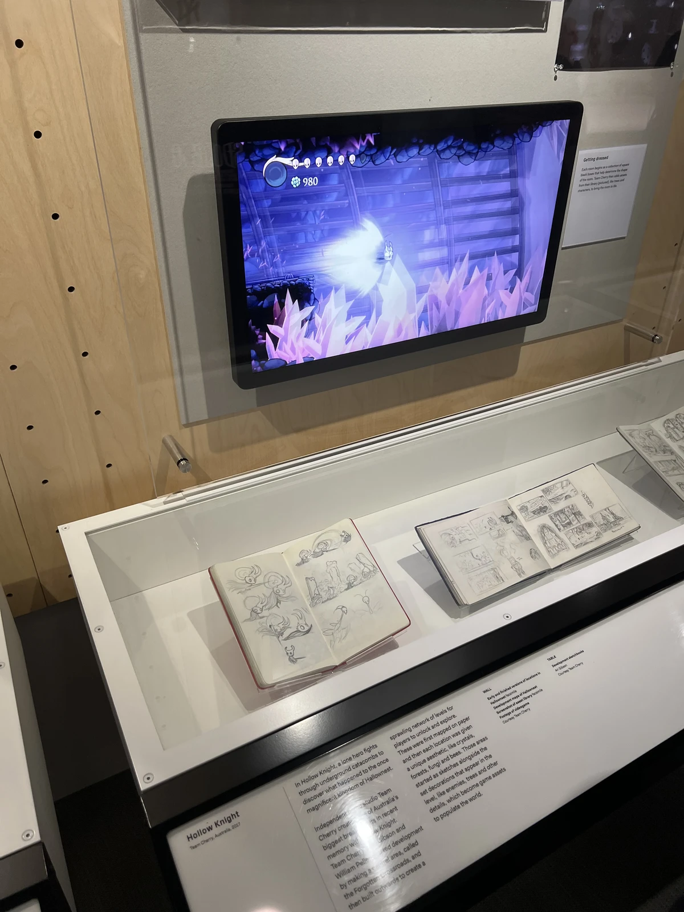
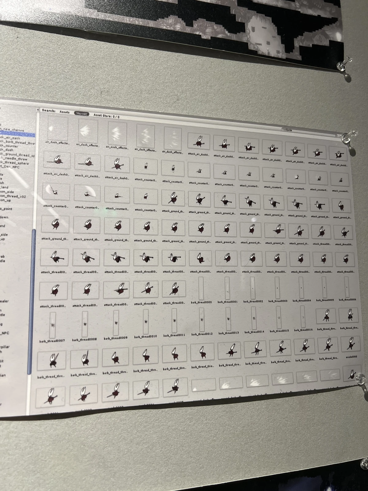
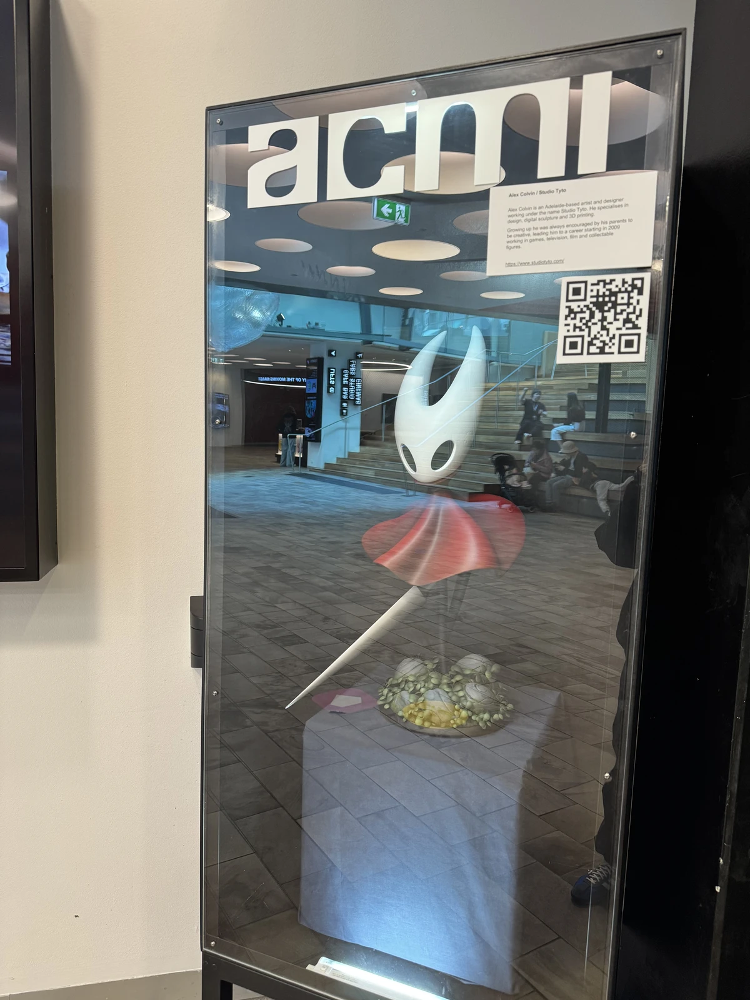
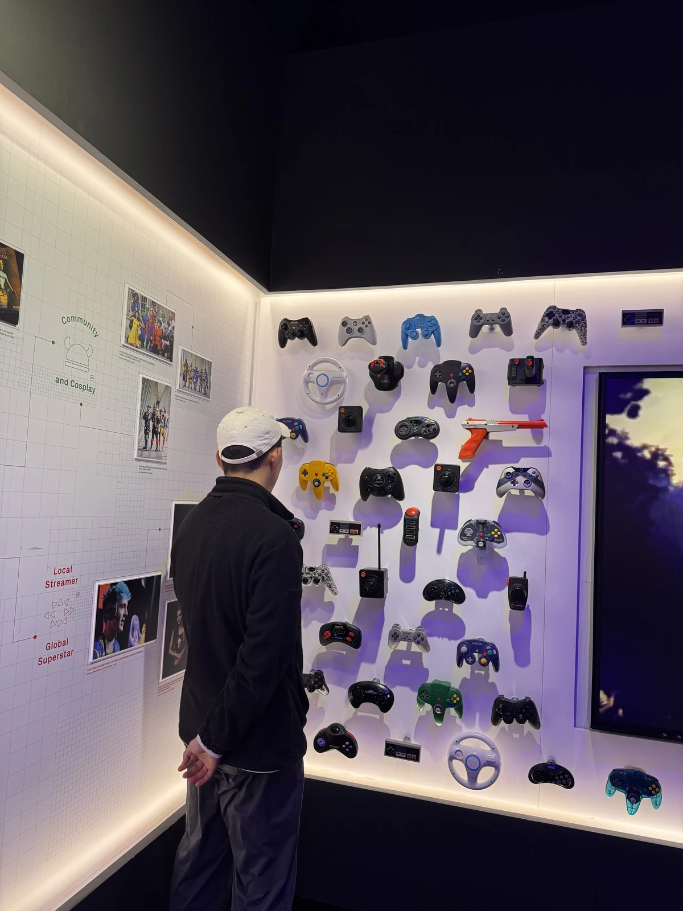
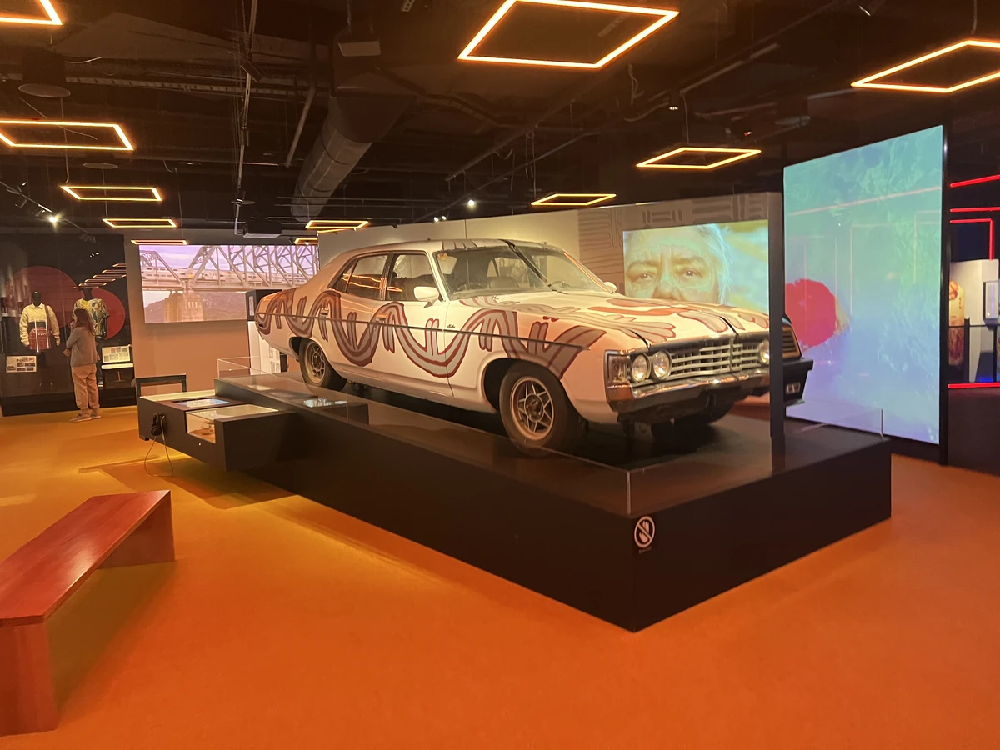
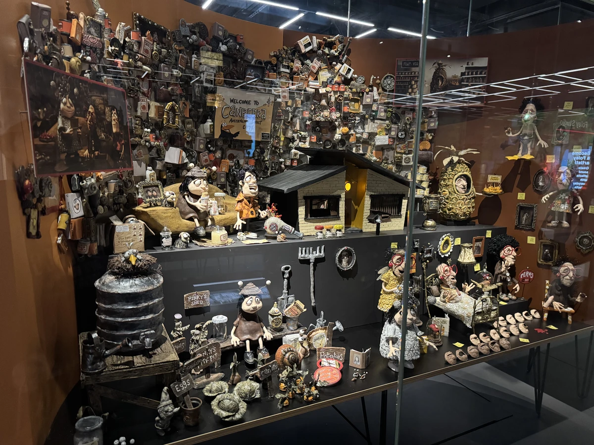
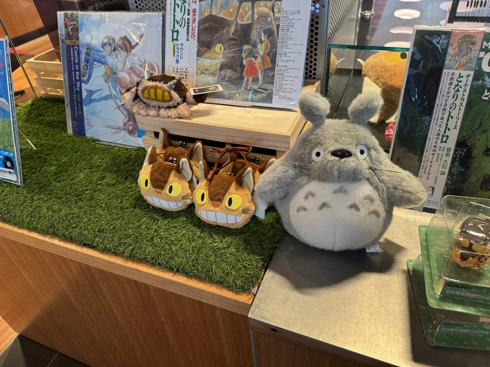

import Video from '../../../components/Video.astro';

I visited Melbourne from February 12th to 17th, so here's a quick travel log!

# Adelaide Airport

Even for an early morning weekday flight, Adelaide Airport was surprisingly busy.

Since it was a morning flight, there were no delays (apparently AI says morning flights have fewer delays), but the carry-on weight check was strict as always 😅.

# Lune Bakery

Our all-time favourite Lune Bakery!! I first tried it a couple of years ago after watching a Korean YouTuber's video about Melbourne, and it was so good I kept thinking about it ever since. As expected, there was a long queue of tourists.

This is a new city location where you can watch the pastries being made in real time while enjoying your coffee and pastries. It was a fun and novel experience, but I couldn't help feeling a little sorry for the staff, the thought of clients watching me work while sipping their coffee all day sounds pretty intense 😐..lol

# ACMI Museum Tour
We visited an exhibition space called ACMI in Melbourne.

Computers that bring back all the 90s nostalgia!

<Video src="/videos/ACMI1.mp4" />
Getting to actually touch them was satisfying, there's something special about pressing physical buttons 😀. Maybe it's because I was born in the 20th century.

<Video src="/videos/ACMI2.mp4" />
When you enter the museum, they give you a ticket that you can tap on devices throughout the exhibition. After your visit, you can enter your ticket code on their website at home to see everything you collected.

### Cup Head
<Video src="/videos/ACMI3.mp4" />
An exhibit showing the principles of stop motion animation, the figures literally look like they're dancing alive right in front of you.

### Hollow Knight

The development journey of the Australian indie game Hollow Knight was also on display. The exhibition was incredibly detailed, even original notebook sketches were included. Knowing that the developers are from Adelaide and seeing it displayed so beautifully in Melbourne gave me a strange feeling as an Adelaide resident. It really captures both the exhaustion and the passion that goes into game development.

### Controllers

Game controllers were also on display. I'd consider myself fairly interested in games, but most of the controllers were unfamiliar to me.

### Movies

There were also exhibits related to film. I don't know much about movies, but personally I was drawn to the distinct, striking quality that old black-and-white films have. Maybe I'll dive into some classic black-and-white films when I have some free time 🙂.

Miniatures used in the filming of the video work were also on display.
They seemed to be the ones used for the canvas-background pieces, but it was my first time seeing them.

There was also a video work by Korean contemporary artist Ayoung Kim.
For those interested: <a href="https://www.acmi.net.au/whats-on/ayoung-kim-delivery-dancers-arc-0-receiver/" target="_blank" rel="noopener noreferrer">
Ayoung Kim – Delivery Dancer's Arc: 0° Receiver</a>.

There was also a wide range of Studio Ghibli merchandise for sale.

# Ten Don San - Dinner

For dinner, we came to the only tendon restaurant in Melbourne CBD. I'd had great tendon back in Korea, so seeing it here felt like running into an old friend.

The lotus root tempura and mushroom were absolutely wonderful :)
I hope a tendon restaurant opens up in Adelaide someday.