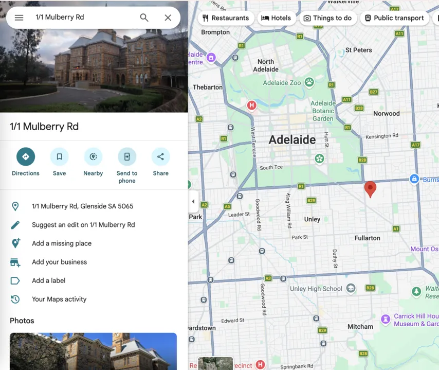
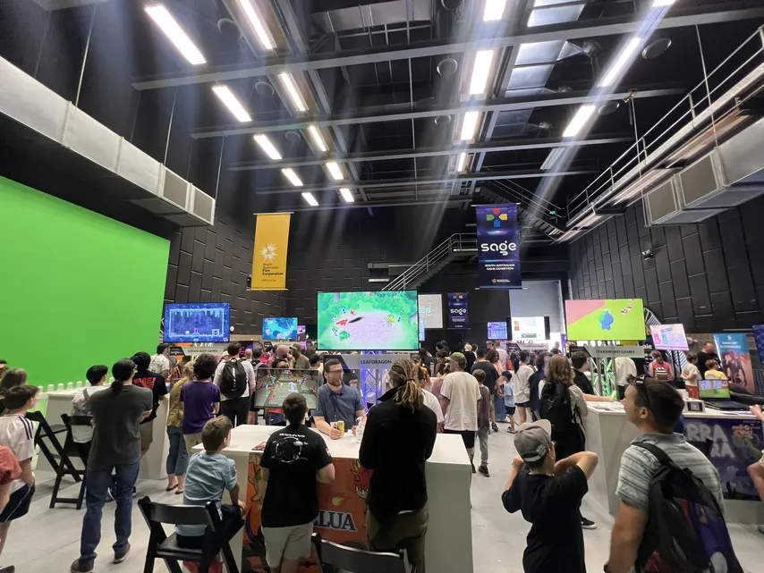
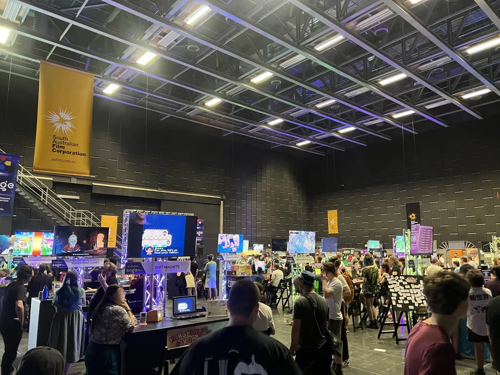
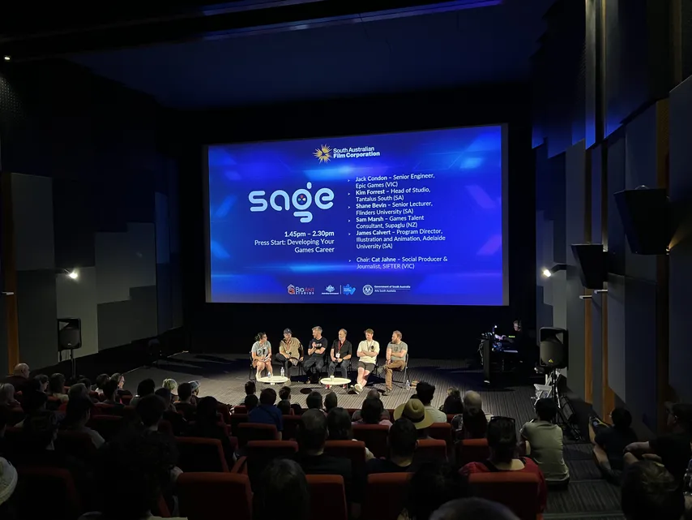
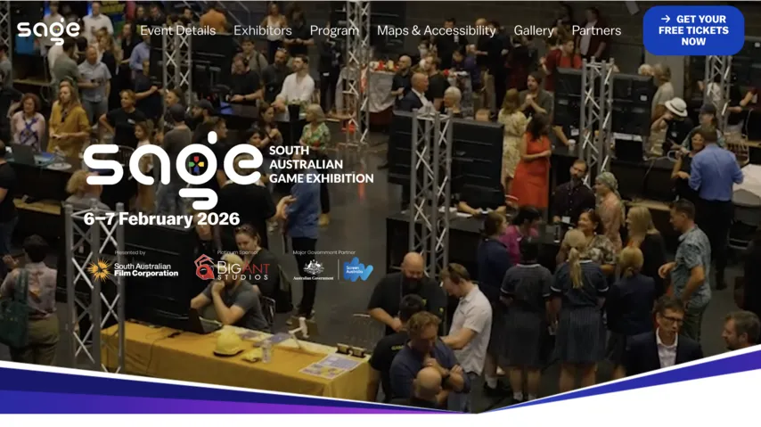

import Video from '../../../components/Video.astro';

I visited Sage event 2026 for the first time.
One of my acquaintances, who is part of the hosting team, recommended to attend as I appreciate game development. It is free!! 😀.

The event was hosted at South Australian Film Corporation (1 Mulberry Rd, Glenside SA 5065)
It was not easy to find car park, and "Permission parking only" was stated, but I noticed all the visitors just parked their car regardless 😅.

### Show Room 1

### Show Room 2

### Theatre (Career Session)

Game devs are purely driven by their passions, not job titles or money. I pay my respect to those who manage to turn that passion into a successful career (and make money). I think they are the developers of developers.

## Favourite Pick 1

The game was damn well-polished, 2D style footy game. Retro, clean, and modern. Especially loved footy ball bouncing's randomness. When it meets with 2D graphic, it creates the uniqueness of movement.
Interestingly, the devs mentioned it's actually rendered in 3D in the background, but displayed as 2D graphics.
It's available to wishlist on <a href="https://store.steampowered.com/app/3621330/Pro_Jank_Footy/" target="_blank" rel="noopener noreferrer">
  Steam
</a>.

## Favourite Pick 2

Dungeons and Dining Tables by Catalyst Games.
It's RPG adventure with some Animal Crossing vibes. You can grow your character, and also customise your own place, interacting with NPCs in the village.
I did ask them "where are the dungeons though?" — turns out they were inspired by Diablo and put "Dungeons" in the title, with plans to add it later. lol
Available to wishlist on <a href="https://store.steampowered.com/app/2941630/Dungeons_and_Dining_Tables/" target="_blank" rel="noopener noreferrer">
  Steam
</a> too.

## Experimental!
<Video src="/videos/hologram.mp4" />
I was lucky enough to find this 3D hologram projector. It uses a spinning wheel inside to project images. Apparently the rendering load being sent to the device is equivalent to a 4K display. You can notice some pixels though.
It has the exact old classic vibe, but in 3D. I got to play it. Loved the explosion effect 💥.

It looks nicer with the video they provided (No flickering like above)
Link: <a href="https://drive.google.com/file/d/1PGdCWiMzTZCJdBCWRH_Au91vkytDlHCv/view?usp=drivesdk" target="_blank" rel="noopener noreferrer">
  G Drive </a>

BTW, the device is not cheap 😮. (This is a smaller version)

It was free entry (still requires ticket) and I could try many games in early stages. I was privileged to see passionate developers, who are purely driven by the joy of craftsmanship 😁.