import Video from '../../../components/Video.astro';

지난 2월 12일부터 17일까지 멜버른에 다녀와서 간단한 여행기 작성이다!

# Adelaide Airport
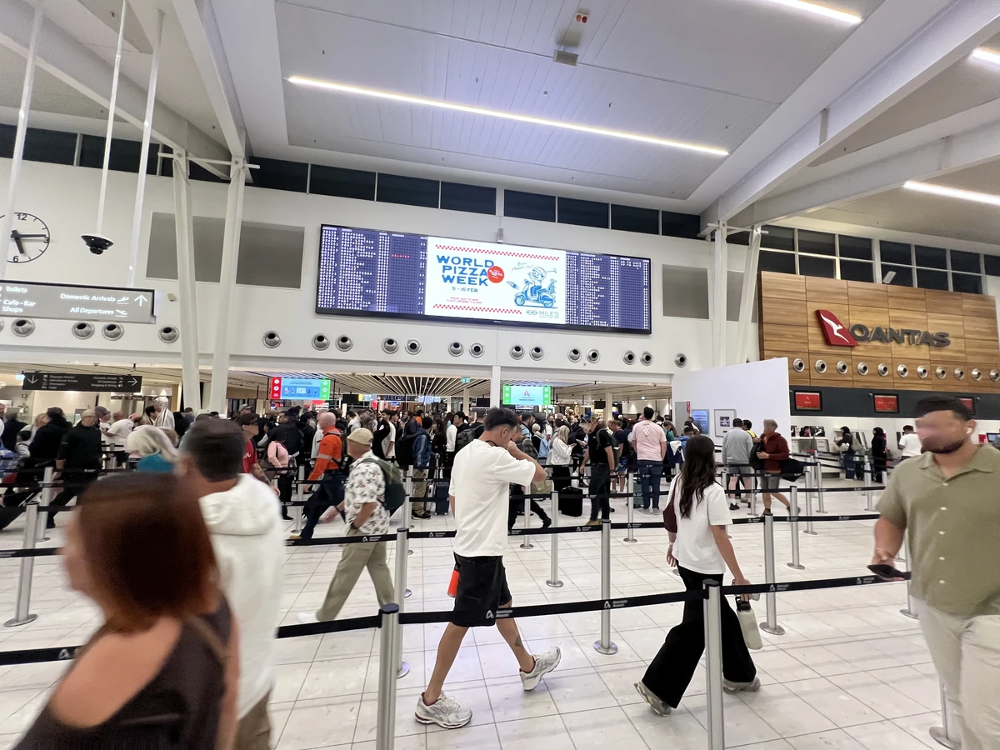
애들레이드 공항의 평일의 이른 오전 비행기여도 꽤나 사람들이 북적였다. 

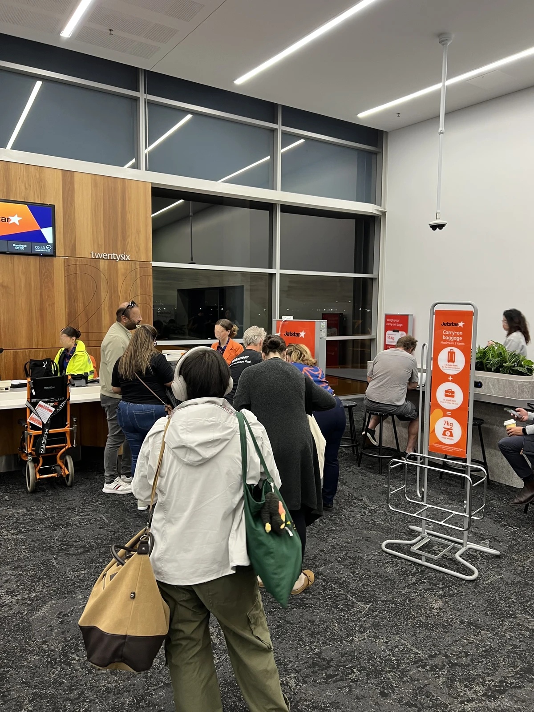
역시나 오전이라 딜레이는 없었지만 (AI에 따르면 오전 비행기가 딜레이가 적다는 듯), 역시 기내 짐 무게 검사는 칼같이 했다 😅. 

# Lune Bakery

우리의 최애 베이커리 륜 베이커리!!다. 재작년, 멜버른에 유튜버 영국남자의 영상을 보고 처음 먹어봤는데, 너무 맛있어서 계속 생각났던 베이커리다. 역시 관광객으로 줄이 길었다.

시티에 새로운 지점인데 커피와 페이스츄리를 먹으며 어떻게 만들어지는지 실시간으로 볼 수 있게 해놓았다. 처음 경험해보는 관경이라 즐거운건 인정했지만 일하는 사람들에게 뭔가 미안한 마음이 드는건 어쩔 수 없었다 😐. 내가 일하는 곳이 커피마시며 클라이언트가 나를 항상 지켜보고 있다고 생각하니 아찔하다..ㅋㅋ

# ACMI Museum Tour
멜버른 ACMI라고 하는 전시관에 갔다.
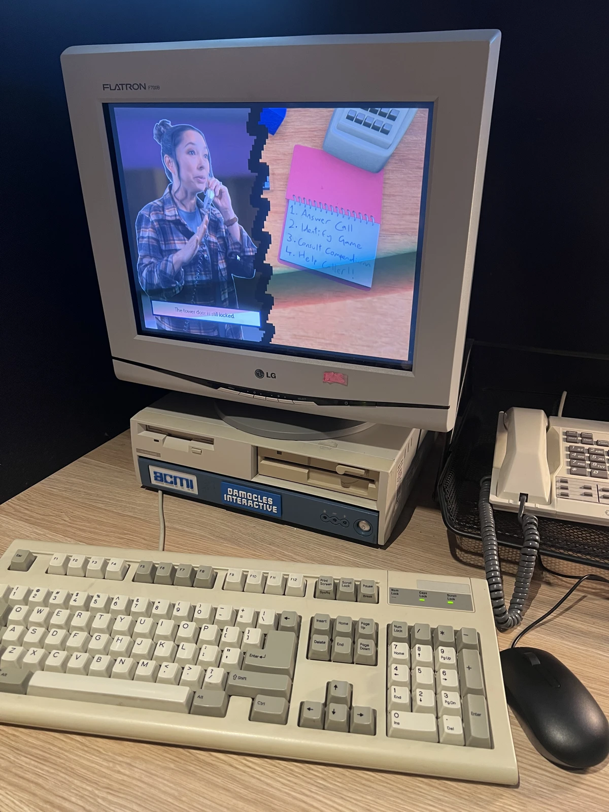
90년대 향수 자극하는 컴퓨터! 
<Video src="/videos/ACMI1.mp4" />
직접 만져보는데 역시 버튼 누르는 맛이 있다 😀 20세기에 태어난 사람이라 그런걸수도.

<Video src="/videos/ACMI2.mp4" />
전시관 입장시에 기기에 테그할 수 있는 입장권을 준다. 테그하면 후에 집에서 내가 뭘 테그해서 모았는지 티켓 코드를 웹사이트에 입력하면 확인 할 수 있다고 한다.

### Cup Head
<Video src="/videos/ACMI3.mp4" />
스탑 모션의 원리를 보여주는 전시물인데 눈앞에서 인형이 살아서 춤춘다.

### Hollow Knight
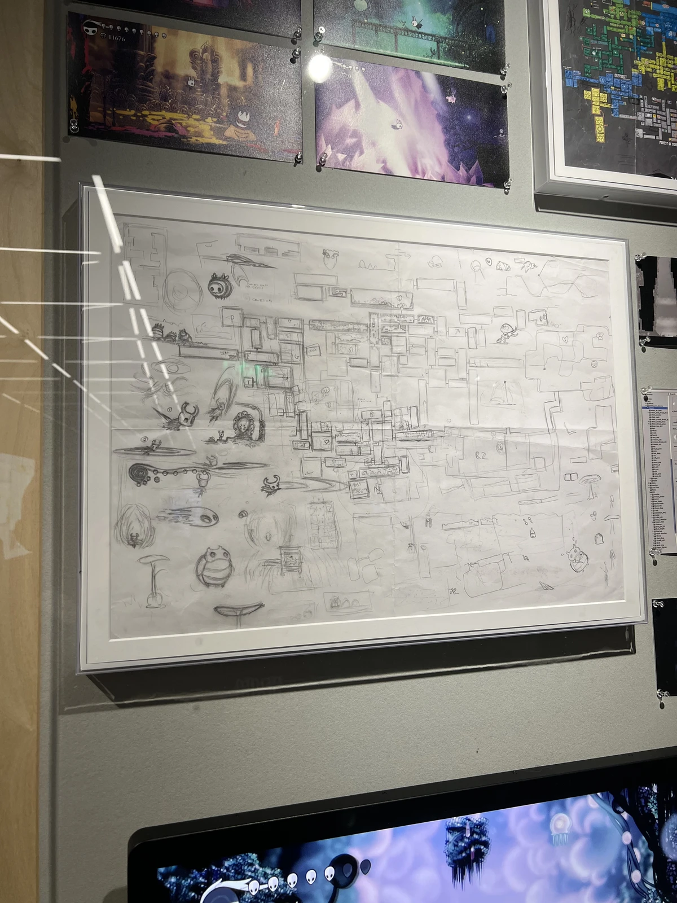

호주 인디 게임 할로우 나이트 개발 여정들도 전시되어 있었다. 애들레이드 개발자들인데 멜버른에 이렇게 전시가 디테일하고 노트 스케치 원본꺼지 잘 되어 있는걸 보니 애들레이드 거주자로서 기분이 좀 묘하긴 했다. 역시 게임 개발의 고단함과 열정이 동시에 느껴진다.

### Controllers

게임 컨트롤러들도 전시되어 있었다. 게임에 관심은 많다고 생각하지만 대부분 낯선 컨트롤러들이다.

### Movies
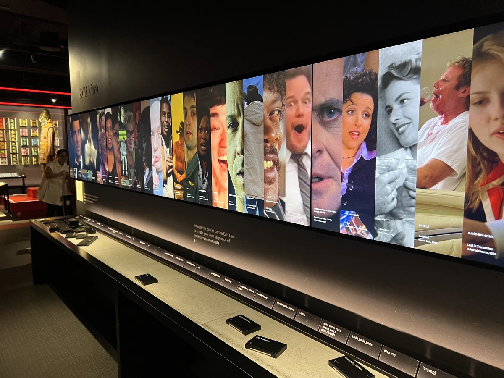
영상물 관련 전시되어 있었다. 영화에 대해서 잘 모르지만 개인적으로 흑백의 과거 영화물에서 느껴지는 명확한 강렬하면서 느낌이 좋았다. 나중에 심심하면 과거 흑백영화들을 좀 파볼까 싶다 🙂.

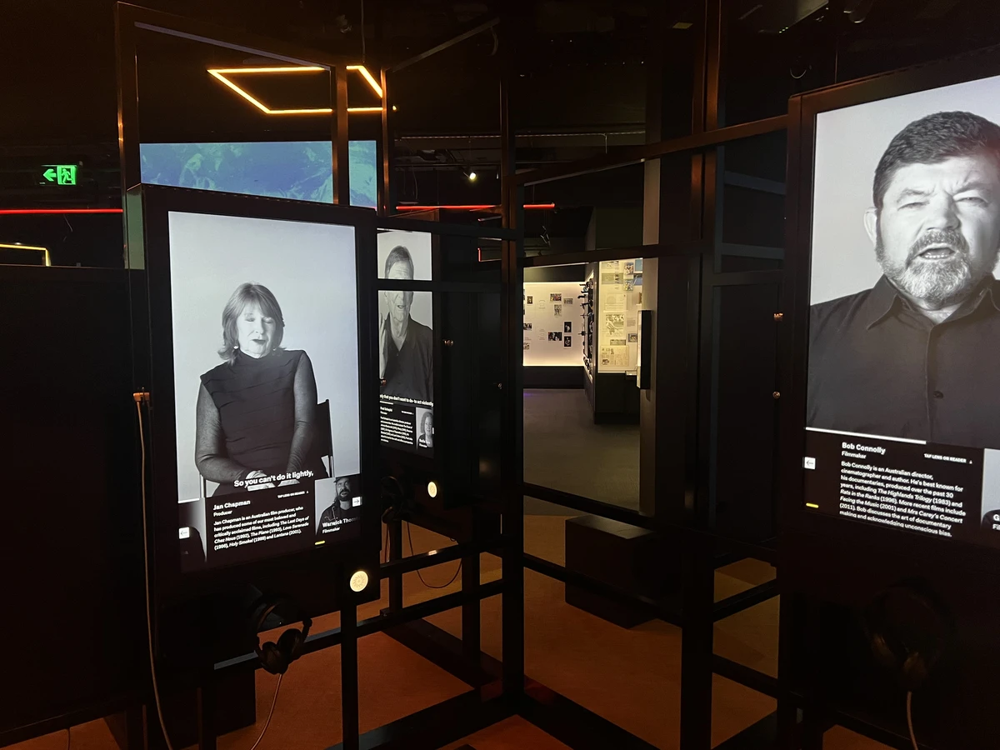

영상물 촬영에 사용된 미니어처도 전시되어 있었다. 배경이 캔버라인 작품인데 처음 보았음.

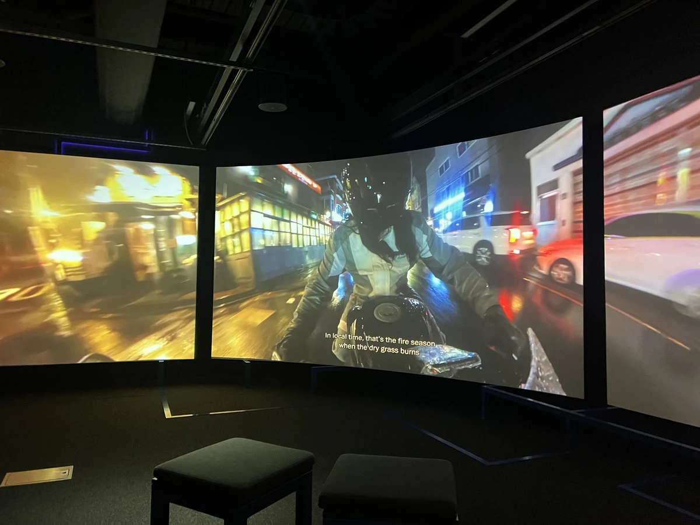
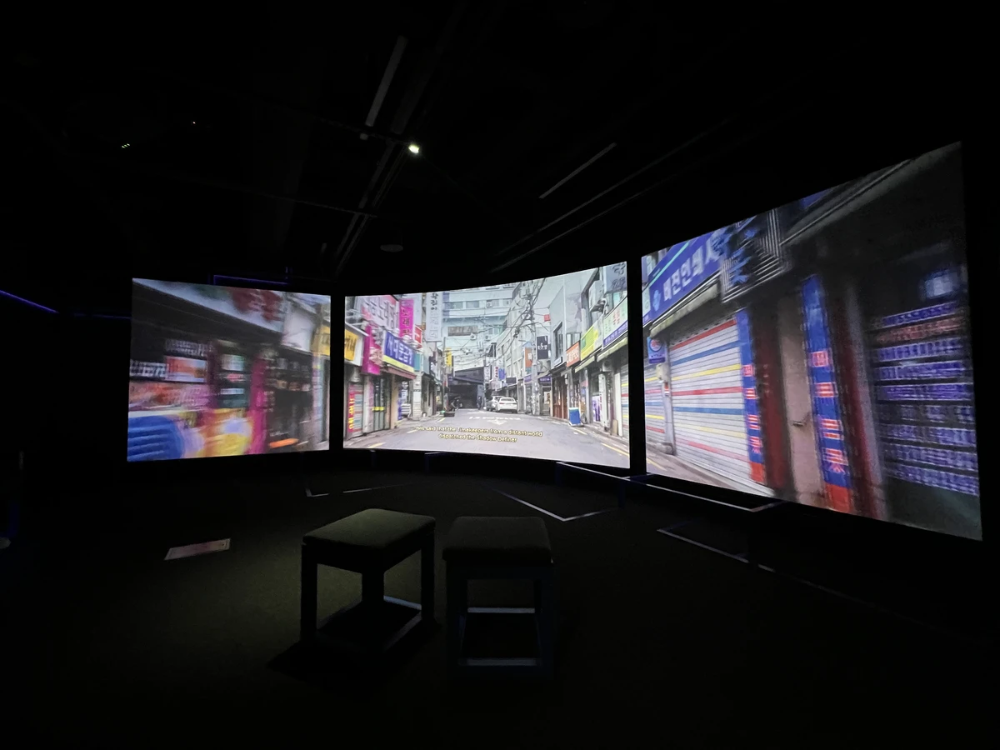
김아영 현대미술가의 영상물도 있었다. 
관심있는 분들은 <a href="https://www.acmi.net.au/whats-on/ayoung-kim-delivery-dancers-arc-0-receiver/" target="_blank" rel="noopener noreferrer">
Ayoung Kim – Delivery Dancer's Arc: 0° Receiver</a>.

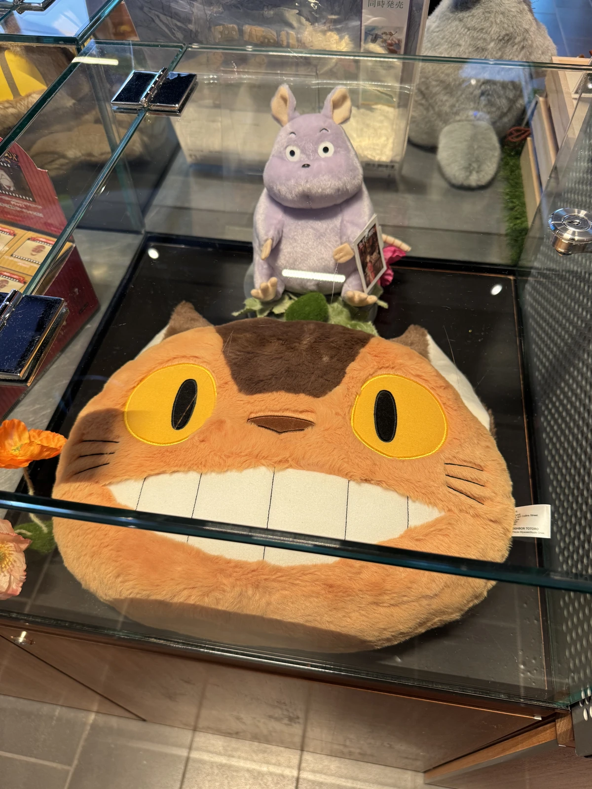

지브리관련 굿즈도 다양하게 판매한다.

# Ten Don San - Dinner
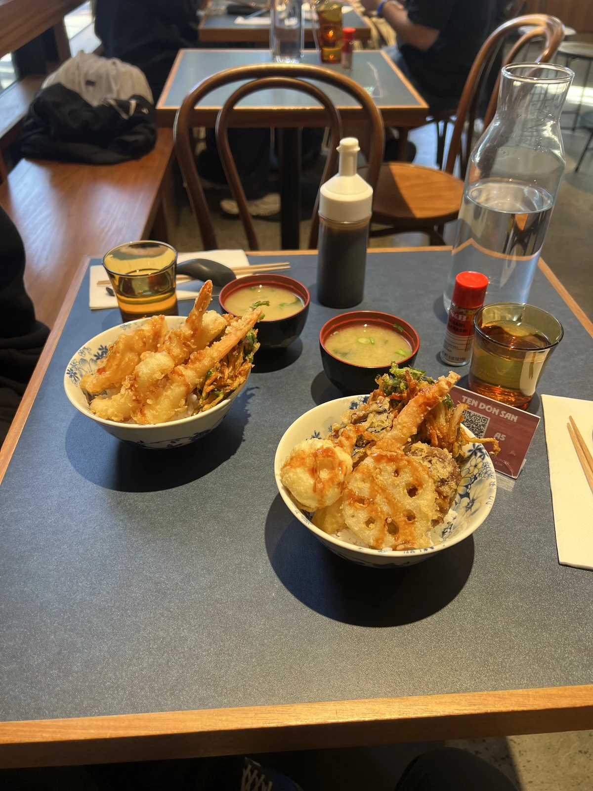
저녁으로는 멜버른CBD에 단 하나 있는 텐동 집에 왔다. 한국에서 맛있게 먹었는데, 여기서 보니 너무 반가웠다.
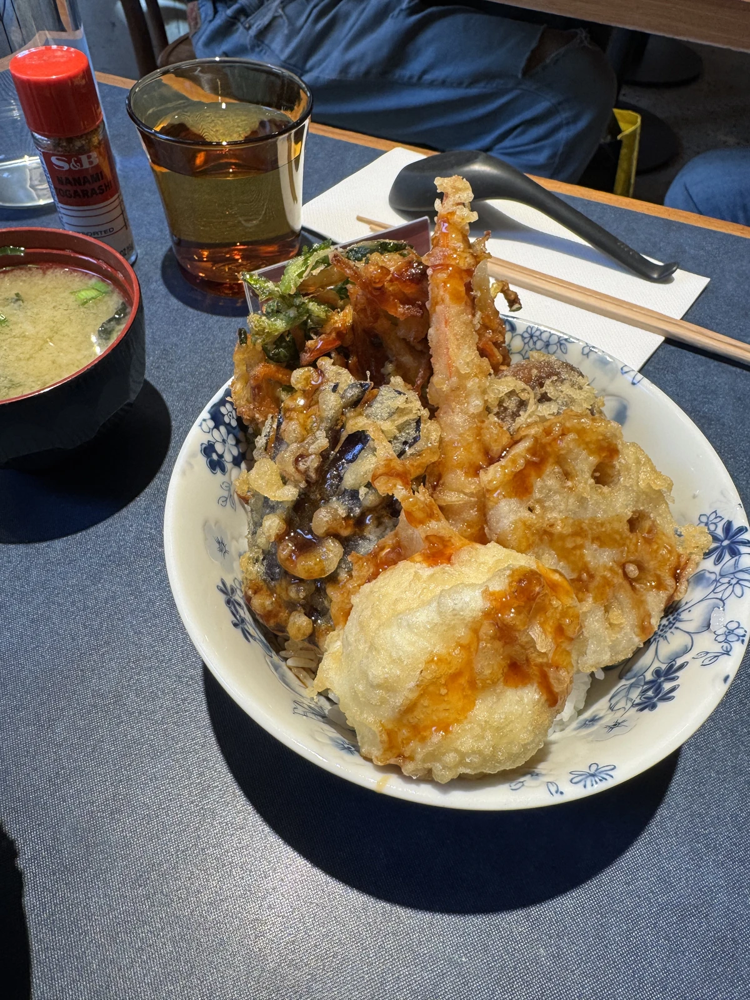
연근 튀김이랑, 버섯이 아주 예술이었다 :)
애들레이드에도 텐동집 하나 생기면 좋을 것 같다.

