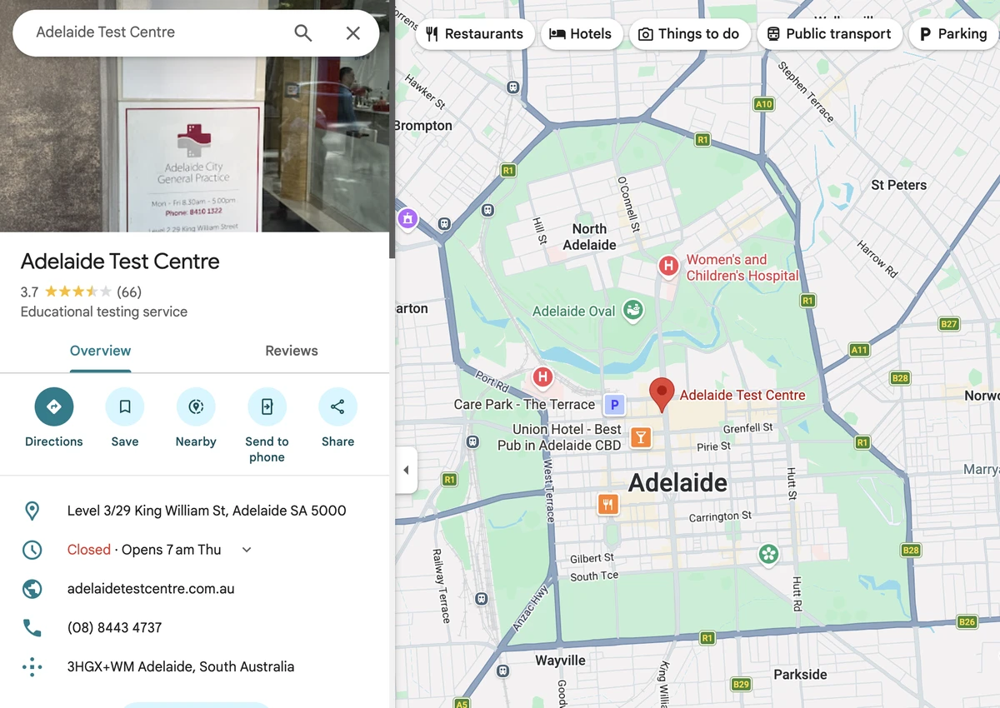
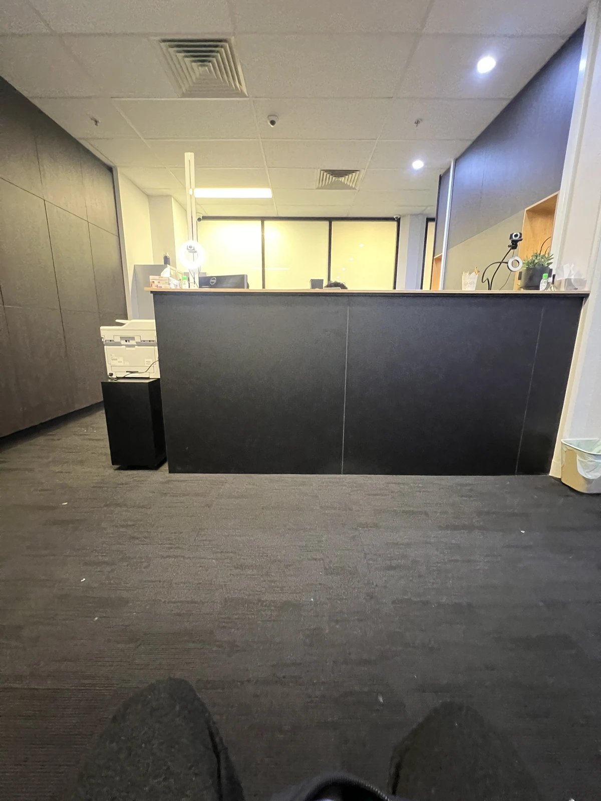
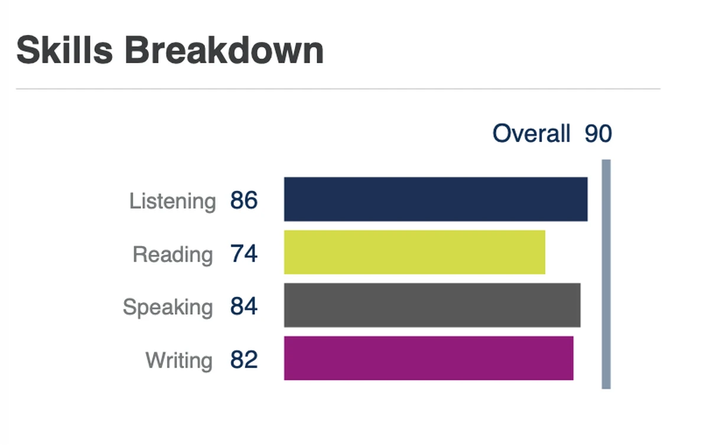

개인적인 실패기라 올릴까 말까 망설여졌는데 그래도 내 삶의 부분을 담담하게 공유하고 싶다. 이 포스트는 내 욕구가 이뤄지지 못한 경험기다 :)
영어 공부하면서도 내 마음은 역시 내 개인 Anotherhome.com.au 프로젝트랑 이 블로그에 쏠려있다 😅.

여기서 봤다. 

테스트 당일, 떨리는 마음.

PTE 영어 시험 봤는데 안타깝게도? superior, 단계 점수는 안나왔다. 스피킹에서 4점, 쓰기에서는 3점이 부족했다.

extended speaking에서 점수가 많이 떨어졌다.
이건 내가 인정, 새로 접한 Summarise Group Discussion에서 더듬 거리고 pause가 종종 있었다.
아무래도 모든 내용을 다 적고 싶은 마음에 두서없이 적다보니 실제로 정리할때는 내가 놓쳤다.

그리고 원래 retell lecture가 이렇게 어려웠나? 첫번째 질문에서 자꾸 소금(salt)이 air pollution에
연관된다고 하는데 이게 무슨 소린지? (나중에 보니 Soot라고 먼지라는 뜻이라는데 나는 처음 알았다.)

영어 시험 나름 꽤 준비했는데 아쉽게?도 내 소망은 이뤄지지 못했다.
그래도 내가 부족한 부분은 인지 했고 가능성은 객과적으로 꽤 보이니 다음 라운드에서 최선을 다하겠다.

