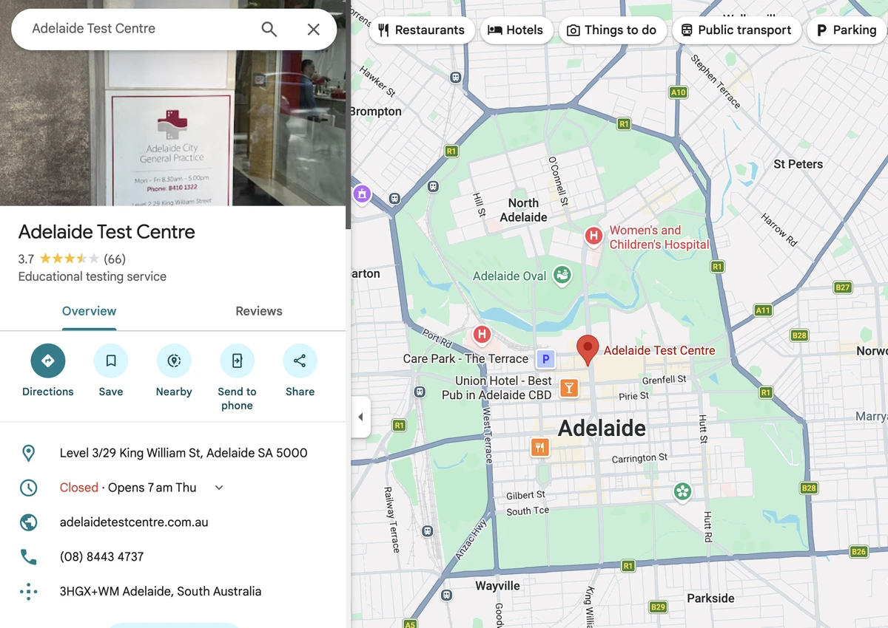
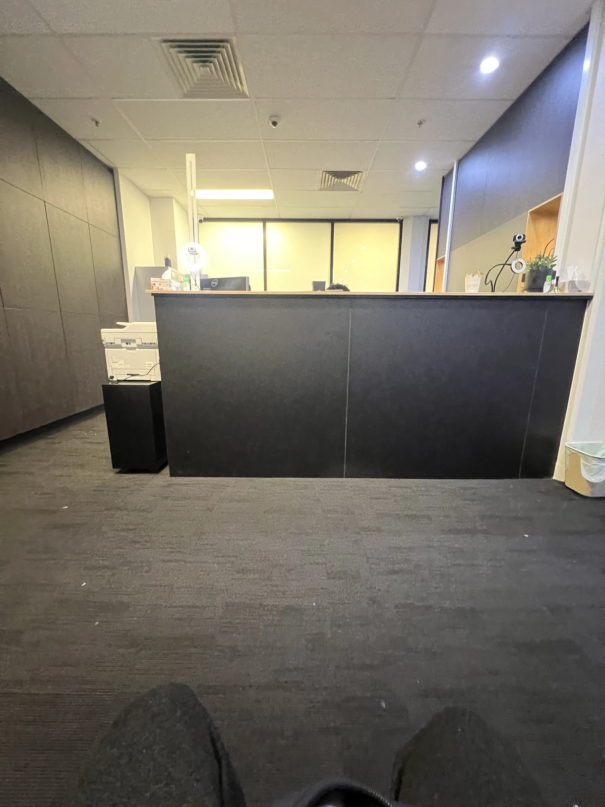
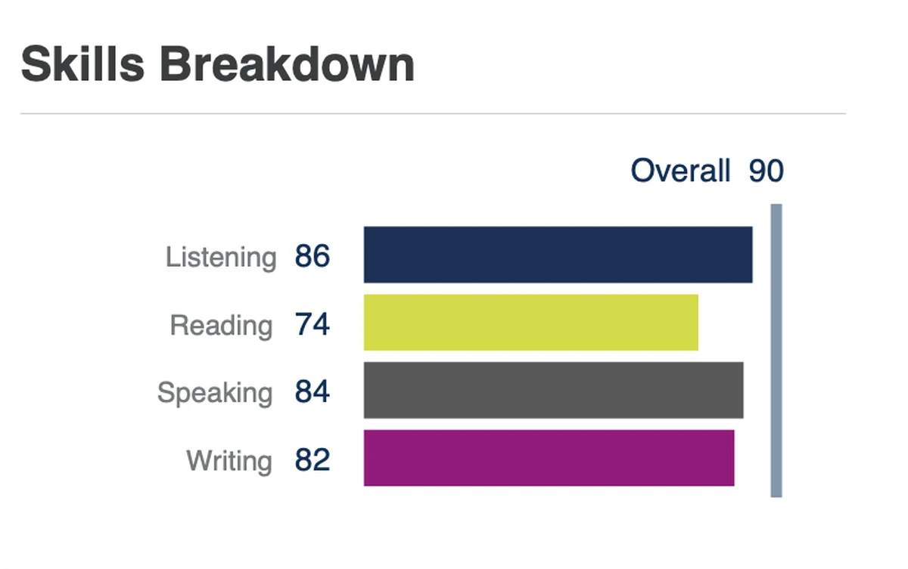

Vì là chuyện thất bại cá nhân nên tôi đã lưỡng lự không biết có nên đăng không, nhưng tôi vẫn muốn chia sẻ một phần đời mình một cách bình thản. Bài này là ghi chép về một trải nghiệm mà mong muốn của tôi đã không thành :)
Ngay cả khi đang học tiếng Anh thì lòng tôi vẫn cứ hướng về dự án cá nhân Anotherhome.com.au và cái blog này 😅.

Tôi thi ở đây.

Ngày thi, lòng hồi hộp.

Tôi đã thi tiếng Anh PTE, nhưng tiếc thay? mức điểm superior thì chưa đạt. Phần nói thiếu 4 điểm, phần viết thiếu 3 điểm.

Điểm rớt nhiều ở phần extended speaking.
Cái này tôi phải công nhận, ở phần Summarise Group Discussion lần đầu gặp, tôi nói lắp bắp và thỉnh thoảng có những khoảng ngập ngừng.
Chắc tại muốn ghi lại hết mọi nội dung nên viết không đầu không đuôi, tới lúc nói thật thì mạch bị rối tung.

Với lại retell lecture vốn khó thế này à? Ở câu đầu tiên họ cứ nói mãi rằng muối (salt) có liên quan tới air pollution,
tôi chẳng hiểu chuyện gì đang xảy ra (về sau xem lại mới biết đó là chữ Soot, nghĩa là bồ hóng, tôi lần đầu mới biết).

Tôi cũng đã chuẩn bị cho kỳ thi khá kỹ, vậy mà tiếc thay? nguyện vọng của tôi vẫn không thành.
Dù vậy tôi đã nhận ra mình còn thiếu ở đâu, và nhìn một cách khách quan thì khả năng vẫn khá rõ, nên vòng sau tôi sẽ làm hết sức.
