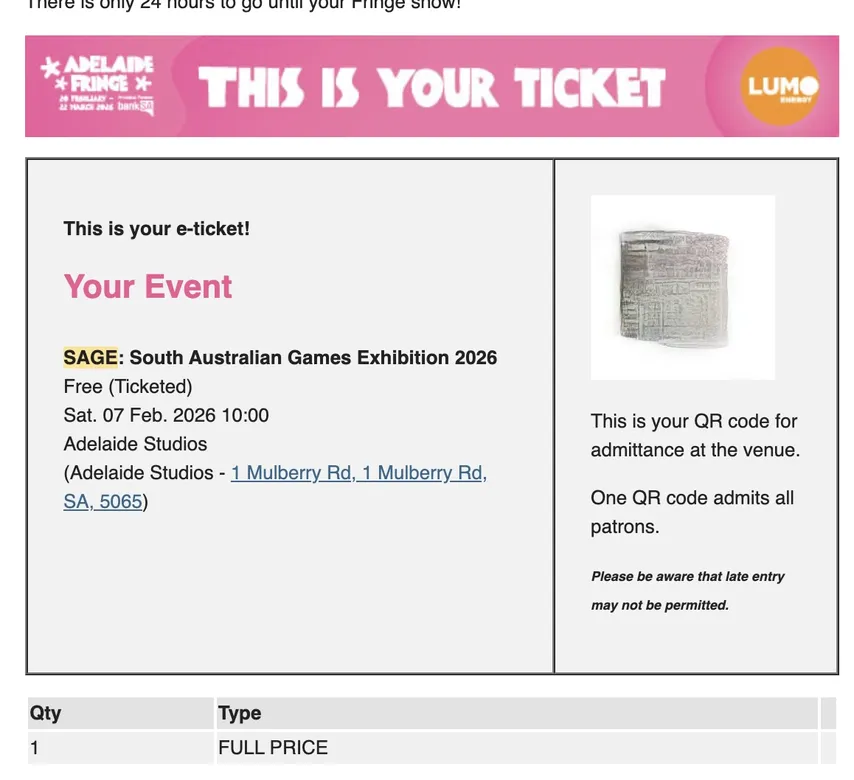

import Video from '../../../components/Video.astro';

第一次参加了 SAGE 2026 活动。
主办团队里有个朋友知道我对游戏开发感兴趣，推荐给我的，而且免费！！😀

活动在南澳电影公司（1 Mulberry Rd, Glenside SA 5065）举办。
停车位不太好找，现场标注着"仅限授权车辆停车"，但来的人好像都不当回事，照停不误 😅。

### 展馆 1

### 展馆 2

### 礼堂（职业发展讲座）

游戏开发者靠的不是头衔、公司或金钱，而是热情。能把这份热情转化为成功职业（同时也赚到钱）的人，我由衷地敬佩。他们大概才是开发者中的开发者吧。

## 最印象深刻的游戏 1

完成度非常高的 2D 足球游戏。复古又干净，同时带着一股现代感。尤其喜欢足球弹跳的随机性。据开发团队说，其实后台是用 3D 渲染的，只是输出成 2D 画面呈现。
感兴趣的话可以在 <a href="https://store.steampowered.com/app/3621330/Pro_Jank_Footy/" target="_blank" rel="noopener noreferrer">Steam</a> 上加入愿望单。

## 最印象深刻的游戏 2

Catalyst Games 的 Dungeons and Dining Tables。
一款有动森风格的 RPG 冒险游戏，可以培养角色、装扮自己的空间，还能和村里的 NPC 互动。不过我问了一句"地牢在哪？"，开发者说是受暗黑破坏神启发，就先把"Dungeon"放进了游戏名，大概之后会加进去吧。ㅋ
同样可以在 <a href="https://store.steampowered.com/app/2941630/Dungeons_and_Dining_Tables/" target="_blank" rel="noopener noreferrer">Steam</a> 上加入愿望单。

## 实验性游戏
<Video src="/videos/hologram.mp4" />
运气不错，发现了一台 3D 全息投影仪。利用内部旋转轮来投影图像，据说传输到设备的渲染负荷相当于一块 4K 显示屏。不过像素感还是有点明显。
整体是那种复古经典的感觉，但以 3D 呈现出来。我亲自体验了一下，爆炸特效尤其喜欢 💥。

厂商提供的演示视频效果要好看很多（没有上面视频里的闪烁感）
https://drive.google.com/file/d/1PGdCWiMzTZCJdBCWRH_Au91vkytDlHCv/view?usp=drivesdk

话说回来，这台设备的价格可不便宜 😮。（这还是小尺寸版本）

免费入场（需要票），可以亲身体验各种处于早期阶段的游戏。能近距离看到那些纯粹因为喜欢而投入其中的热情开发者，真的很开心 😁。