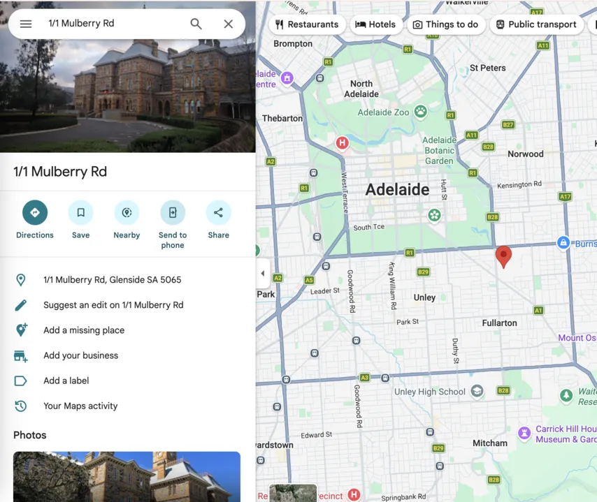
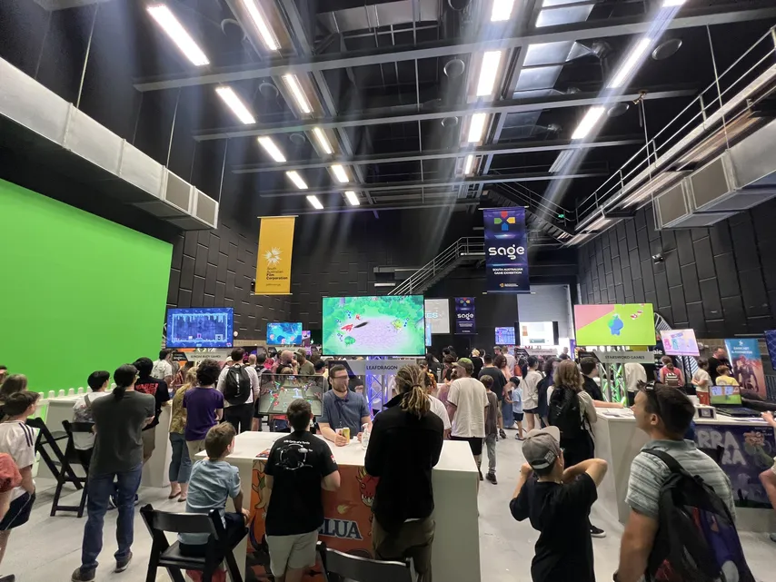
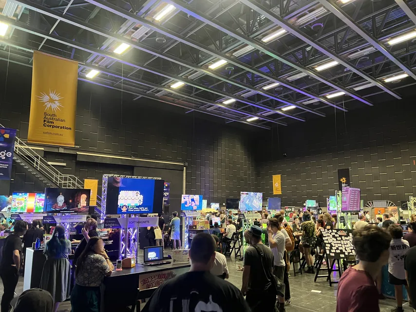
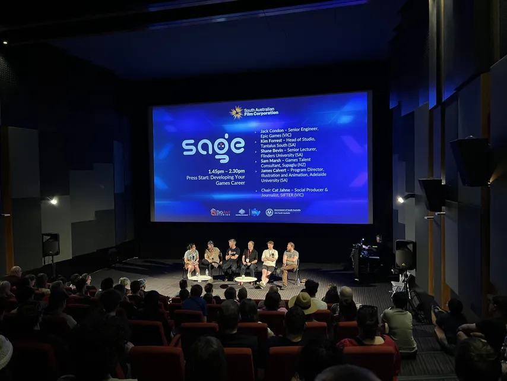
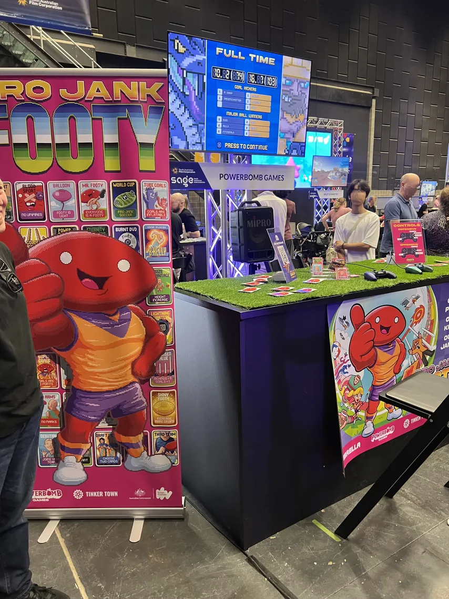
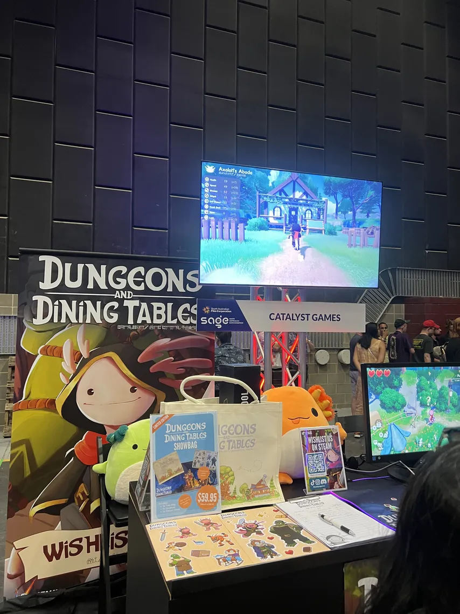
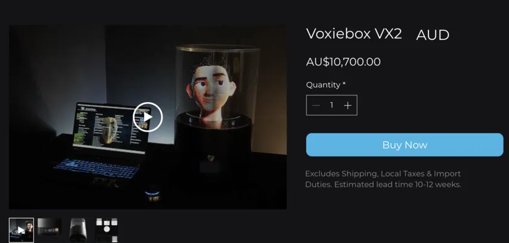
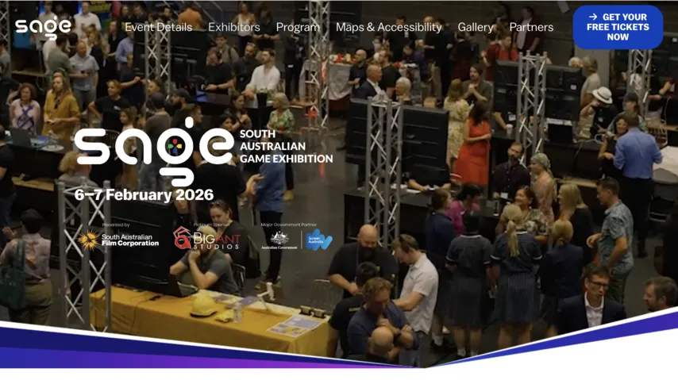
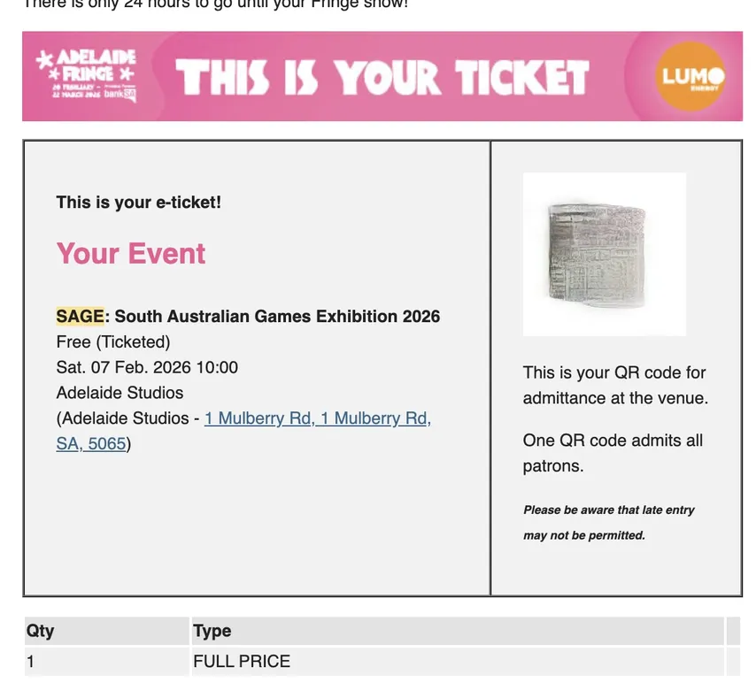

import Video from '../../../components/Video.astro';

ผมไปร่วมงาน SAGE 2026 เป็นครั้งแรก
คนรู้จักที่อยู่ในทีมจัดงานแนะนำผมซึ่งสนใจการพัฒนาเกมให้ไป แถมฟรี!! 😀

งานจัดที่ South Australian Film Corporation (1 Mulberry Rd, Glenside SA 5065)
หาที่จอดรถยากพอสมควร และถึงจะเขียนไว้ชัดว่า "เฉพาะรถที่ได้รับอนุญาตเท่านั้น" แต่ผู้มาร่วมงานก็ดูจะจอดกันโดยไม่สนใจอะไรเลย 😅

### ห้องจัดแสดงที่ 1

### ห้องจัดแสดงที่ 2

### หอประชุม (เซสชันเรื่องอาชีพ)

นักพัฒนาเกมขับเคลื่อนด้วยแพสชัน ไม่ใช่ตำแหน่ง บริษัท หรือเงิน ผมขอคารวะจากใจจริงต่อคนที่เชื่อมแพสชันนั้นเข้ากับเส้นทางอาชีพที่สำเร็จ (และหาเงินได้ด้วย) พวกเขานี่แหละน่าจะเป็นนักพัฒนาในบรรดานักพัฒนาทั้งหมด

## เกมที่ประทับใจที่สุดอันดับ 1

เป็นเกมฟุตบอล 2D ที่ความสมบูรณ์สูงมาก ให้ความรู้สึกเรโทรแต่ก็สะอาดตาและโมเดิร์นไปพร้อมกัน ผมชอบเป็นพิเศษตรงความสุ่มของการกระดอนของลูกบอล ทีมพัฒนาบอกว่าจริงๆ แล้วเรนเดอร์เป็น 3D อยู่เบื้องหลัง แล้วแสดงผลออกมาเป็นกราฟิก 2D
ถ้าสนใจก็เพิ่มลงวิชลิสต์ได้ที่ <a href="https://store.steampowered.com/app/3621330/Pro_Jank_Footy/" target="_blank" rel="noopener noreferrer">
Steam</a>

## เกมที่ประทับใจที่สุดอันดับ 2

Dungeons and Dining Tables ของ Catalyst Games
เป็นเกม RPG ผจญภัยที่ให้ความรู้สึกแบบ Animal Crossing ปั้นตัวละครให้เติบโต ตกแต่งพื้นที่ของตัวเอง และมีปฏิสัมพันธ์กับ NPC ในหมู่บ้านได้ แต่ดันเจียนอยู่ไหนล่ะครับ? ผมถามไปแบบนั้น เขาบอกว่าได้แรงบันดาลใจจาก Diablo เลยใส่คำว่า 'ดันเจียน' ไว้ในชื่อเกมก่อน คงจะเพิ่มเข้ามาทีหลังมั้ง ฮ่าๆ
เช่นกัน เพิ่มลงวิชลิสต์ได้ที่ <a href="https://store.steampowered.com/app/2941630/Dungeons_and_Dining_Tables/" target="_blank" rel="noopener noreferrer">Steam</a> เหมือนกัน

## เกมเชิงทดลอง
<Video src="/videos/hologram.mp4" />
โชคดีที่ผมได้เจอเครื่องฉายโฮโลแกรม 3D มันฉายภาพโดยใช้วงล้อที่หมุนอยู่ข้างใน ได้ยินว่าภาระการเรนเดอร์ที่ส่งไปยังเครื่องเทียบเท่ากับจอ 4K เลยทีเดียว แต่ก็เห็นพิกเซลอยู่บ้าง
ให้อารมณ์คลาสสิกแบบสมัยก่อนแต่ทำออกมาเป็น 3D ผมได้ลองเล่นเองด้วย เอฟเฟกต์ระเบิดนี่ชอบเป็นพิเศษ 💥

ถ้าดูจากวิดีโอที่ทางบริษัทให้มาจะสวยกว่านี้เยอะ (ไม่มีอาการกะพริบเหมือนวิดีโอข้างบน)
https://drive.google.com/file/d/1PGdCWiMzTZCJdBCWRH_Au91vkytDlHCv/view?usp=drivesdk

ว่าแต่เครื่องนี้ ราคาไม่เบาเลย 😮 (อันนี้เป็นรุ่นเล็ก)

เข้างานฟรี (ต้องมีตั๋ว) และได้ลองเล่นเกมหลากหลายที่ยังอยู่ในระยะเริ่มต้นด้วยตัวเอง ดีใจที่ได้เห็นนักพัฒนาที่เต็มไปด้วยแพสชันซึ่งขับเคลื่อนด้วยความสุขในการสร้างสรรค์ล้วนๆ แบบใกล้ชิด 😁
