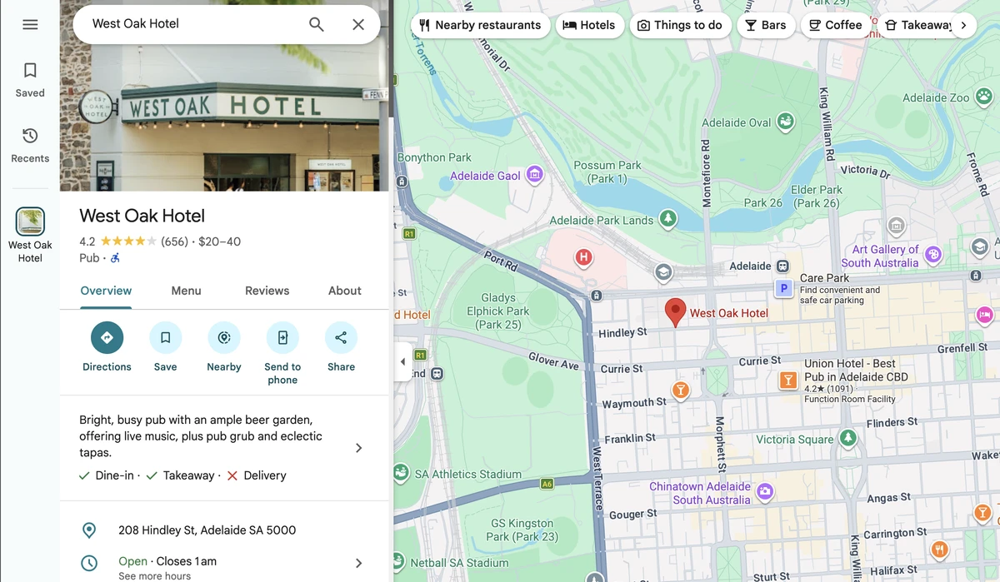
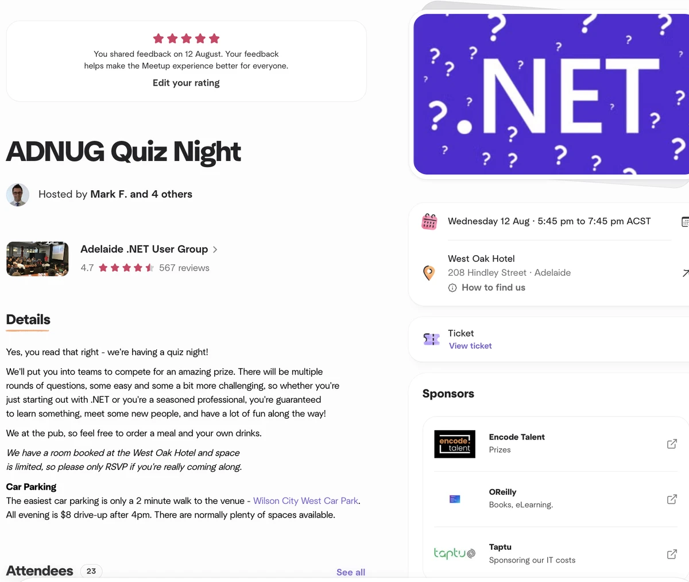
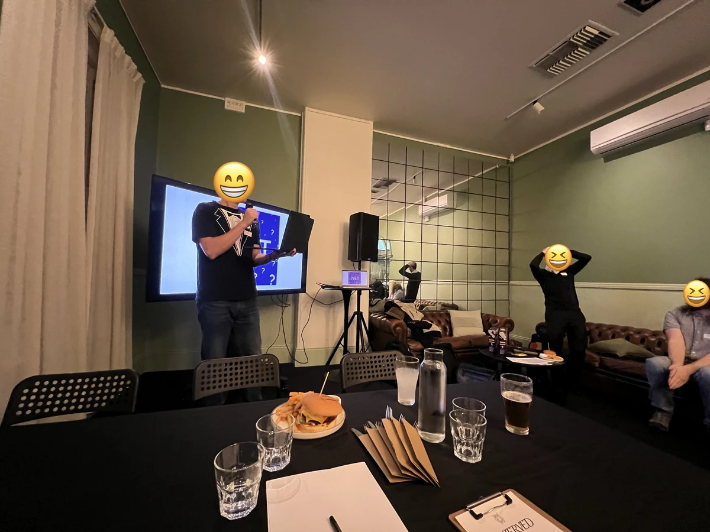
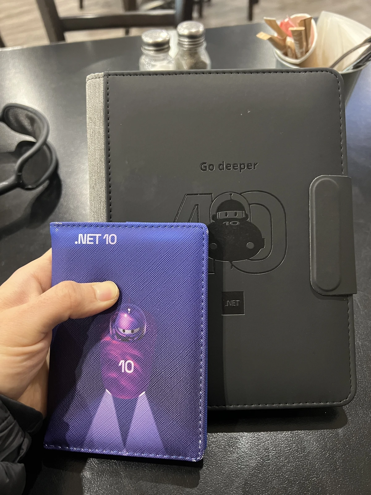
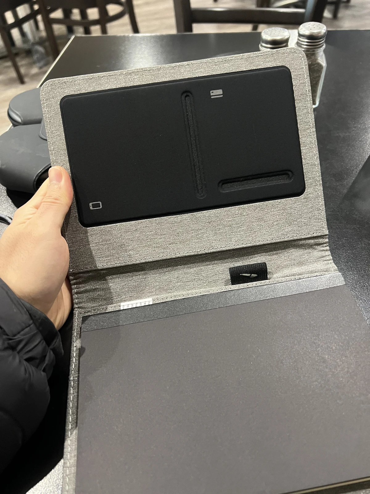
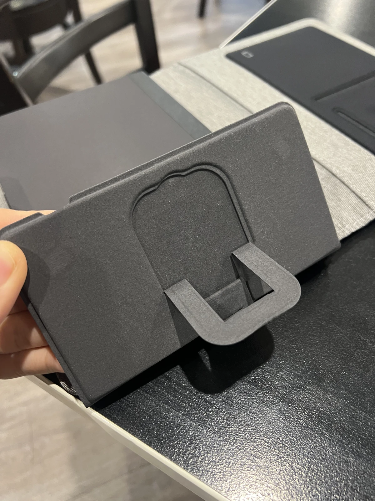
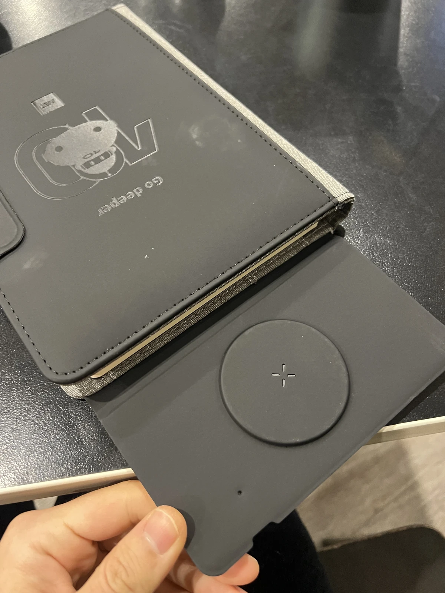
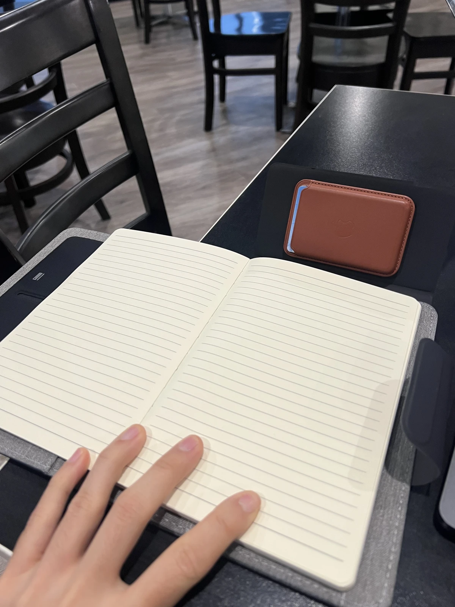

## 위치 - 웨스트 오크 호텔, 애들레이드

닷넷 밋업! 애들레이드에서 내가 가장 favour 하는 밋업이다. 두달에 한번 열리고 장소는 웨스트 오크 호텔이다.

보통 밋업은 애들레이드 유니버시티 west campus에서 열리고 이 호텔은 밋업 이후, 맥주 한잔 마시면서 catch-up 하고싶을때 가는곳이었는데 나는 다음날 출근때문에 참여하지 않아왔다.

그런데 이번에는 애초에 장소가 이 호텔로 잡혔고 이번엔 새로운 포맷? 인 퀴즈나잇이 준비되었다고 해서 가봤다! (사실 펍이 낯설어서 그동안 가길 망설인 점도 있다..ㅎㅎ 퀴즈나잇도 처음임)

## 밋업 도착

아쉽게 도착했을때 사진을 안찍었다. 
언제나 그렇듯 밋업에 가면, 오가나이저 분들이 반갑게 맞이해주시고 이름표를 가슴에 붙여서 출첵부터 한다.

가볍게 15분 정도 모르는 사람(다른말로는, 이제 곧 알 사람) 이랑 정신없이 공통점이나 의견의 차이점에 대해 토론하다보면 퀴즈 시작된다. 이날엔 왜 스프링부트랑 닷넷이 다른지에 대해 얘기했다..ㅎㅎ 초면부터 너무 진지한 이야기를 꺼냈는데 대화가 너무 하고싶었다. 밋업 아니면 이런 nerdy한 대화 어디서 하기 어렵다.

## 퀴즈 시작
이벤트 전 간단하게 행사 소개, 스폰서 소개 등으로 시작했다. 이날에도 Encode Talent (테크 밋업 어디에나 있는 스폰서사다. 사이먼도 항상 직접 참여한다), 그리고 GUESTPIX의 Prateek님도 스폰서로 함께했다. 이 스폰서분들이 장소 대관 및 퀴즈 상품 등을 후원해줬다.

퀴즈는 일반 상식, 개발, 데이터베이스, 닷넷, Computer Science 관련 유명 인물들 등의 질문들이 나왔다. 거의 개발자라면 머리긁으면서 좋아할 질문들이 쏟아졌다..

## 무엇보다..
삼등했다!! 닷넷 시작한 지 그렇게 오래 안되었음에도 때려맞춘 덕에 상을 받았다
닷넷10 다이어리랑, 여권 케이스를 받았다.
이런 상을 받게되어 영광이다 😁.

무려 무선 충전 스탠드가 있고 질감도 좋은 다이어리다.

들고다니면서 자랑하기도 좋은 자랑스러운 굿즈다.

좋은 시간, 기억을 가져서 감사하다. 🙂