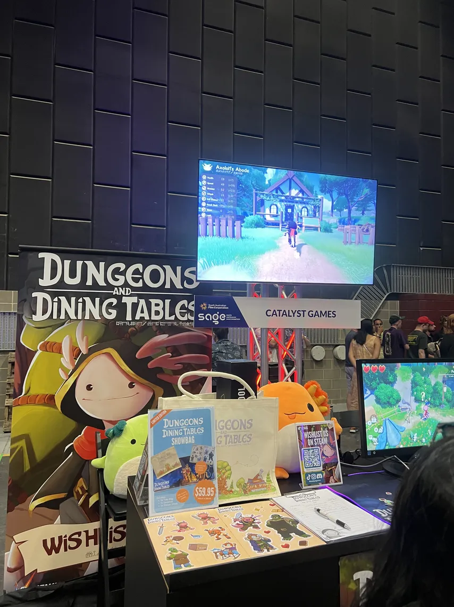
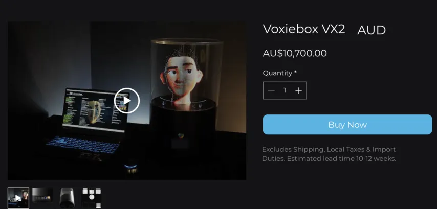

import Video from '../../../components/Video.astro';

I visited Sage event 2026 for the first time.
One of my acquaintances, who is hosting the event, recommended to visit as I appreciate game development 😀. It was free ticket.

The event place was hosted at South Australian Film Corporation (1 Mulberry Rd, Glenside SA 5065)
It was not easy to find car park plus, it was "Permission parking only", but I noticed all the visitors just parked their car regardless 😅.

### Show Room 1

### Show Room 2

### Theatre (Career Session)

Game devs are purely driven by their passions, not job titles. I pay my respect to those who manage to turn that passion into a successful career (and make money). I think they are the developers of developers.

## Favourite Pick 1

The game was well-polished, 2D style footy game. Retro, clean, and modern. Especially loved footy ball's bouncing's randomness. When it meets with 2D graphic, it deliver unique feeling.
It's available to wishlist on <a href="https://store.steampowered.com/app/3621330/Pro_Jank_Footy/" target="_blank" rel="noopener noreferrer">
  Steam
</a>.

## Favourite Pick 2

Dungeons and Dining Tables by Catalyst Games.
It's RPG advanture with some Animal Crossing vibes. You can grow your character, and also customise your own place, interacting with NPCs in the village.
Available to wishlist on <a href="https://store.steampowered.com/app/2941630/Dungeons_and_Dining_Tables/" target="_blank" rel="noopener noreferrer">
  Steam
</a>.

## Experimental!
<Video src="/videos/hologram.mp4" />
I was lucky enough to find this 3D hologram projection? It uses a spinning wheel inside to project images. Apparently the rendering load being sent to the device is equivalent to 4K display.
It has the exact old classic vibe, but in 3D. I got to play it. Loved the explosion effect 💥.

It looks nicer with the video they provided (No flickering like above)
https://drive.google.com/file/d/1PGdCWiMzTZCJdBCWRH_Au91vkytDlHCv/view?usp=drivesdk

BTW, the device is not cheap 😮. (This is a smaller version)

It was free entry (still requires ticket) and I could try many games in eary stages. I was previlaged to see passionate develpers, who are purely driven by the joy of craftsmanships 😁.